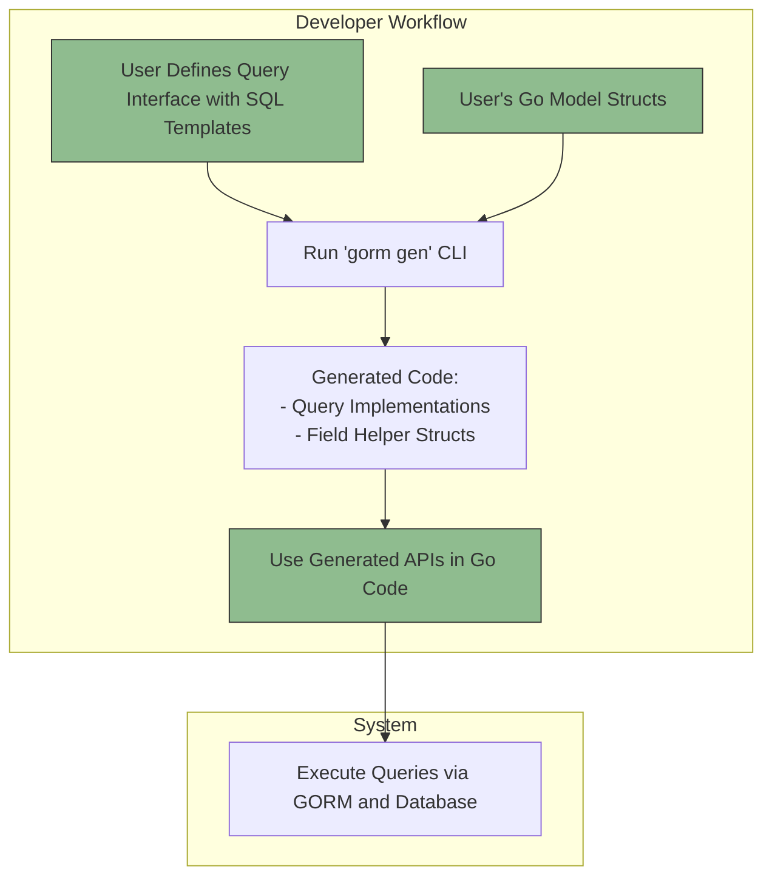

# What is GORM CLI?

## Transforming Go Data Access with Type-Safe Code Generation

GORM CLI is a powerful developer tool designed to bring type safety, maintainability, and fluency to data access in Go projects that use GORM. By leveraging your Go interfaces decorated with SQL templates and your existing Go model structs, GORM CLI generates two key complementary artifacts:

- **Interface-driven, type-safe query APIs**
- **Model-driven field helpers for filtering, updates, and managing associations**

This combination turns raw SQL queries and complex model manipulations into straightforward, compile-time-checked, and fluent Go method calls.


## Why GORM CLI Matters

Imagine spending hours writing SQL queries as strings, manually scanning results into structs, and hunting for SQL bugs or runtime mismatches. GORM CLI eliminates this pain by automating code generation based on your own interfaces and structs, making your data layer strong, discoverable, and less error-prone.

By generating the glue code that connects SQL, your database, and your Go code safely:

- You gain **compile-time validation** of queries and parameters
- You get **fluent method chaining** that guides you to available operations
- You avoid common runtime issues like SQL injection or mapping errors
- You accelerate development with reusable, consistent query methods


## How It Works at a Glance

1. **Write Go interfaces with SQL template comments** to express your query intentions clearly and declaratively.
2. **Define your model structs** as usual, optionally with configuration annotations.
3. **Run `gorm gen` on your interface and model packages**.
4. **Use the generated code**: type-safe methods for queries and powerful field helpers for filters, updates, and association management.

This process automates what would otherwise be manual boilerplate, letting you focus on your business logic.


## Key Benefits of Using GORM CLI

- **Type Safety Across Your Queries** — Method signatures enforce input and output types at compile time, avoiding bugs from malformed SQL or mismatched parameters.
- **Readable, Maintainable Query Code** — SQL templates inside interfaces keep queries close to Go types, improving readability and discoverability.
- **Seamless Integration with GORM** — The generated APIs plug directly into your existing GORM workflows, using idiomatic Go.
- **Flexible Configuration** — Customize generation with optional configs to include/exclude types, override output paths, and control code layout.
- **Rich Support for Associations** — Manage complex relationships with generated helpers for creating, updating, unlinking, and deleting associated records safely.


## Real-World Example: From Interface to Query

```go
// Define a generic query interface with templated SQL
// This supports fetching users and filtering dynamically
// The SQL comments guide the generation of type-safe implementations

type Query[T any] interface {
  // SELECT * FROM @@table WHERE id=@id
  GetByID(id int) (T, error)

  // SELECT * FROM @@table WHERE @@column=@value
  FilterWithColumn(column string, value string) (T, error)

  // Complex dynamic query using template directives
  // SELECT * FROM @@table
  // {{where}}
  //   {{if user.Name != ""}} name=@user.Name {{end}}
  //   {{if user.Age > 0}} AND age=@user.Age {{end}}
  // {{end}}
  QueryWith(user models.User) (T, error)

  // UPDATE @@table with conditional SET
  // {{set}}
  //   {{if user.Name != ""}} name=@user.Name, {{end}}
  //   {{if user.Age > 0}} age=@user.Age, {{end}}
  // {{end}}
  // WHERE id=@id
  UpdateInfo(user models.User, id int) error
}
```

After generation, you can safely invoke:

```go
// Fetch a user by ID
user, err := generated.Query[User](db).GetByID(ctx, 123)

// Filter users by name and age
filteredUsers, err := generated.Query[User](db).FilterWithColumn(ctx, "name", "jinzhu")

// Update user info
err = generated.Query[User](db).UpdateInfo(ctx, someUser, someID)
```


## Seamless Model-Driven Helpers

Alongside queries, GORM CLI generates **field helpers** from your model structs. These helpers simplify building filters, updates, and managing relationships.

For a `User` model:

```go
type User struct {
  ID        uint
  Name      string
  Age       int
  CreatedAt time.Time
}
```

You get handy, type-safe helpers like:

```go
generated.User.Name.Eq("alice")        // Where name = 'alice'
generated.User.Age.Gt(18)               // Where age > 18
generated.User.CreatedAt.Between(start, end)   // CreatedAt BETWEEN start AND end
```

These combine naturally with GORM's query builder:

```go
db.Where(generated.User.Name.Eq("bob"))
  .Where(generated.User.Age.Gt(20))
  .Find(ctx, &users)
```


## Tackling Associations with Confidence

Generated helpers also handle relationships clearly and safely:

- Create or create-in-batch associated records
- Update, unlink, or delete in a type-safe manner
- Apply filters on associated records before operations

Example:

```go
gorm.G[User](db).
  Set(
    generated.User.Name.Set("alice"),
    generated.User.Pets.Create(generated.Pet.Name.Set("fido")),
  ).
  Create(ctx)
```

This creates a new user *and* associates a new pet together.


## Configuration and Customization

While GORM CLI works out-of-the-box, advanced users can customize generation with a `genconfig.Config` declaration:

```go
var _ = genconfig.Config{
  OutPath: "custom/output",
  FieldNameMap: map[string]any{
    "json": JSON{},   // Custom helper for json-tagged fields
  },
  IncludeInterfaces: []any{"Query*"},  // Whitelist interfaces
  ExcludeStructs: []any{"*DTO"},       // Blacklist certain structs
}
```


## Summary

GORM CLI transforms how you write, maintain, and use data access code in Go with GORM:

- Write expressive interfaces that contain embedded SQL templates
- Generate comprehensive, type-safe query implementations
- Use generated, strongly typed field helpers to simplify filters and updates
- Manage complex associations with intuitive helper methods
- Customize and extend via configuration to fit your project needs

By automating boilerplate and enforcing compile-time checks, GORM CLI boosts developer productivity and code correctness.


## Next Steps
- Explore the [Product Value & Use Cases](/overview/introduction/value-prop-and-use-cases) page to see where GORM CLI fits best.
- Learn how to [Define Models and Query Interfaces](/getting-started/first-gen-workflow/define-models-interfaces) and start generating code.
- Dive into the [Feature Summary](/overview/introduction/feature-overview) for full capability details.


---

## Frequently Asked Questions

<AccordionGroup title="Common Questions About GORM CLI">
<Accordion title="What is the input to GORM CLI?">
GORM CLI generates code from your Go interface files where methods have SQL templates embedded in comments, together with your Go model structs. This allows it to produce type-safe APIs and helpers.
</Accordion>
<Accordion title="Do I need to write SQL?">
Yes, but embedded as templates in interface method comments, leveraging placeholders that bind to function parameters. This provides full flexibility with safety.
</Accordion>
<Accordion title="What if I don’t want to generate all interfaces or structs?">
Use `genconfig.Config` with `Include*` and `Exclude*` lists to whitelist or blacklist interfaces/structs by name or pattern.
</Accordion>
<Accordion title="How do I integrate generated code with GORM?">
Simply import and use the generated APIs and field helpers in your normal GORM workflow. The generated code returns `gorm.Interface[T]` implementations compatible with GORM queries.
</Accordion>
</AccordionGroup>


---

## Visual Overview


