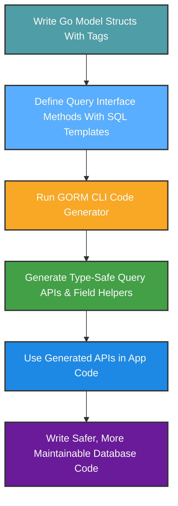

# Product Value and Use Cases

GORM CLI transforms how Go developers interact with databases by generating type-safe, fluent APIs that simplify and safeguard data operations in GORM projects. This page explores why GORM CLI matters for developers and teams looking to write robust data access layers, uphold coding standards, and accelerate development without sacrificing maintainability or runtime safety.

---

## Why GORM CLI? Unlocking Safer, Faster Database Code

Building database queries manually in Go can be error-prone, repetitive, and hard to maintain, especially as applications grow. GORM CLI eliminates these pain points by automating the generation of two powerful artifacts:

- **Typed, interface-driven query APIs** that guarantee compile-time safety
- **Model-driven field helpers** that provide fluent, discoverable syntax for every field and association

With this approach, you never write raw SQL in your application code. Instead, your query definitions and model struct fields drive generation producing ready-to-use, strongly-typed Go methods and helpers. This not only reduces bugs but also enables:

- **Better IntelliSense & discoverability** when writing queries
- **Easier refactoring** that compiler checks enforce
- **Consistent coding patterns** across your team


## Real Scenarios Where GORM CLI Drives Productivity

### 1. Building a Robust Data Access Layer

Imagine you maintain a growing Go application with complex business logic querying a Postgres or MySQL database. You want to avoid scattered SQL strings and fragile, manual query building.

By defining query interfaces with annotated SQL templates and leveraging your existing GORM models, GORM CLI generates safe methods that fit naturally into your codebase:

```go
// Query interface in your package
 type Query[T any] interface {
     // SELECT * FROM @@table WHERE id=@id
     GetByID(id int) (T, error)
     
     // SELECT * FROM @@table WHERE name=@name AND age=@age
     FilterByNameAndAge(name string, age int)
 }

// Generated usage
user, err := generated.Query[User](db).GetByID(ctx, 123)
users, err := generated.Query[User](db).FilterByNameAndAge("alice", 30).Find(ctx)
```

This layer is strongly typed, with no risk of SQL injection or typo errors — boosting confidence and maintainability.


### 2. Enforcing Coding Standards and Consistency

Teams often struggle to keep query code consistent. GORM CLI enforces patterns by design:

- Queries are centrally defined via interfaces, keeping SQL logic organized
- Field helpers generated from models provide uniform, discoverable predicates and setters
- Association helpers simplify related data operations with clear semantics (create, update, unlink, delete)

This uniformity accelerates onboarding and code reviews.


### 3. Accelerating Development for Teams Using Go and GORM

When generating query APIs and field helpers, manual repetitive tasks vanish:

- No hand-writing gluing code from models to queries
- Easy reuse of typed templates for multiple entities
- Batch operations and associations handled transparently

Instead of spending hours debugging SQL, developers focus on business rules and features.


## Benefits You Realize Using GORM CLI

| Benefit                      | Why It Matters                            |
|------------------------------|-----------------------------------------|
| **Compile-Time Safety**       | Avoid runtime SQL errors and type bugs  |
| **Fluent, Discoverable API**  | Speed up development and reduce errors  |
| **Seamless GORM Integration**| Leverage GORM features without compromise|
| **Better Maintainability**    | Generate uniform code that supports refactor|
| **Clear Association Support** | Manage relationships with type safety   |


## Common Use Cases

- **Data Querying:** Use generated interface methods for fast, correct data retrieval.
- **Complex Filtering:** Leverage model-based field helpers to chain filters and ordering with clear syntax.
- **Association Management:** Create, update, unlink, or delete related records safely and clearly.
- **Batch Operations:** Efficiently insert or update multiple related models.
- **SQL Templates:** Write expressive queries with dynamic placeholders that bind parameters safely.


## Before and After GORM CLI

| Without GORM CLI                               | With GORM CLI                           |
|-----------------------------------------------|----------------------------------------|
| Write raw SQL as strings, scattered and error-prone  | Write query interfaces once, generate strong APIs  |
| Manual error-prone association logic                | Clear, typed association helpers generate correct operations |
| Fragile string concatenation for filters            | Fluent, typed predicates with helpers and batch methods |
| Hard to refactor queries safely                      | Compiler enforces type safety, no silent bugs       |


## Measuring ROI

- **Time Savings:** Eliminates repetitive query code writing and debugging
- **Reduced Errors:** Compile-time type checking prevents SQL mistakes
- **Team Efficiency:** Uniform API accelerates collaboration and onboarding
- **Code Quality:** Encourages clear separation of concerns and consistent patterns


## Getting Started Preview

Begin your journey with GORM CLI by:

1. Defining your Go models and query interfaces with SQL comment templates.
2. Running the `gorm gen` command to generate code.
3. Using generated type-safe APIs in your project with confidence.

See these docs for the next step:

- [Defining Models and Query Interfaces](/getting-started/first-code-generation/defining-models-and-interfaces)
- [Running the Code Generator](/getting-started/first-code-generation/running-gorm-cli-gen)


---

<Tip>
To maximize the benefits, keep your query interfaces and models close in the same Go package or directory. This simplifies generation and improves type resolution.
</Tip>

<Warning>
Remember: GORM CLI generates code based strictly on your input models and interfaces. If you don't define an interface or model correctly, generation may skip them or produce incomplete helpers.
</Warning>

---

## Summary
GORM CLI redefines database coding in Go by generating type-safe, fluent query APIs and rich model-based field helpers that prevent runtime errors, reduce boilerplate, and boost developer productivity. The tool excels in scenarios demanding robust data layers, coding standards, and team efficiency for GORM projects.

Explore next how to define these interfaces and models to start generating powerful APIs.


---

## Additional Resources
- Visit [What is GORM CLI?](/overview/introduction_value/what_is_gorm_cli) to understand core concepts and capabilities.
- Learn about [Defining Models and Query Interfaces](/getting-started/first-code-generation/defining-models-and-interfaces) for practical setup guidance.
- Discover [Working with Associations: Patterns & Best Practices](/guides/advanced-use-cases/associations-best-practices) to manage relationships efficiently.
- Read [Writing Powerful Queries with the Template SQL DSL](/guides/advanced-use-cases/template-sql-dsl) to harness GORM CLI's templating power.

---

## Visualizing the Workflow


