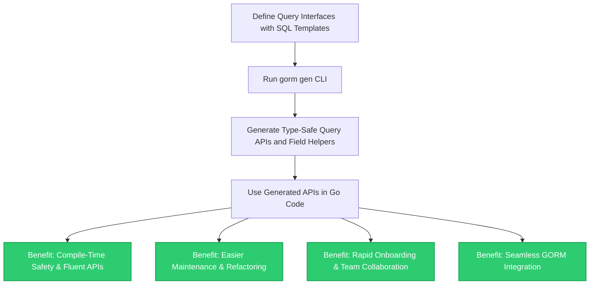

# Value Proposition & Benefits

## Why GORM CLI Adds Unmatched Value to Your Go Projects

As Go developers working with databases, you face common challenges—ensuring type safety, maintaining readable and maintainable code, onboarding new team members quickly, and scaling your data access layer alongside evolving application complexity. GORM CLI addresses these core pain points by generating type-safe, fluent query APIs and model-driven field helpers that integrate seamlessly with GORM. This page explains the distinct, practical benefits you gain by adopting GORM CLI in your workflow.

---

## Unlock Compile-Time Safety and Developer Confidence

At the core, GORM CLI empowers you to write database queries as Go interface methods with embedded SQL templates. From these, it generates concrete, type-safe query implementations that catch mistakes at compile time, not at runtime.

Imagine reducing the risk of SQL injection or mismatched query parameters. By working with generated, strongly-typed code, your team:  
- Avoids subtle bugs caused by manual SQL string concatenation.  
- Benefits from IDE autocompletion and static checks on query parameters and return types.  
- Gains immediate feedback during development rather than hunting errors during runtime.

This feature alone accelerates development velocity and reinforces code quality standards across your team.

---

## Improve Codebase Maintainability and Readability

Manual query building scattered across the codebase often results in duplication, inconsistent style, and obscure SQL expressed as concatenated strings. GORM CLI centralizes the definition of your queries within Go interfaces annotated with clear SQL templates.

This structured approach enables:
- Clear separation of query intent from execution logic.
- Consistent, reusable query patterns enforced by the generated API.
- Easier refactoring because changes update the interface, and then regenerate safe code automatically.

The generated field helpers aligned with your models further standardize query construction for filters, updates, and associations.

---

## Accelerate Onboarding and Collaboration

New team members frequently struggle with understanding raw SQL across the codebase or grasping the query construction conventions. GORM CLI-generated APIs provide a discoverable, fluent interface that mirrors your domain models and query intent.

This means:
- Developers find exactly the methods they need with familiar Go signatures.
- They learn from one central source of truth: the query interfaces and your data models.
- Less time is spent debugging query parameter mismatches or deciphering legacy string literals.

Teams onboard faster, ramp up productivity, and improve collaboration on database-related features.

---

## Seamless Integration with GORM

GORM CLI is explicitly designed to complement the GORM ORM. It enhances GORM’s expressive API with:  
- Model-driven field helpers that provide type-safe predicates for filters, updates, and association operations.  
- Generated query interfaces that blend into your GORM calls seamlessly, preserving your existing Go and GORM paradigms.

Whether you need simple CRUD with safety or complex conditional queries templated via SQL, GORM CLI fits naturally into your existing stacks without disrupting established workflows.

---

## Bridging Handwritten Logic and Code Generation for Scalability

Large projects eventually encounter queries that are too complex for handwritten code to remain manageable. GORM CLI’s generation mechanism bridges handwritten interfaces and automatic code generation by:

- Allowing you to define the query logic declaratively as SQL templates inside interfaces.
- Automatically generating safe, maintainable implementations that handle parameter binding and conditional constructs.
- Supporting customization and extensibility through generation config.

This synergy enables your codebase to scale without growing technical debt or risking regressions.

---

## Benefits at a Glance

- **Compile-time Type Safety:** Catch query and parameter mistakes early.
- **Maintainable Query Interfaces:** Centralize and standardize query definitions.
- **Fluent, Discoverable API:** Improve developer experience with intuitive method calls.
- **Rapid Team Ramp-up:** Simplify onboarding with clear query contracts.
- **Seamless GORM Integration:** Enhance your ORM without friction.
- **Scalable Query Generation:** Support complex queries with automated code.

---

## Real-World Scenarios Where GORM CLI Excels

- You’re building complex business apps with evolving data models and want strong type guarantees.
- You need to generate batch operations and association helpers that integrate tightly with GORM’s ORM.
- Your team wants to reduce database query bugs, speed up development, and enforce conventions.
- You want to define SQL with conditions, loops, and templates but keep the syntax close to Go.

---

## Before and After GORM CLI

| Aspect               | Without GORM CLI                         | With GORM CLI                              |
|----------------------|----------------------------------------|-------------------------------------------|
| Query safety         | Manual strings; prone to errors         | Type-safe generated interfaces             |
| Query readability    | Scattered SQL strings                   | Centralized, interface-driven definitions  |
| Onboarding          | Steep learning curves                    | Fluent, discoverable APIs                    |
| Code maintenance    | High technical debt                     | Automated code regeneration                 |
| Integration         | Separate handwritten + ORM code         | Unified, integrated GORM helper generation |

---

## Getting Started Preview

To start realizing these benefits, the typical flow involves:

1. **Define query interfaces** annotated with SQL templates matching your domain models.
2. **Run the `gorm gen` CLI command** to generate type-safe APIs and helpers.
3. **Use the generated APIs** in your application code for queries and updates.

This simple yet powerful workflow replaces error-prone handcrafting and leads to more robust, maintainable Go database code.

For an in-depth guide, see [Quick Feature Overview](/overview/features-and-workflow-overview/quick-feature-overview) and start with [Setting Up Your First Project](/getting-started/essentials/initial-setup).

<Tip>
To ensure you leverage the full power of GORM CLI, write precise SQL template comments in your interfaces. The generated code handles parameter binding, conditional clauses, and method chaining automatically, saving you from manual query construction errors.
</Tip>

<Info>
GORM CLI requires Go 1.18+ with generics support, aligning perfectly with modern Go development practices.
</Info>

---

## Summary

Embracing GORM CLI revolutionizes your Go database development by delivering compile-time safety, maintainability, team agility, and tight GORM integration—all via elegant code generation based on interface definitions.

Take the next step: define your first SQL-templated interface and experience error-free, scalable query APIs today.

---

## Diagram: GORM CLI Key Benefits Flow

