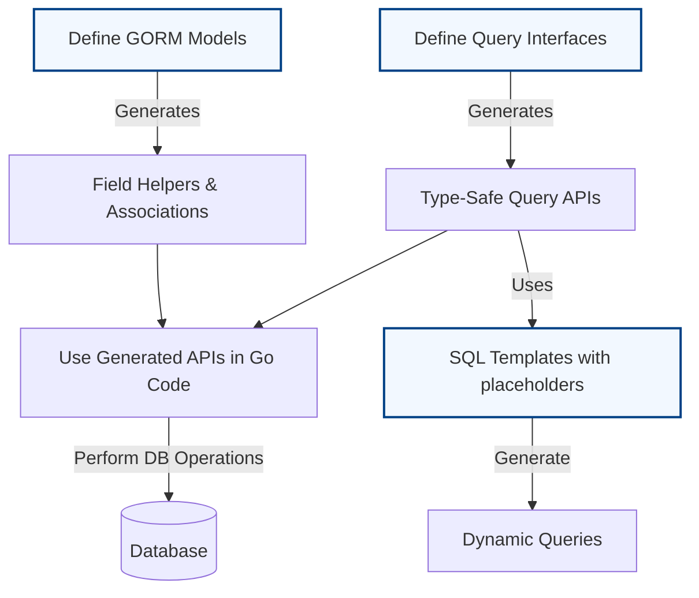

# Core Concepts & Terminology

Welcome to the foundational guide for GORM CLI. This page unpacks the essential concepts and terminology that form the backbone of the GORM CLI experience. Understanding these core ideas empowers you to navigate the documentation confidently and harness the full potential of the tool.

---

## Why Core Concepts Matter

Before diving into how to generate and use code with GORM CLI, you need to grasp the fundamental components it builds upon. This section demystifies what queries from interfaces, field helpers from models, associations, and template-based SQL mean in practical terms. You’ll gain clarity on how these elements interconnect to deliver a type-safe, fluent coding experience.

---

## Key Concepts Explained

### 1. Queries Generated from Interfaces

GORM CLI lets you write Go interfaces that describe database queries using method signatures and SQL templates embedded in comments. From these interfaces, the tool generates _type-safe_, fluent query APIs. 

- **What you get:** Methods directly mapped to SQL queries that return typed results.
- **Benefit:** Avoid raw SQL errors and get auto-completion and compile-time checks for your database operations.

**Example:**
```go
// Query interface with an SQL query annotation
// SELECT * FROM @@table WHERE id=@id
GetByID(id int) (T, error)
```

The generated method `GetByID` will fetch the record with that ID, safely typed to the model struct `T`.

---

### 2. Field Helpers Generated from Models

From your Go model structs, GORM CLI generates **field helpers**. These are strongly-typed references to each field of your models, crafted to help write filters, updates, and association operations easily and safely.

- **What you get:** Fluent field predicates like `.Eq()`, `.Like()`, `.Gt()` for queries, and `.Set()` for updates.
- **Benefit:** Compose queries and updates with type safety, avoiding column name typos and runtime errors.

**Concrete example:**
```go
// Querying users older than 18:
users, err := gorm.G[User](db).
  Where(generated.User.Age.Gt(18)).
  Find(ctx)
```

This uses the `Age` field helper on the `User` model for a readable query predicate.

---

### 3. Associations

GORM CLI understands relationships between models — such as `has one`, `has many`, `belongs to`, and `many2many`. The generator creates specialized association helpers enabling operations on related records with full type safety.

- **Operations supported:** Create, Update, Unlink (dissociate), Delete on associated data.
- **Benefit:** Manage complex related data declaratively and safely from your code.

**Example use cases:**
- Creating a user and simultaneously adding pets.
- Updating a user’s associated address.
- Removing a language that a user speaks (many2many).

```go
gorm.G[User](db).
  Set(
    generated.User.Name.Set("alice"),
    generated.User.Pets.Create(generated.Pet.Name.Set("fido")),
  ).
  Create(ctx)
```

This creates a new user `alice` and one pet named `fido` linked to that user.

---

### 4. Template-Based SQL

To support flexible and dynamic queries, GORM CLI uses a **SQL template DSL** embedded as specially formatted comments on interface methods.

- **Usage:** Write SQL statements using placeholders such as `@@table` and `@param` for automatic binding.
- **Dynamic clauses:** `{{where}}`, `{{set}}`, `{{if}}`, `{{for}}` directives allow conditional and iterative SQL generation.
- **Benefit:** Write expressive queries with conditional logic, loops, and parameter binding — all type-safe and concise.

**Example:**
```go
// SELECT * FROM @@table
// {{where}}
//   {{if user.Name != ""}} name=@user.Name {{end}}
//   {{if user.Age > 0}} AND age=@user.Age {{end}}
// {{end}}
FilterByUser(user models.User) ([]T, error)
```

The generated method allows filtering by `Name` and `Age` only if those values are provided.

---

## Terminology Clarifications

| Term             | Meaning                                                                                  |
|------------------|------------------------------------------------------------------------------------------|
| **Type-safe queries** | Queries generated with compile-time checked argument and return types. Confirms you’re using correct fields and types. |
| **Field helpers**      | Imploded Go variables representing model fields for building filter, update, and order expressions fluently and safely. |
| **Associations**       | Model relationships that allow CRUD operations on related data with typing guarantees.  |
| **SQL template DSL**   | A structured way to write SQL with placeholders and logic blocks to generate queries programmatically. |

---

## How These Concepts Fit Together

The synergy of these elements creates a workflow where Go interface definitions describe your queries, model structs provide fields and relations, and SQL templates add run-time flexibility.

This empowers you to:

- Write expressive, safe database access layers.
- Maintain your code as clean interfaces and typed models.
- Reuse generated helpers to minimize boilerplate and errors.

### Visual Overview



---

## Practical Tips

- **Start with your models:** Ensure your GORM models accurately reflect your database schema.
- **Write interfaces for your queries:** Keep them minimal and use SQL templates to handle variable filtering.
- **Use field helpers:** Leverage generated fields for safer, easier query and update construction.
- **Understand association types:** Use the correct association method (Create, Update, Unlink, Delete) to match your business logic.
- **Debug SQL templates:** The CLI generation errors will point clearly to SQL template issues—keep templates clean and test interface methods.

---

## Troubleshooting Common Issues

<AccordionGroup title="Common Questions & Solutions">
<Accordion title="Why aren’t my interfaces generating code?">
Make sure your interface has properly formatted SQL templates in comments. The CLI requires annotated SQL to generate implementations. Also check that you have included the interfaces in your config or via default include patterns.
</Accordion>
<Accordion title="Field helpers missing or mismatched types?">
Review your model struct tags and types. Use `gen:"json"` for JSON fields or configure type mappings in `genconfig.Config`. Re-run the generator after changes.
</Accordion>
<Accordion title="Association helpers not generated?">
Confirm that associations exist in your models with GORM’s relation tags (e.g., `hasMany`, `belongsTo`).
</Accordion>
</AccordionGroup>

---

## Next Steps

With a clear grasp of these core concepts, proceed to:

- [What is GORM CLI?](../what-is-gorm-cli) for a high-level product overview
- [Defining Query Interfaces & Models](../../guides/getting-started-workflows/defining-interfaces-models) for practical steps on writing your first interfaces and models
- Explore [Template-Based Queries & SQL DSL](../../guides/advanced-usage-patterns/template-based-queries) to master SQL templating techniques

Equip yourself with these fundamentals to work with confidence as you generate and utilize type-safe, fluent APIs tailored to your GORM projects.

---
