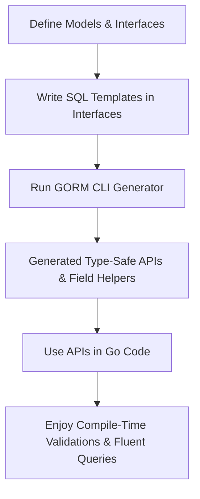

# Target Audience & Use Cases

GORM CLI is designed specifically for Go developers who work extensively with databases through the GORM ORM. This page profiles the ideal users and illustrates real-world workflows where GORM CLI transforms database interactions into type-safe, intuitive, and maintainable code.

---

## Why GORM CLI Fits Your Needs

If you're a Go developer who values:

- **Strongly typed query APIs** that eliminate runtime SQL errors,
- The ability to **write expressive, composable queries with compile-time checks**,
- Seamless handling of **complex associations** in your data model,
- Accelerated development with **generated CRUD operations and model helpers**,

then GORM CLI is the perfect tool to enhance your productivity and code safety.


## Profiles of Ideal Users

### 1. Backend Developers Building GORM-Based Services

You are developing Go services using GORM for database access, juggling multiple models and complex relationships. You want:

- To avoid hand-writing and debugging raw SQL or unsafe query strings.
- Compile-time validation of query parameters to catch errors early.
- Clear, discoverable APIs for CRUD and association operations.

### 2. Developers Focused on Model-Centric Programming

Your applications revolve around rich domain models with nested associations such as has-many, belongs-to, and many-to-many. You need tooling that:

- Automatically generates field helpers reflecting your models’ fields and relations.
- Enables fluent, type-safe filters, updates, and batch creations linked to your domain.
- Handles polymorphic associations effortlessly with generated helpers.

### 3. Teams Needing Rapid CRUD and Custom Query Generation

Your team prioritizes rapid development cycles. You require:

- Template-based query interfaces where you write simple SQL templates once and get type-safe APIs.
- Strong conventions that reduce boilerplate and inconsistencies.
- Configurability for fine-tuning model and interface code generation to fit your coding standards.

---

## Typical Use Cases & Workflows

Here are three common scenarios where GORM CLI proves invaluable.

### Use Case 1: Rapid CRUD API Generation

**Problem:** You want to quickly generate reliable CRUD APIs with safe queries without manually coding each method.

**With GORM CLI:**

- Define Go interfaces with SQL templates describing operations like `GetByID(id int)` or `FilterByNameAndAge(name string, age int)`.
- Declare your model structs as usual with GORM tags.
- Run the generator to produce type-safe API implementations and field helpers.
- Use the generated APIs in your code, enjoying autocompletion and compile-time correctness.

**Result:** You cut development time drastically and avoid runtime SQL errors.


### Use Case 2: Complex Query Templating with Type Safety

**Problem:** Your queries vary widely with dynamic filters and conditional SQL clauses. Writing these manually invites mistakes.

**With GORM CLI:**

- Use the SQL template DSL embedded in interface comments to express conditional and iterative query logic.
- The generator produces concrete methods that are checked at compile time.

**Example:**

```go
// SELECT * FROM @@table
// {{where}}
//   {{if user.ID > 0}} WHERE id=@user.ID {{else if user.Name != ""}} WHERE name=@user.Name {{end}}
QueryWith(user models.User) (T, error)
```

This design enables dynamic SQL with guaranteed parameter safety and convenient generated query APIs.


### Use Case 3: Model-Driven Association Management

**Problem:** Complex data models with has-many, belongs-to, and many-to-many associations are hard to manipulate safely.

**With GORM CLI:**

- Association field helpers are generated automatically.
- You can invoke operations like `Create`, `Update`, `Unlink`, and `Delete` on associations with type safety.

**Example:**

```go
// Create a User and associate Pets and Languages
gorm.G[User](db).
  Set(
    generated.User.Name.Set("polyglot"),
    generated.User.Pets.CreateInBatch([]models.Pet{{Name: "fluffy"}, {Name: "spot"}}),
    generated.User.Languages.CreateInBatch([]models.Language{{Code: "EN"}, {Code: "FR"}}),
  ).
  Create(ctx)
```

This fluent syntax reduces boilerplate and errors in managing data relationships.

---

## Before and After GORM CLI

| Without GORM CLI | With GORM CLI |
|------------------|--------------|
| Write raw SQL strings prone to syntax and parameter binding errors | Define interfaces and generate type-safe query APIs with guaranteed correctness |
| Manually map results to structs, risking runtime crashes | Use generated field helpers and query methods discoverable in IDE |
| Tediously handle associations and FK updates | Fluent association helpers to create/update/unlink/delete related records safely |

The difference is substantial: increased confidence, fewer bugs, and faster iteration.

---

## Key Benefits at a Glance

- **Compile-Time Safety:** Errors in SQL and parameters surface during compilation, not at runtime.
- **Discoverable APIs:** Generated query and field helpers provide IDE autocompletion.
- **Enhanced Productivity:** Rapid scaffolding of CRUD and complex queries.
- **Association Support:** Manage one-to-one, one-to-many, many-to-many, and polymorphic relations fluidly.
- **Customizable Generation:** Tailor the generator with config files for naming and field mappings.

---

## Getting Started Preview

To begin harnessing GORM CLI in your projects:

1. Define query interfaces with SQL templates and model structs in the same package.
2. Run the generator via CLI (`gorm gen -i ./path -o ./generated`) to create type-safe query APIs and helpers.
3. Import and use the generated code in your services for reads, writes, and association handling.

For detailed steps, see our [Generating and Using Type-Safe APIs](https://yourdocsite/overview/architecture-features-integration/feature-overview) and [Defining Query Interfaces & Models](https://yourdocsite/guides/getting-started-workflows/defining-interfaces-models).

---

## Practical Tips & Best Practices

- Consistently keep your model structs and query interfaces close for coherence.
- Use the SQL template DSL to clearly express complex or conditional queries.
- Leverage association field helpers to avoid manual FK management.
- Customize your generation through `genconfig.Config` to fit project patterns.
- Test generated APIs early to catch generation or template issues.

---

<Info>
Explore other documentation pages like [What is GORM CLI?](/overview/product-intro-basics/what-is-gorm-cli) and [Core Concepts & Terminology](/overview/product-intro-basics/core-concepts-terminology) to solidify your understanding.
</Info>

---

_This page is your gateway to understanding who benefits most from GORM CLI and the tangible ways it can transform your Go database workflows._


---

### Related Links

- [What is GORM CLI?](/overview/product-intro-basics/what-is-gorm-cli)
- [Core Concepts & Terminology](/overview/product-intro-basics/core-concepts-terminology)
- [Defining Query Interfaces & Models](/guides/getting-started-workflows/defining-interfaces-models)
- [Template-Based Queries & SQL DSL](/guides/advanced-usage-patterns/template-based-queries)
- [Working with Associations](/guides/advanced-usage-patterns/working-with-associations)


---

### Example: Typical API Method Definition

```go
// SELECT * FROM @@table WHERE id=@id
GetByID(id int) (T, error)

// Usage:
user, err := generated.Query[User](db).GetByID(ctx, 123)
```

Hands-on examples like this appear in the generated code helping you write safe and clear data operations.


---

### Illustration: User Workflow with GORM CLI



This flow depicts the sequence from your code to generated helpers and final usage with assured correctness.


---

If you are a Go developer aiming to write robust, maintainable database code with GORM, understanding your fit here and the workflows is essential. Start with defining your models and query interfaces, and let GORM CLI handle safe, efficient code generation for you.
