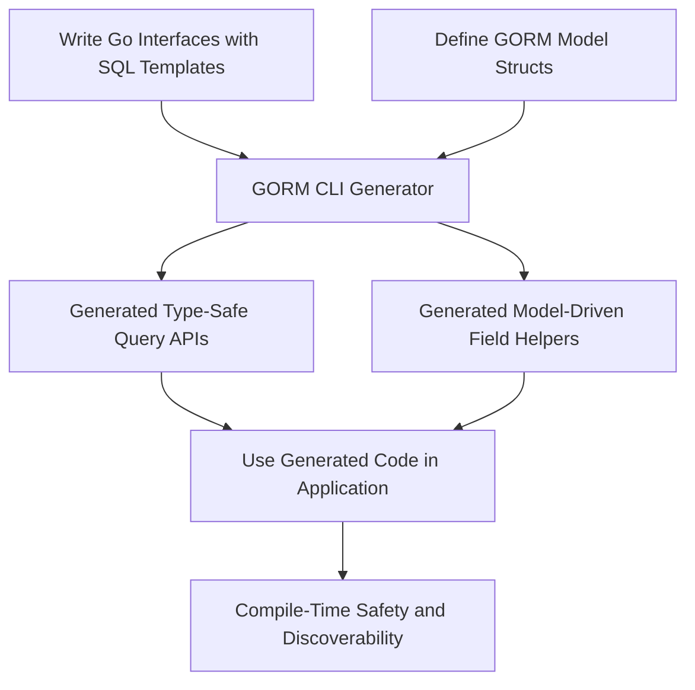

# What is GORM CLI?

Discover how GORM CLI empowers Go developers to write safer, cleaner, and more maintainable data access layers by generating type-safe query APIs and model-driven field helpers.

---

## Empower Your GORM Projects with Type-Safe, Interface-Driven Code Generation

GORM CLI is a powerful code generation tool designed specifically for Go projects using GORM. It transforms your raw SQL interfaces and model definitions into robust, type-safe, and fluent APIs that eliminate boilerplate and enhance compile-time safety.

### Why Choose GORM CLI?

- **Type-Safe Query APIs**: Convert Go interfaces annotated with SQL templates into concrete implementations that guarantee type safety and intuitive method signatures.
- **Model-Driven Field Helpers**: Auto-generate strongly typed helpers for basic fields, filters, updates, ordering, and complex associations.
- **Compile-Time Validation**: Catch SQL errors and misuse early by leveraging Go's type system during compilation, not at runtime.
- **Enhanced Discoverability**: Generated code provides fluent, discoverable methods for querying and updating your database, improving developer productivity.
- **Reduced Boilerplate**: Write concise interfaces and model structs — let GORM CLI handle the tedious generation of repetitive query and helper code.

### Who Should Use This?

This tool is built for Go developers who:

- Use GORM as their ORM and want safer, cleaner data querying and manipulation.
- Desire compile-time checks for custom SQL implementations.
- Need to reduce manual query and helper code, boosting maintainability.
- Want to leverage rich features around associations and model-driven operations.

---

## What Exactly is GORM CLI?

Simply put, GORM CLI is a code generator that produces two essential code artifacts:

1. **Interface-Driven Query APIs:** You write Go interfaces with SQL snippets or templates detailing your data operations. GORM CLI generates concrete, type-safe implementations of these interfaces that you invoke directly.

2. **Model-Driven Field Helpers:** Based on your model structs, GORM CLI produces helpers to construct expressive queries, filters, updates, and manage associations — all with type safety and IDE-friendly auto-completion.

Together, these components create a fluent, discoverable API layer on top of GORM's dynamic query builder.

### The Core Problem It Solves

Standard GORM usage often relies on stringly-typed queries or ORM abstractions vulnerable to runtime errors and lacking concise generation for common query patterns. GORM CLI fills this gap by:

- Enabling compile-time validation through generated code.
- Supporting complex SQL templating directly in Go interfaces.
- Generating association helpers that simplify managing relationships.

### What Sets GORM CLI Apart?

- **Generics & Go 1.18+ Focus:** Uses Go generics for type parameters, ensuring type-safe APIs tailored to your models.
- **Template SQL DSL:** Allows embedding sophisticated templated SQL directly in interface method comments, with placeholders linked to method parameters.
- **Seamless GORM Integration:** Generated code complements, rather than replaces, GORM, allowing incremental adoption.

---

## Key Features & Capabilities

### 1. Type-Safe Query API Generation
Write interfaces with rich SQL templates and get fully typed implementations that integrate context management automatically.

```go
// Example interface from `examples/query.go`
type Query[T any] interface {
  // SELECT * FROM @@table WHERE id=@id
  GetByID(id int) (T, error)

  // SELECT * FROM @@table WHERE @@column=@value
  FilterWithColumn(column string, value string) (T, error)

  // UPDATE @@table
  // {{set}}
  //   {{if user.Name != ""}} name=@user.Name, {{end}}
  // {{end}}
  // WHERE id=@id
  UpdateInfo(user models.User, id int) error
}
```

- **Benefit:** Achieve auto-generated query methods closely matching your needs.
- Methods support contextual database operations and return strongly typed results.

### 2. Model-Driven Field Helper Generation
From your GORM models, GORM CLI generates strongly typed helpers adaptable for various SQL predicates and updates.

- Includes support for common Go types (`int`, `string`, `time.Time`, `bool`, etc.) and custom mappers.
- Supports association helpers for `has one`, `has many`, `belongs to`, and `many2many` relationships.

Example usage for filtering and updating:

```go
gorm.G[User](db).
  Where(generated.User.Name.Eq("alice")).
  Set(generated.User.Age.Incr(1)).
  Update(ctx)
```

### 3. Rich Template SQL DSL
Embed templated SQL in your interface methods with directives such as:

| Directive   | Purpose                                | Example                            |
| ----------- | ------------------------------------- | -------------------------------- |
| `@@table`   | Model’s table name                     | `SELECT * FROM @@table WHERE id=@id` |
| `@@column`  | Dynamic column binding                 | `SELECT * FROM @@table WHERE @@column=@value` |
| `@param`    | Bind Go parameters to SQL params      | `WHERE name=@user.Name`            |
| `{{where}}` | Conditional WHERE clause               | `{{where}} age > 18 {{end}}`      |
| `{{set}}`   | Conditional SET clause (UPDATE)        | `{{set}} name=@name {{end}}`      |
| `{{if}}`    | Conditional SQL fragment               | `{{if age > 0}} AND age=@age {{end}}` |
| `{{for}}`   | Iterate over collections               | `{{for _, t := range tags}} ... {{end}}` |

This allows flexible queries with parameter substitution, branching logic, and iteration handled gracefully.

### 4. Comprehensive Association Support
Manage relations confidently with generated helpers that cover operations such as:

- **Create**, **CreateInBatch**: Add related records atomically.
- **Update**: Modify association targets with conditions.
- **Unlink**: Remove association links without deleting records.
- **Delete**: Remove association records directly (especially for many2many).

Example create with association:

```go
gorm.G[User](db).
  Set(
    generated.User.Name.Set("alice"),
    generated.User.Pets.Create(generated.Pet.Name.Set("fido")),
  ).
  Create(ctx)
```

All operations come with compile-time guarantees and enable chaining.

### 5. Simple Configuration Options
Adjust generation behavior with `genconfig.Config` file-level or package-level config:
- Output directory
- Included/Excluded interfaces and structs (via shell-style patterns)
- Custom field name/type mappings
- Single-file vs package-level generation

---

## Why Should I Care?

### Immediate Benefits:

- **Safety:** Avoid runtime SQL errors and common mistakes by enforcing correctness at compile time.
- **Productivity:** Write fewer lines of repetitive boilerplate, freeing time to focus on business logic.
- **Discoverability:** Generated field helpers and query APIs significantly improve IDE auto-completion and code readability.
- **Flexibility:** Support for expressive SQL templates combined with strong typing gives you the best of raw SQL and ORM convenience.

### Real-World Use Cases:

- Building backend services with complex data access requirements that demand tight control alongside Go’s type system.
- Migrating legacy SQL queries into a safer, maintainable codebase with minimal manual refactoring.
- Handling multi-entity CRUD with complex associations, where standard ORM abstractions fall short.
- Generating APIs for domain-specific queries with validation and parameter binding handled automatically.

### Before and After GORM CLI

| Without GORM CLI                         | With GORM CLI                                  |
|----------------------------------------|-----------------------------------------------|
| Write raw SQL strings scattered in code| Define interfaces with SQL templates once     |
| Lose compile-time validation            | Compile-time checked, type-safe query methods |
| Manual query building and error-prone  | Fluent APIs with field helpers and associations|
| Tedious update/build logic              | Automatic generation of updates and filters   |

---

## Getting Started Preview

Start using GORM CLI by following these simple steps:

1. **Define your query interfaces** with SQL templates in your project.

2. **Create or ensure your model structs** are properly defined with GORM tags.

3. **Run the generator:**

```bash
gorm gen -i ./path/to/your/interfaces -o ./generated
```

4. **Use generated APIs:**

```go
// Query user by ID
user, err := generated.Query[User](db).GetByID(ctx, 123)

// Filter users by name and age
users, err := generated.Query[User](db).FilterByNameAndAge("jinzhu", 25).Find(ctx)
```

### Prerequisites

- Go 1.18 or later (for generics support)
- Existing GORM project with models defined

### Next Steps

Explore the following documentation to master core workflows:

- [Getting Started with GORM CLI](./guides/core-workflows/getting-started)
- [Generating & Using Type-Safe Query APIs](./guides/core-workflows/generating-and-using-query-apis)
- [Model-Driven Field Helper Generation](./guides/core-workflows/model-driven-field-helpers)

---

For in-depth examples, configuration options, and advanced patterns, dive into the corresponding guides and concepts in the documentation.

---

## Summary Diagram: How GORM CLI Fits Your Workflow



This illustrates how your source interfaces and models feed into the generator, producing code you can confidently use with full type safety and fluent APIs.
