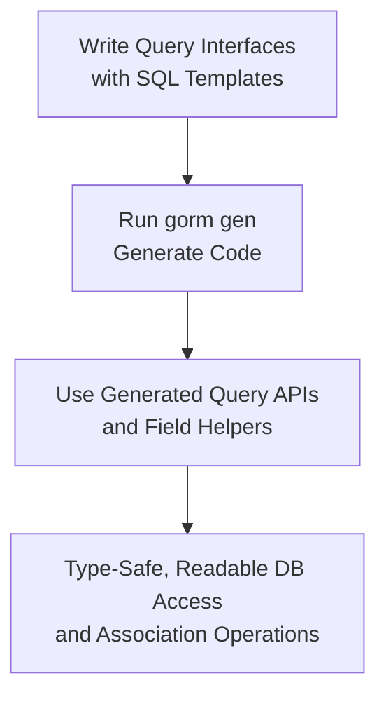

# Key Features at a Glance

Unlock the power of GORM CLI by quickly exploring its core capabilities designed to boost your productivity and safety when working with GORM ORM in Go projects. This page provides an accessible snapshot of what GORM CLI can generate: type-safe query APIs, model-driven field helpers, association operations, configuration flexibility, and seamless integration.

---

## Why GORM CLI's Features Matter to You

Imagine writing database query code where every method is guaranteed type safety, where tedious SQL boilerplate vanishes, and where manipulating associated data is intuitive and error-free. GORM CLI equips you with precisely this experience by generating fluent, compile-time-checked APIs directly from your interfaces and models.

This isn't just another code generator—it's a productivity and reliability powerhouse designed for real-world Go developers striving for clean, maintainable data access layers.

---

## Core Capabilities

### 1. Interface-Driven, Type-Safe Query APIs

- **What you get:** Define Go interfaces with SQL templates in comments, and GORM CLI generates concrete, strongly typed query methods that integrate naturally with your models.
- **User value:** Achieve compile-time safety, autocomplete support, and readable, maintainable query logic.

#### Example
```go
// Define a query interface with annotated SQL templates
type Query[T any] interface {
  // SELECT * FROM @@table WHERE id=@id
  GetByID(id int) (T, error)
}

// Generated usage
user, err := generated.Query[User](db).GetByID(ctx, 123)
```

---

### 2. Model-Driven Field Helpers

- **What you get:** GORM CLI generates field helper structs from your model definitions, allowing easier construction of conditions, updates, and filters.
- **User value:** Write expressive and error-resistant queries and updates without manually crafting SQL snippets.

#### Real-World Scenario
```go
gorm.G[User](db).
  Where(generated.User.Name.Eq("alice"), generated.User.Age.Gt(25)).
  Find(ctx)
```

---

### 3. Rich Association Operations

- **Supported:** Create, Update, Unlink, Delete, batch Create for connected data (has one, has many, belongs to, many2many, polymorphic).
- **User value:** Maintain complex relational data with clear, typed methods that preserve foreign key correctness and optimize association handling.

#### Use Case Example
```go
// Create user and pets
gorm.G[User](db).Set(
  generated.User.Name.Set("alice"),
  generated.User.Pets.Create(generated.Pet.Name.Set("fido")),
).Create(ctx)

// Unlink user's pets
gorm.G[User](db).
  Where(generated.User.ID.Eq(1)).
  Set(generated.User.Pets.Unlink()).Update(ctx)
```

---

### 4. Easy Configuration and Filtering

- **Configurable:** Control output paths, inclusion, and exclusion of interfaces/structs via simple `genconfig.Config` in your package.
- **User value:** Tailor code generation to your project structure and preferences without complex setup.

#### Sample Config
```go
var _ = genconfig.Config{
  OutPath: "examples/output",
  IncludeInterfaces: []any{"Query*"},
  FieldTypeMap: map[any]any{sql.NullTime{}: field.Time{}},
}
```

---

### 5. Seamless Integration with GORM ORM

- **What you get:** Generated code works natively with `gorm.io/gorm`, leveraging its query building, hooks, and context passing.
- **User value:** Utilize the power of GORM with typed safety and generated helpers for a smoother developer experience.

---

## Putting It All Together: Typical Flow



This simple flow captures how you move from defining your interfaces and models to leveraging GORM CLI’s generated code in your applications, achieving safer and more maintainable data access.

---

## Practical Tips

- Always annotate your interface methods with SQL templates to unlock full generation benefits.
- Organize your models and interfaces in packages with optional `genconfig.Config` for granular control.
- Use association helpers to handle related data safely instead of manual foreign key manipulation.
- Leverage field helpers for expressive and clean query conditions.

## Common Pitfalls to Avoid

- Forgetting to mark the `input` interface file when running the CLI results in no code generated.
- Mixing raw SQL strings without templates loses type-safety advantages.
- Neglecting to configure inclusion/exclusion of interfaces if your codebase has legacy or deprecated definitions.

---

For more in-depth explanations, see [What is GORM CLI?](/overview/product-intro-core-benefits/what-is-gorm-cli) and [Value Proposition & Target Audience](/overview/product-intro-core-benefits/value-prop-target-audience).

Explore the detailed guides to get complete examples and advanced usage patterns after mastering this feature overview.

---

## Next Steps

- Dive into [Quickstart & Typical Workflow](/overview/real-world-integration-use-cases/quickstart-and-workflow-overview) to begin hands-on use.
- Configure generation options with [Basic Configuration (Optional)](/getting-started/first-use-configuration/configuration-basics).
- Learn to handle associations and custom SQL with the [Guides](#/guides).

---

Effortlessly transform your GORM-powered projects with GORM CLI’s powerful code generation — making database queries safer, more readable, and maintainable.


---