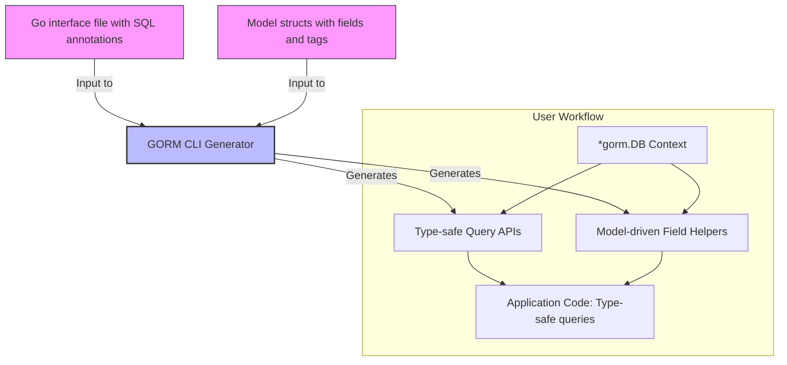

# Key Features at a Glance

Unlock the power of compile-time safety and fluent database interactions with GORM CLI’s robust feature set. This page distills GORM CLI’s core capabilities into clear, actionable benefits that empower Go developers to write clean, efficient, and type-safe data access code with confidence.

---

## What You Can Accomplish with GORM CLI

GORM CLI transforms your Go codebase by generating two complementary tools from your source interfaces and models:

- **Type-safe query APIs:** From Go interfaces annotated with SQL templates, GORM CLI produces query methods that are fully type-checked at compile time — eliminating runtime errors and enhancing developer productivity.
- **Model-driven field helpers:** Leveraging your model structs, the generator creates a rich set of strongly typed helpers for filters, updates, and associations — making code more expressive and minimizing raw SQL injection.
- **Advanced association operations:** Perform complex relational data modifications including creating, updating, unlinking, deleting, and batch operations — all with compile-time safety.

This arsenal simplifies common database tasks and elevates data layer integrity throughout your Go projects.

---

## Dive Into the Core Capabilities

### 1. Interface-Driven, Type-Safe Query APIs

GORM CLI uses annotated Go interfaces with embedded SQL templates to generate concrete query methods. For example:

```go
// Interface with SQL template annotation
// SELECT * FROM @@table WHERE id=@id
GetByID(id int) (T, error)
```

This interface yields a method like:

```go
user, err := generated.Query[User](db).GetByID(ctx, 123)
```

**Benefits:**
- Compile-time verification of query parameters and return types
- Autogenerated method bodies enforce consistent, safe SQL
- Reduced boilerplate and human error in query construction

---

### 2. Model-Driven Field Helpers

From your Go model structs, GORM CLI generates strongly typed field helpers to build queries dynamically:

```go
// Example model
 type User struct {
   ID   uint
   Name string
   Age  int
 }

// Generated field helpers
generated.User.ID.Eq(1)           // id = 1
generated.User.Name.Like("%jinzhu%")  // name LIKE '%jinzhu%'
generated.User.Age.Between(18, 65) // age BETWEEN 18 AND 65
```

These helpers enable clear, fluent query building:

```go
db.Where(generated.User.Age.Gt(18)).Find(ctx)
```

**Benefits:**
- Intuitive API for filters, updates, and ordering
- Prevents common SQL injection or typo errors
- Supports zero values and complex expressions seamlessly

---

### 3. Association Operations with Compile-Time Safety

Handle complex relationships between models with easy helper methods:

- **Create & CreateInBatch:** Insert new associated rows and link them in a single fluent call
- **Update:** Update associated records with filtering conditions
- **Unlink:** Detach associations safely without deleting data
- **Delete:** Remove associated records or join rows when necessary

Example of creating a user with a pet:

```go
gorm.G[User](db).
  Set(
    generated.User.Name.Set("alice"),
    generated.User.Pets.Create(generated.Pet.Name.Set("fido")),
  ).
  Create(ctx)
```

**Benefits:**
- Enforces FK integrity and association semantics
- Simplifies common relational operations
- Avoids error-prone manual join or FK management

---

### How These Features Streamline Your Workflow

**Before GORM CLI:** Writing data access code requires manually crafting SQL or repetitive boilerplate with risks of subtle bugs.

**With GORM CLI:** Your interfaces and models drive rich, type-safe generated APIs. This reduces errors, enhances discoverability, and accelerates development.

**Outcome:** Faster, safer development cycles with clear, maintainable data interaction code.

---

## Practical Examples to Illustrate Value

### Query By ID

```go
user, err := generated.Query[User](db).GetByID(ctx, 123)
```
Safe, simple, and expressive — no manual SQL strings.

### Filter With Field Helpers

```go
users, err := gorm.G[User](db).Where(
  generated.User.Name.Like("%alice%"),
  generated.User.Age.Gt(18),
).Find(ctx)
```
Readable, type-checked, and composable predicates.

### Manage Associations

```go
gorm.G[User](db).
  Set(
    generated.User.Name.Set("bob"),
    generated.User.Pets.CreateInBatch([]models.Pet{{Name: "rex"}, {Name: "bella"}}),
  ).
  Create(ctx)
```
One call to create a user and batch link multiple pets.

---

## Getting Started Preview

- Define your query interfaces using SQL templates.
- Model your structs with relevant tags for field helper generation.
- Run `gorm gen -i ./path_to_code -o ./generated` to generate typesafe APIs.

Ready to experience the full power of GORM CLI? Explore the [Getting Started Guide](../getting-started/) to write your first query interface, generate code, and integrate into your Go project.

---

<Tip>
Use clear interface method comments with SQL templates to unlock automatic generation of precise query methods.
</Tip>

<Warning>
Make sure to import your model packages appropriately and keep your struct definitions consistent to ensure accurate helper generation.
</Warning>

---

## Summary

| Feature                       | Description                                                  | User Benefit                           |
|------------------------------|--------------------------------------------------------------|--------------------------------------|
| Type-safe Query APIs          | Generate compile-time verified query methods from interfaces | Reduce runtime errors, improve code quality |
| Model-driven Field Helpers    | Create strongly typed predicates and setters from structs   | Fluent, readable query building      |
| Advanced Association Handling | Create, update, unlink, delete associations safely            | Simplify complex relational data manipulations |

Harness these features to make your Go applications' data layers safer, cleaner, and far easier to maintain.

---

## Related Documentation

- [What is GORM CLI?](./what-is-gorm-cli) — Understand the broader product vision and use cases.
- [Getting Started: Generate Your First Query API](../../guides/core-workflows/getting-started) — Step-by-step code generation walkthrough.
- [Model-Driven Field Helpers: Filters, Updates & Associations](../../guides/core-workflows/field-helper-basics) — Deep dive into generated field helpers.
- [Template-Based Queries: From Interface to Custom SQL](../../guides/advanced-patterns/template-sql-workflows) — Learn SQL template DSL usage.

---

This page provides a compact yet comprehensive overview of what GORM CLI offers and why these features matter for your development journey.

Make the switch to safer, smarter database coding today.

---

## Visual Overview of Code Generation Flow



This diagram illustrates how your Go code forms the input that the GORM CLI generator processes to produce query APIs and field helpers that you consume directly in your application logic.

---