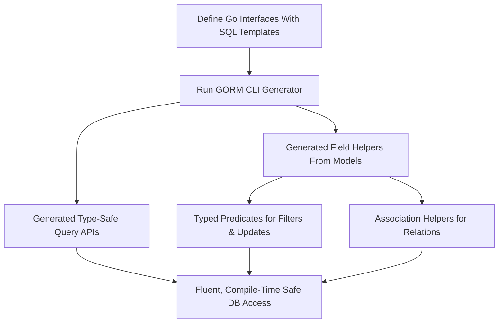

# Feature Highlights

Discover the powerful features that make GORM CLI an indispensable tool for Go developers working with GORM. This page offers a concise overview of the core capabilities that enable type-safe, efficient database operations through code generation. Whether you’re just starting out or reviewing what GORM CLI can do for you, this snapshot equips you with the fundamental benefits and functionalities.

---

## Unlock Type-Safe Query APIs

GORM CLI empowers you to write raw SQL queries as Go interfaces, embedding SQL templates directly into comments. The generator then produces fully type-safe, compile-time checked query methods. This approach eliminates common runtime SQL errors by moving query validation to compile time.

- **Interface-driven:** Define your data access operations as Go interfaces with SQL templates.
- **Type-safe:** Benefit from Go’s generic support and strong typing for query parameters and results.
- **Fluent API:** The generated code provides intuitive, discoverable methods that feel natural in your Go codebase.

### Example

```go
// Define a generic query interface with embedded SQL
 type Query[T any] interface {
   // SELECT * FROM @@table WHERE id=@id
   GetByID(id int) (T, error)
 }

// Usage
user, err := generated.Query[User](db).GetByID(ctx, 123)
```

---

## Model-Driven Field Helpers

GORM CLI generates field helpers from your model structs, giving you typed helpers for filtering, updating, ordering, and working with associations.

- **Strongly typed fields:** Avoid error-prone string-based queries by using generated typed field helpers.
- **Comprehensive predicates:** Built-in methods for equality, range checks, null checks, and SQL expressions.
- **Zero-value updates:** Handles updates with zero or default values safely.

### Example

```go
// Filter users with age between 18 and 65
users, err := gorm.G[User](db).Where(generated.User.Age.Between(18, 65)).Find(ctx)

// Increment age by 1
gorm.G[User](db).
  Where(generated.User.Name.Eq("alice")).
  Set(generated.User.Age.Incr(1)).
  Update(ctx)
```

---

## Advanced Association Operations

Managing relationships between models is seamless and type-safe with generated association helpers. These helpers encapsulate common association patterns and operations.

- **Supports all association types:** belongs to, has one, has many, many-to-many, and polymorphic.
- **Operations include:** Create, CreateInBatch, Update, Unlink, and Delete.
- **Conditional unlink and delete:** Apply filters to target related rows before unlinking or deleting.
- **Batch operations:** Efficiently create or link multiple associated records in a single operation.

### Example

```go
// Create a user with an associated pet
gorm.G[User](db).
  Set(
    generated.User.Name.Set("alice"),
    generated.User.Pets.Create(generated.Pet.Name.Set("fido")),
  ).
  Create(ctx)

// Unlink pets named "fido" from user with ID 1
gorm.G[User](db).
  Where(generated.User.ID.Eq(1)).
  Set(generated.User.Pets.Where(generated.Pet.Name.Eq("fido")).Unlink()).
  Update(ctx)
```

---

## Highly Configurable Generation

GORM CLI supports customization via package-level `genconfig.Config` declarations, allowing you to tailor generated code to fit your application's needs.

- **OutPath control:** Direct generated files to custom output directories.
- **Field type mapping:** Map Go types (native or wrapper types) to specific field helper types (e.g., JSON fields, time types).
- **Include/exclude interfaces and structs:** Use pattern-based or literal specifications to control what gets generated.
- **File-level configuration:** Support localized configuration for specific files or packages.

### Example

```go
var _ = genconfig.Config{
  OutPath: "examples/output",
  FieldTypeMap: map[any]any{
    sql.NullTime{}: field.Time{},
  },
  FieldNameMap: map[string]any{
    "json": JSON{},
  },
  IncludeInterfaces: []any{"Query*"},
  ExcludeInterfaces: []any{"*Deprecated*"},
  IncludeStructs: []any{"User", "Account*"},
}
```

---

## Template-Based Query DSL

Write powerful, dynamic SQL queries with embedded template directives inside your interface method comments. These templates map Go variables to SQL parameters with safety and expressiveness.

- **Placeholders:** `@@table` and `@@column` resolve dynamically to model table and column names.
- **Parameter binding:** Use `@param` syntax to bind Go method parameters safely.
- **Conditional clauses:** `{{where}}` and `{{set}}` directives allow conditional SQL fragments.
- **Loops and conditionals:** Use `{{if}}` and `{{for}}` control structures inside SQL templates.

### Example

```go
// SELECT * FROM @@table
// {{where}}
//   {{if user.Name != ""}} name=@user.Name {{end}}
//   {{if user.Age > 0}} AND age=@user.Age {{end}}
// {{end}}
QueryWith(user User) (T, error)
```

---

## Why Feature Highlights Matter

This page serves as your go-to quick reference for understanding what GORM CLI brings to your development workflow. It captures the essence of how code generation translates to safer, faster, and more maintainable database access code for Go projects using GORM.

Use this overview to orient yourself before diving deeper into the specifics, or as a refresher when planning your adoption strategy.

---

## Next Steps

Ready to get hands-on? Proceed to the [Installation](https://gorm.io/docs/cli/installation) and [Getting Started](https://gorm.io/docs/cli/quickstart) guides for step-by-step instructions that bridge feature knowledge to practical implementation.

For an in-depth understanding of each feature, explore the related guides:

- [Working with Field Helpers and Predicates](https://gorm.io/docs/cli/field-helpers)
- [Managing Associations in Depth](https://gorm.io/docs/cli/associations)
- [Template-Based Queries](https://gorm.io/docs/cli/template-dsl)
- [Customizing Generation with genconfig](https://gorm.io/docs/cli/genconfig)


<Callout title="Tip">
To maximize your productivity, start by defining interfaces for your common queries and generate code using the `gorm gen -i ./path -o ./generated` command. This foundation allows you to leverage all the features highlighted here with confidence.
</Callout>

---

<AccordionGroup title="Common Pitfalls and Troubleshooting">
<Accordion title="Why is my generated code missing some interfaces or structs?">
Ensure your `genconfig.Config` include/exclude patterns match the interface and struct names correctly. Remember that Include filters take priority.
</Accordion>
<Accordion title="My custom SQL template DSL syntax isn’t generating code as expected">
Double-check your SQL template comments for correct directives such as `@@table`, `@param` bindings, and balanced `{{where}}`/`{{end}}` blocks to conform with GORM CLI’s DSL syntax.
</Accordion>
<Accordion title="Handling associations behaves unexpectedly in updates or creates">
Review your model definitions and generated association helpers carefully. Pay close attention to whether you use `Unlink()` versus `Delete()` and verify association types (belongs to, has many, etc.) match your use.
</Accordion>
</AccordionGroup>


---

## Summary Diagram of Core Features

