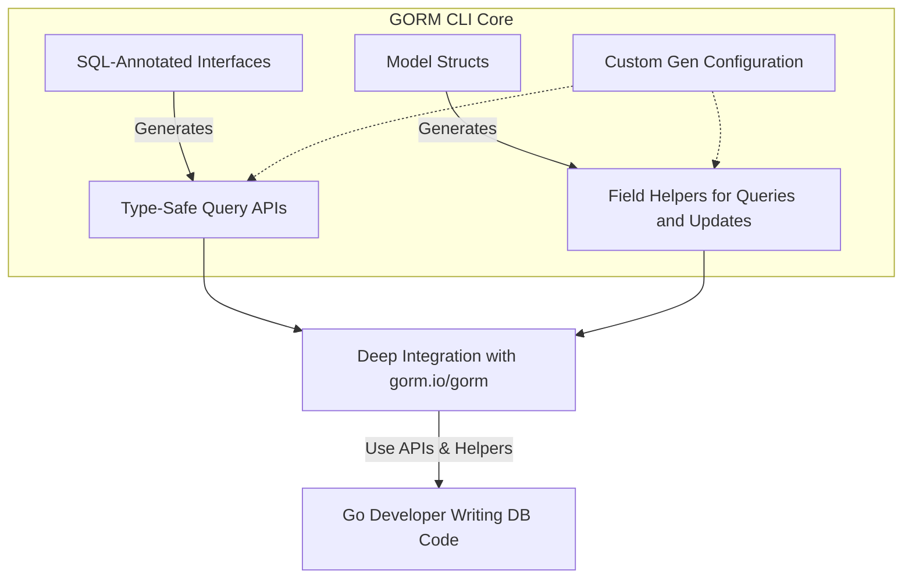

# Feature Highlights at a Glance

Get an at-a-glance rundown of GORM CLI's most compelling features that streamline Go database development by generating type-safe query APIs and powerful field helpers. This page provides a succinct overview of what makes GORM CLI unique and the core capabilities that will transform how you work with GORM.

---

## Unlock Type-Safe Query APIs from Interfaces

GORM CLI converts your Go interfaces—annotated with clear SQL templates—into fluent, compile-time safe query APIs. This empowers you to write queries in a natural, code-driven way, eliminating runtime errors and boosting maintainability.

### What You Gain
- Seamless translation of your SQL-annotated interface methods into ready-to-use query implementations.
- Safety and discoverability with fully typed methods that map directly to your database models.
- Auto-injected context support for easy integration with Go's context-aware programming.

### Real-world Example
```go
// Interface with SQL templates
 type Query[T any] interface {
   // SELECT * FROM @@table WHERE id=@id
   GetByID(id int) (T, error)
   
   // Dynamic column filtering
   FilterWithColumn(column string, value string) (T, error)
 }
```

After generation, call `generated.Query[User](db).GetByID(ctx, 123)` to execute your queries with confidence.

---

## Model-Driven Field Helpers: Fluent Query & Update Building

From your model structs, GORM CLI generates a rich set of field helpers supporting filters, updates, ordering, and association handling. These helpers transform verbose or error-prone raw SQL into expressive, type-safe Go code.

### Highlights
- Helpers for common types: ints, strings, time.Time, nullable types, and custom mappings.
- Support for conditional predicates like `.Eq()`, `.Like()`, `.Between()`, `.IsNull()`.
- Update expressions for incrementing, setting values, and advanced SQL expressions.

### Example
```go
// Filter users whose age is between 18 and 65
 users, err := gorm.G[User](db).
   Where(generated.User.Age.Between(18, 65)).
   Find(ctx)

// Update user name and mark adult status
 err := gorm.G[User](db).
   Set(
     generated.User.Name.Set("alice"),
     generated.User.IsAdult.Set(true),
   ).
   Where(generated.User.ID.Eq(1)).
   Update(ctx)
```

---

## Comprehensive Association Operations

GORM CLI uniquely supports all common association types such as has-one, has-many, belongs-to, and many-to-many with a fully typed API to create, update, unlink, and delete associations—boosting productivity and reducing complexity.

### Supported Operations
- **Create**: Add and link related entities in one step.
- **Update**: Modify associated records conditionally.
- **Unlink**: Remove relationship links safely without deleting records.
- **Delete**: Remove associated records or join rows.
- **Batch Create**: Efficiently create or link many related entities.

### Example
```go
// Create a user with one pet
 gorm.G[User](db).
   Set(
     generated.User.Name.Set("alice"),
     generated.User.Pets.Create(generated.Pet.Name.Set("fido")),
   ).
   Create(ctx)

// Unlink all pets from a user
 gorm.G[User](db).
   Where(generated.User.ID.Eq(1)).
   Set(generated.User.Pets.Unlink()).
   Update(ctx)
```

---

## Flexible Generation with Custom Configurations

Tailor code generation with package-level config structs (`genconfig.Config`) to customize output paths, include or exclude types, map Go types to field helpers, or implement custom field helpers.

### Configurable Options
- Output directory (`OutPath`) for generated code.
- Inclusion/exclusion lists for interfaces and structs.
- Type mapping for SQL nullable, timestamp, or even JSON custom fields.

### Example Config
```go
var _ = genconfig.Config{
  OutPath: "examples/output",
  FieldTypeMap: map[any]any{
    sql.NullTime{}: field.Time{},
  },
  FieldNameMap: map[string]any{
    "json": JSON{},
  },
}
```

This empowers teams to keep generation tightly aligned with project conventions.

---

## Deep Integration with GORM Ecosystem

Every generated artifact blends naturally with `gorm.io/gorm`, ensuring that your generated queries and field helpers can be composed, chained, and executed just like native GORM operations.

### Benefits
- Leverage existing GORM database connections and context management.
- Compose custom queries with type-safe, fluent APIs using generated code.
- No disruption to existing GORM-based workflows; instead, direct productivity boost.

### Quick Usage
```go
// Find user by ID using generated API
 user, err := generated.Query[User](db).GetByID(ctx, 123)

// Query users filtered with generated field helpers
 users, err := gorm.G[User](db).
     Where(generated.User.Role.Eq("admin")).
     Find(ctx)
```

---

## Why This Matters To You

Switching to GORM CLI means safer, cleaner, and more maintainable database access code:
- **Type safety** prevents subtle bugs and runtime errors.
- **Fluent APIs** reduce boilerplate and improve readability.
- **Association operations** reduce complexity and increase productivity.
- **Customization** keeps the tool flexible for all projects.

Whether you're building new APIs or evolving legacy data access layers, GORM CLI helps you achieve better outcomes faster.

---

## Next Steps
- Explore [Your First Code Generation: From Models to APIs](../../guides/getting-started-workflows/first-generation) to see how to build your initial interfaces.
- Dive into [Field Helpers: Filtering, Updates, and Expressions](../../guides/getting-started-workflows/field-helpers-basics) to master query expressions.
- See [Managing Associations: Best Practices & Scenarios](../../guides/advanced-patterns-integration/associations-in-depth) for handling related data effectively.


---

## Additional Resources
- [What is GORM CLI?](./what-is-gorm-cli) - comprehensive intro to the tool.
- [Who Should Use GORM CLI?](./target-audience-use-cases) - identify if this fits your project.
- Official GitHub Repository: [https://github.com/go-gorm/cli](https://github.com/go-gorm/cli)

---

## Summary Diagram



Harness GORM CLI to unlock safe, clear, and productive data access workflows for your Go projects.


<Check>
GORM CLI Feature Highlights include type-safe query generation, model-driven field helpers, robust association support, flexible configurations, and seamless GORM integration, delivering maximum developer productivity.
</Check>
