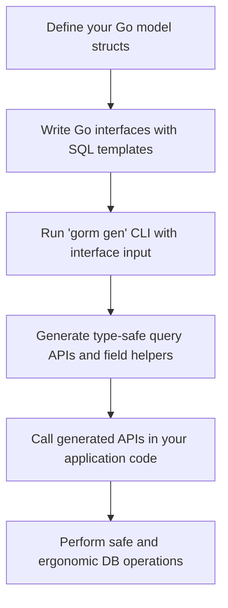

# What is GORM CLI?

## Unlock Type-Safe, Ergonomic, and Scalable Database Operations in Go

GORM CLI is a powerful code generation tool designed specifically for Go developers working with the GORM ORM. It automatically generates **type-safe query interfaces** and **model-driven field helpers** from your Go interfaces and model structs, transforming raw SQL templates and model definitions into fluent, compile-time checked APIs.

This means you spend less time writing boilerplate database code and more time focused on business logic — all while preventing common runtime errors through static type safety.

---

## The Problem GORM CLI Solves

Writing database queries in Go, especially when using GORM, often requires balancing between raw SQL, dynamically built queries, and idiomatic ORM usage. Managing these can quickly lead to:

- Fragile SQL strings vulnerable to runtime errors
- Lack of discoverability or autocomplete for query conditions
- Tedious boilerplate code for filtering, updating, or associating related models
- Unsafe manual type conversions and error-prone query construction

GORM CLI solves these challenges by **generating interfaces based on your SQL templates and strongly typed helpers from your models**, providing a streamlined, safe, and ergonomic experience.

---

## What GORM CLI Is and How It Works

At its core, GORM CLI:

- Takes **Go interface files** annotated with **SQL templates** describing your queries and mutations.
- Parses your **model structs** to produce **field helpers** that represent columns and associations in a type-safe manner.
- Generates **concrete implementations** of those interfaces, returning fully typed Go methods that seamlessly integrate with GORM’s API.
- Provides a **template DSL** that supports conditional clauses, dynamic parameters, and iteration inside your SQL comments.

You write your interfaces like this:

```go
// Query interface example
// SELECT * FROM @@table WHERE id=@id
GetByID(id int) (T, error)

// SELECT * FROM @@table WHERE @@column=@value
FilterWithColumn(column string, value string) (T, error)

// UPDATE @@table
// {{set}}
//    {{if user.Name != ""}} name=@user.Name, {{end}}
//    {{if user.Age > 0}} age=@user.Age, {{end}}
// {{end}}
// WHERE id=@id
UpdateInfo(user User, id int) error
```

Run the CLI tool with these interfaces as input, and GORM CLI generates the corresponding Go code with type-safe query methods.

---

## Distinctive Features That Set GORM CLI Apart

- **Compile-Time Type Safety:** Avoid common runtime failures by generating code that matches the exact signatures and field types of your models.
- **SQL Template DSL:** Write flexible, conditional SQL logic inside method comments using special directives for tables, columns, parameters, and logical clauses.
- **Field Helper Generation:** Automatically generate helpers for every model field including complex associations, enabling fluent and discoverable predicate and setter methods.
- **Seamless GORM Integration:** Generated code works hand-in-hand with your existing GORM DB instances without friction.
- **Configurable Generation:** Customize output directories, which interfaces and structs to include or exclude, and how types map to helper fields using declarative configs.

---

## How It Fits in Your Development Workflow

1. **Define Your Models and Query Interfaces** 
   - Design your Go structs for entities
   - Write Go interfaces with SQL-in-comments describing queries and updates

2. **Run GORM CLI**
   - Use the CLI to generate implementation code + helpers

3. **Use Generated APIs in Your Application**
   - Call fully typed query methods
   - Use field helpers with fluent predicates and update setters

4. **Gain Confidence and Productivity**
   - Type errors surface at compile time
   - Discover database fields and query methods through IDE autocomplete
   - Avoid tedious boilerplate and repetitive patterns

---

## Real-World Example: Query Interface Using GORM CLI

```go
// Define a generic query interface in your package
package examples

type Query[T any] interface {
  // SELECT * FROM @@table WHERE id=@id
  GetByID(id int) (T, error)

  // SELECT * FROM @@table WHERE @@column=@value
  FilterWithColumn(column string, value string) (T, error)

  // Conditional UPDATE example
  // UPDATE @@table
  // {{set}}
  //   {{if user.Name != ""}} name=@user.Name, {{end}}
  //   {{if user.Age > 0}} age=@user.Age, {{end}}
  // {{end}}
  // WHERE id=@id
  UpdateInfo(user User, id int) error
}
```

From this interface, GORM CLI generates strong-typed implementations that let you call:

```go
query := generated.Query[User](db)
user, err := query.GetByID(ctx, 123)
err = query.UpdateInfo(ctx, User{Name: "Alice", Age: 30}, 123)
```

This eliminates manual SQL string building and manual scanning, providing a cleaner, safer development experience.

---

## Summary

GORM CLI empowers Go developers to elevate their GORM-based data access with:

- Type-safe, discoverable query APIs generated from SQL-annotated Go interfaces
- Model-driven, fluent field helpers enabling expressive predicates and updates
- Integration leveraging GORM’s context and chaining paradigm
- Configurable, maintainable, and scalable generated code

By automating redundant boilerplate and enforcing compile-time correctness, GORM CLI accelerates development velocity while reducing bugs in database interactions.

---

For detailed guides on getting started, configuration, and advanced usage patterns, explore the rest of the documentation under the **Overview** and **Getting Started** sections.


---

> **Next Steps:**
> - Visit [Key Benefits and Use Cases](./key-benefits-and-use-cases) to understand how GORM CLI can unlock your productivity.
> - Explore [Who Should Use GORM CLI?](./who-should-use-it) to see if this tool fits your team.
> - Begin with [Quickstart: Your First Workflow](../../getting-started/project-configuration-run/quickstart-overview) to generate your first type-safe APIs.


---

## Related Resources

- [GORM CLI GitHub Repository](https://github.com/go-gorm/cli)
- [Official GORM Documentation](https://gorm.io)
- CLI Command Reference: `gorm gen -h`

---

## Diagram: High-Level Flow of GORM CLI Code Generation



This streamlined flow shows how GORM CLI fits into your development lifecycle.
