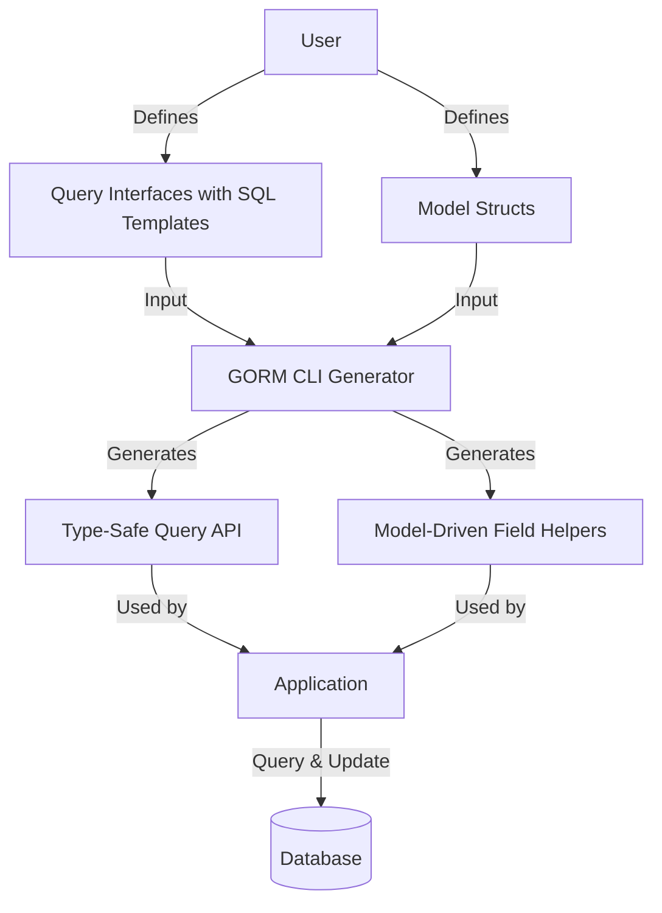

# What is GORM CLI?

## Unlock Compile-Time Safety and Fluent APIs for Your GORM Projects

GORM CLI revolutionizes how you interact with your database in Go projects that use GORM. It automatically generates **interface-driven, type-safe query APIs** along with **model-driven field helpers**. This powerful duo elevates your codebase by ensuring queries and updates are checked at compile time — removing guesswork and runtime errors — while providing a fluent, discoverable API for data operations.

### Why GORM CLI Matters

- **Compile-Time Safety:** Prevent runtime SQL errors through generated, type-safe Go interfaces.
- **Fluent Query & Update APIs:** Write expressive, chainable code for complex queries and mutations.
- **Model-Driven Field Helpers:** Use strongly typed helpers tailored to your models for building filters and updates.
- **Productivity Boost:** Write less error-prone boilerplate and focus on your business logic.

### Who Should Use This Page

This introduction is for Go developers working with GORM who want to enhance their productivity and code quality by leveraging automated code generation for safe, fluent database access.

---

## What Is GORM CLI?

GORM CLI is a command-line tool designed to **generate code that complements your GORM models and interfaces**. Specifically, it creates:

- **Type-safe query APIs:** Based on your Go interfaces annotated with SQL templates, it generates concrete implementations that ensure consistent, type-checked data access.
- **Field helpers:** Generated from your model structs, these helpers encapsulate column operations like filtering, updating, and association management.

By doing this, GORM CLI helps you avoid the pitfalls of hand-written SQL or unsafe query building, enabling safer and more maintainable database interaction.

### Core Mission

The tool's mission is to **turn interface definitions and model schemas into reliable Go code with minimal manual effort.** It solves the problem of fragile and verbose raw SQL usage by:

- Parsing SQL templates embedded in interface method comments
- Ensuring parameters and return types align strictly with method signatures
- Creating helpers that map directly to model fields and their associations

### What Makes GORM CLI Unique?

- **Interface-driven generation:** You define query contracts via familiar Go interfaces; GORM CLI fills in the implementation.
- **Template-based SQL with placeholders:** Supports dynamic, conditional, and batch operations with a tailored templating DSL.
- **Type-safe & fluent:** Returned APIs integrate seamlessly with GORM's `*gorm.DB` and produce compile-time errors on misuse.

---

## Key Features & Capabilities

### 1. Generate Concrete Query Implementations from Interfaces

Define Go interfaces with SQL templates in comments, such as:

```go
// SELECT * FROM @@table WHERE id=@id
GetByID(id int) (T, error)
```

GORM CLI generates methods that accept a `context.Context`, bind parameters safely, and return typed results, eliminating runtime errors related to parameter mismatches or SQL injection risks.

### 2. Model-Driven Field Helpers

From your Go struct models, it generates strongly typed helpers for each field. For example:

```go
generated.User.Name.Eq("jinzhu")    // generates: name = "jinzhu"
```

These helpers support predicates (`Eq`, `Like`, `Between`), setters (`Set`, `SetExpr`), and updates, all with type safety.

### 3. Fluent Association Management

Supports complex operations on associations like has-one, has-many, belongs-to, and many-to-many. You can:

- Create and link related records
- Update associations with fluent chaining
- Unlink or delete associations conditionally
- Batch-create links efficiently

### 4. Customizable via Generation Configuration

Use the `genconfig.Config` struct to customize output paths, include/exclude interfaces or structs, and map custom Go types to specific field helpers.

Key configuration example:

```go
var _ = genconfig.Config{
  OutPath: "examples/output",
  FieldTypeMap: map[any]any{
    sql.NullTime{}: field.Time{},
  },
  IncludeInterfaces: []any{"Query*"},
}
```

### 5. Template DSL for Dynamic SQL

Write expressive SQL templates with support for:

- Placeholder substitution (`@@table`, `@param`)
- Conditional clauses (`{{if}}`, `{{where}}`, `{{set}}`)
- Iteration (`{{for}}` loops)

This empowers complex query generation with clean, maintainable SQL embedded inside your Go code.

---

## Why Should I Care?

### Real Benefits

- **Eliminate runtime query errors:** Your queries are type-checked and verified before you run the app.
- **Accelerate development:** Cut down on tedious, error-prone manual SQL and boilerplate.
- **Improve maintainability:** Changes to interfaces or models propagate reliably to your data access layer.
- **Increase discoverability & readability:** Fluent generated code guides you with clear method names and patterns.

### Common Use Cases

- Building robust CRUD query APIs following type-safe contracts.
- Generating scalable filters, sorts, and updates on complex models.
- Managing associations cleanly within transactional workflows.
- Integrating custom types with tailored field helpers for JSON, time, or nullable fields.

### Experience Before vs After

**Before:** Manually writing hand-crafted SQL strings prone to syntax errors, injection risks, and awkward integration with Go types.

**After:** Define interfaces with intuitive SQL templates and models with tags; generate complete, safe APIs that seamlessly integrate with your Go application.

---

## Getting Started Preview

### Quick Start

1. Define interfaces with query methods and SQL templates.
2. Organize your models in the same package or directory.
3. Run `gorm gen` CLI command to generate typed query APIs and field helpers.
4. Use generated packages directly in your application for robust, readable database access.

Example command:

```bash
gorm gen -i ./examples -o ./generated
```

### Prerequisites

- Go 1.18+ (to support generics)
- Basic familiarity with GORM models and querying concepts
- Writing SQL inside Go interface method comments using the supported template DSL

### Next Steps

Dive into:

- [Writing Interfaces & Models](../getting-started/first-run-generation/configuration-basics)
- [Generating Code](../getting-started/first-run-generation/generating-code)
- [Using Generated APIs](../getting-started/first-run-generation/first-usage)

---

Feel the difference when your database code shifts from fragile scripts to confident, fluent, and type-safe Go interfaces powered by GORM CLI.

---

## Further Reading & References
- [GORM CLI GitHub Repository](https://github.com/go-gorm/cli)
- [Template DSL Syntax](../concepts/data-models-config/template-dsl)
- [Generation Configuration Patterns](../concepts/data-models-config/generation-config)
- [Association Operations Guide](../guides/core-workflows/association-operations)


---

## Code Example Snippet

```go
// Interface with SQL template
// SELECT * FROM @@table WHERE id=@id
GetByID(id int) (T, error)

// Usage after generation
user, err := generated.Query[User](db).GetByID(ctx, 123)
```


---

## Summary Diagram of Core Workflow


