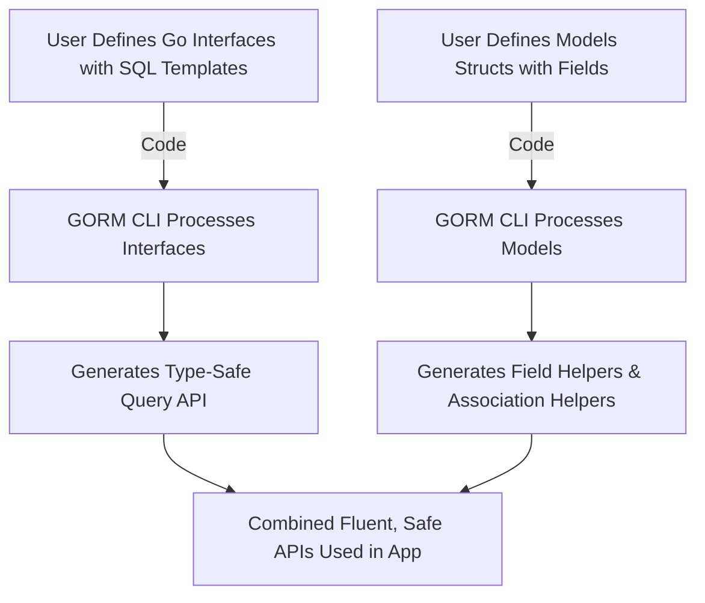

# Core Features Overview

Welcome to the Core Features Overview of GORM CLI. This page offers you a clear, concise look at the indispensable capabilities that make GORM CLI an essential tool for Go developers working with GORM. You will understand how it transforms your database interaction by generating type-safe, interface-driven query APIs, model-based field helpers, and robust association operations — all designed to enhance your productivity and code safety.

---

## What You Will Discover Here

- How GORM CLI generates interface-driven query APIs that are type-safe and reduce runtime errors.
- The role of model-driven field helpers to simplify filtering, querying, and working with associations.
- The power and convenience of association operations for real-world relations management.

---

## Interface-Driven Query APIs

### What They Are
GORM CLI generates concrete implementations of your Go interfaces that contain SQL templates in their documentation comments. These generated APIs are:

- **Type-safe**: They ensure correct data types at compile time, reducing bugs related to mismatched query parameters.
- **Intuitive**: They let you call queries as Go methods, improving readability and maintainability.

### How This Helps You
When you define methods in interfaces with SQL-like comments, GORM CLI reads and transforms them into fully implemented APIs. Instead of writing boilerplate SQL or manually handling query results, you get fluent, strongly typed methods like `GetByID` or `FilterWithColumn` that match your business logic.

<CodeGroup>
```go
// Example interface with SQL template methods
type Query[T any] interface {
  // SELECT * FROM @@table WHERE id=@id
  GetByID(id int) (T, error)

  // SELECT * FROM @@table WHERE @@column=@value
  FilterWithColumn(column string, value string) (T, error)
}
```
</CodeGroup>

### Real Scenario
Imagine you want to fetch a user by ID. Simply call:

```go
user, err := generated.Query[User](db).GetByID(ctx, 123)
```

This smooths out data access without manually writing SQL that might be error-prone.

---

## Model-Driven Field Helpers

### What They Are
From your Go model structs, GORM CLI generates strongly typed field helpers. These helpers let you write readable, maintainable predicates and setters without manually constructing query clauses.

### Key Benefits
- **Discoverability**: Generated fields like `generated.User.Age` provide autocomplete-friendly APIs.
- **Expressiveness**: Use methods like `.Eq()`, `.Like()`, `.Between()`, `.IsNull()`, and `.Set()` to express filtering and updates clearly.
- **Safety**: Compile-time checks catch type mismatches early.

### Example
```go
gorm.G[User](db).
  Where(generated.User.Age.Gt(18)).
  Find(ctx)
```
This query fetches all users older than 18 with a clear, readable expression.

---

## Powerful Association Operations

### The Challenge
Managing database relationships — like creating, updating, linking, or deleting related records — can be complex, error-prone, and verbose.

### What GORM CLI Brings
It generates association helpers like `field.Struct[T]` or `field.Slice[T]` for your model associations such as `has one`, `has many`, `belongs to`, or `many2many`. These helpers enable:

- **Create**: Create a related row and link it automatically.
- **Update**: Update related records with type safety and conditional filters.
- **Unlink**: Remove links without deleting data.
- **Delete**: Remove related records or join table entries.
- **Batch Operations**: Efficiently create/link multiple related rows at once.

### Real-World Usage
```go
// Create a user and a pet linked together
gorm.G[User](db).
  Set(
    generated.User.Name.Set("alice"),
    generated.User.Pets.Create(generated.Pet.Name.Set("fido")),
  ).
  Create(ctx)
```

This simplifies what would otherwise be multiple manual SQL operations into a concise, safe workflow.

---

## Summary of Benefits

- **Boosts Productivity**: Automated code generation eliminates repetitive boilerplate.
- **Enhances Safety**: Compile-time type checking prevents runtime SQL errors.
- **Improves Readability**: Code reads like your application logic, not SQL strings.
- **Supports Complex Relations**: Advanced association helpers handle relational complexities elegantly.

---

## Practical Tips

- Document your interfaces clearly with SQL comment templates to maximize the generator's power.
- Use model tags (like `gen:"json"`) and configuration to customize field helper behavior.
- Familiarize yourself with association operation semantics to manage linked records confidently.

---

## What’s Next?

- Head over to [Preparing Your Models and Interfaces](/getting-started/first-run-basic-usage/prepare-code) to learn how to set up your code for generation.
- Run the generator following the guide in [Running the Generator](/getting-started/first-run-basic-usage/run-generator).
- Explore [Using Model-Driven Field Helpers](/guides/core-workflows/using-model-field-helpers) for detailed examples of fluent queries.


---

Need a quick visual? Here’s a simplified diagram showing how GORM CLI’s code generation workflow leverages interface and model definitions:



---

Feel empowered to dive deeper into each feature. GORM CLI is designed to save you time and help you write safer, cleaner database code efficiently.

Explore more in the navigation panel or jump into hands-on guides to master the tool's full potential.

---

*This overview is part of the essential product documentation. For foundational understanding, see [What is GORM CLI?](/overview/product-introduction/what-is-gorm-cli) and to understand who benefits most, refer to [Target Audience & Use Cases](/overview/product-introduction/target-audience-use-cases).*
