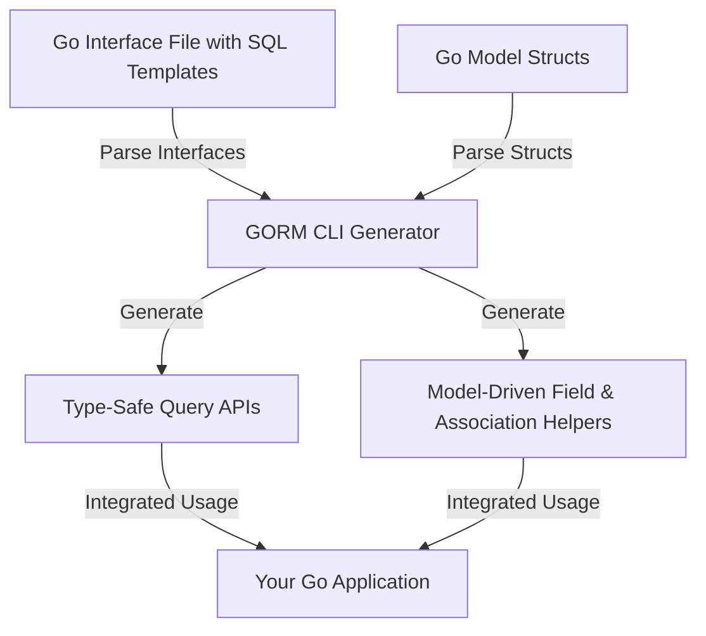

# Feature Overview

Discover the powerful core capabilities of GORM CLI that transform your Go project interactions with databases into type-safe, fluent, and maintainable workflows. This page presents a benefit-driven summary of the essential features — from query API generation to advanced field and association helpers — helping you understand how GORM CLI enables more productive, error-resistant development.

---

## Unlock Type-Safe Query APIs From Go Interfaces

GORM CLI automates the generation of robust, type-safe query APIs from your Go interface definitions containing SQL templates. Instead of hand-writing database methods, you define interfaces with annotated SQL in comments, and GORM CLI creates fluent, compile-time checked implementations.

- **Safety First:** Prevent runtime SQL errors by catching mistakes during compilation.
- **Fluency:** Work with natural Go methods instead of raw SQL strings.
- **Flexibility:** Support complex queries including conditional logic and dynamic parameters via templated SQL.

**Example:**

```go
// Define Query Interface
// SELECT * FROM @@table WHERE id=@id
GetByID(id int) (T, error)

// Usage
user, err := generated.Query[User](db).GetByID(ctx, 123)
```

This replaces error-prone raw queries with clear, typed methods tailored to your domain.

---

## Model-Driven Field Helpers: Filters, Updates, and Associations

GORM CLI generates expressive field helpers derived from your model structs, enabling:

- **Typed Filters:** Create predicates based on fields with intuitive operators—e.g., `.Eq()`, `.Like()`, `.Between()`.
- **Safe Updates and Sets:** Use `.Set()`, `.Incr()` and `.SetExpr()` to build update expressions safely.
- **Association Handling:** Manage related entities with helpers for `has one`, `has many`, `belongs to`, and `many2many` relationships.

**Concrete Benefits:**

- Avoid magic strings by working with generated constants.
- Leverage autocomplete and type checking in your IDE.
- Eliminate boilerplate code writing.

**Example:**

```go
gorm.G[User](db).
  Where(generated.User.Name.Eq("alice"), generated.User.Age.Between(18, 30)).
  Update(ctx)
```

---

## Comprehensive Association Operations

GORM CLI natively supports complex association workflows with compile-time safety:

- `Create` and `CreateInBatch`: Insert and link related entities.
- `Update`: Modify associated records according to filters.
- `Unlink`: Remove foreign key links or join table entries without deletion.
- `Delete`: Remove associated child or join records.

Fine-grained control is possible using conditional filters on association helpers, enabling powerful, precise data manipulations in a fluent and safe style.

**Example:**

```go
gorm.G[User](db).
  Where(generated.User.ID.Eq(1)).
  Set(
    generated.User.Pets.Where(generated.Pet.Name.Eq("fido")).Update(generated.Pet.Name.Set("rex")),
  ).
  Update(ctx)
```

---

## Configurability Through `genconfig.Config`

Customize and extend generation behavior via package-level configurations:

- **Output Path:** Control where generated files are placed.
- **Selective Inclusion/Exclusion:** Whitelist or blacklist interfaces and structs by pattern or type.
- **Custom Field Mappings:** Override field helper types for Go types or annotated fields.
- **File-Level Control:** Choose whether to apply config globally or per file.

**Example of selective generation:**

```go
var _ = genconfig.Config{
  IncludeInterfaces: []any{"Query*"},
  FieldNameMap: map[string]any{"json": JSON{}},
}
```

This empowers teams to tailor code generation to their coding standards and domain needs without modifying the generator itself.

---

## Advanced Patterns Out-of-the-Box

GORM CLI supports sophisticated use cases including:

- **JSON Field Helpers:** Generate customized SQL expressions that adapt to different database dialects.
- **Template-Based Queries:** Use a rich SQL DSL with directives like `@@table`, `@param`, `{{where}}`, and `{{set}}` allowing dynamic, conditional, and iterative query construction.

This unlocks powerful scenarios such as database-agnostic JSON querying and highly dynamic, yet safe, query methods.

**Example - JSON helper usage:**

```go
// Query JSON field condition adapted per DB
generated.User.Profile.Equal("$.vip", true)
```

**Template Query Snippet:**

```sql
SELECT * FROM @@table
{{where}}
  {{if name != ""}} name=@name {{end}}
  {{if age > 0}} AND age=@age {{end}}
{{end}}
```

---

## How These Features Work Together



Together, these generated components empower Go developers to interact with databases fluently, safely, and productively.

---

## Practical Tips

- Define interfaces with clear SQL in method comments to leverage type-safe APIs.
- Use field helpers to reduce boilerplate and avoid SQL injection risks.
- Organize associations thoughtfully to maximize association operation benefits.
- Use `genconfig.Config` for tailored generation, especially in monorepos or shared packages.
- Leverage template DSL directives for flexible and expressive query generation.

---

## Common Pitfalls to Avoid

- Omitting return error or the correct return types in interface methods will cause generation errors.
- Forgetting to add context parameters results in auto-injected but less explicit APIs.
- Overlooking interface or struct selection in config may result in generating unwanted or no code.
- Using unsupported Go types without proper field mappings in config may generate incorrect helpers.

---

## Next Steps

- Explore the [Quickstart Workflow](../quick-features/quickstart) to begin generating your first APIs.
- Review the [Configuration & Customization](../quick-features/customization-overview) guidelines to fine-tune generation.
- Dive into the [Template-based Query Generation](../../guides/generation-patterns/template-sql-gen) for mastering dynamic queries.

---

Understanding these features equips you to harness GORM CLI fully, accelerating development with confidence and clarity.

---

For more foundational context, visit:
- [What is GORM CLI?](../product-intro/what-is-gorm-cli)
- [Why Use GORM CLI?](../product-intro/why-gorm-cli)

