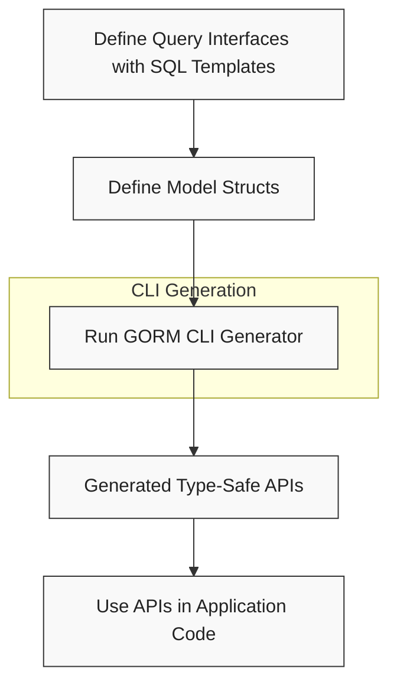

# Quick Start: From Models to Queries

Welcome to the essential first step in mastering GORM CLI! This guide walks you through the fundamental workflow—from defining your query interfaces and model structs, to running the code generator, and finally using the generated APIs seamlessly within your Go application. By the end, you’ll see the end-to-end power of GORM CLI illuminated with concise code examples and clear CLI commands.

---

## Why This Workflow Matters

GORM CLI empowers Go developers to write type-safe, fluent, and maintainable database access code by generating query APIs directly from your Go interfaces and model structs. This page demonstrates how to take your raw interface definitions and model structs and turn them into powerful, compile-time safe database query APIs with just a few simple steps.

Naturally, you want to avoid boilerplate code and runtime errors while ensuring your database operations stay intuitive and fluent. That’s precisely what this workflow delivers.

---

## Step 1: Define Your Query Interfaces and Models

Your journey begins by expressing your database queries as Go interfaces with SQL templates embedded in method comments. Simultaneously, you declare your data models as Go structs.

### Example Interface and Model
```go
// examples/query.go
package examples

type Query[T any] interface {
  // SELECT * FROM @@table WHERE id=@id
  GetByID(id int) (T, error)

  // where("name=@name AND age=@age")
  FilterByNameAndAge(name string, age int) ([]T, error)
}

// examples/models/user.go
package models

type User struct {
  ID   uint
  Name string
  Age  int
}
```

This design captures queries declaratively. Comments hold SQL templates that map parameters directly to SQL statements. Models describe your database tables’ schema.

---

## Step 2: Run the Generator CLI

From your terminal, run the `gorm` CLI tool to generate your query APIs and field helpers.

```bash
gorm gen -i ./examples -o ./generated
```

- `-i ./examples` specifies the input package or file containing your query interfaces and models.
- `-o ./generated` defines the output directory for the generated files.

This single command parses your interfaces and structs, applies configurable generation rules, and produces type-safe, well-structured code ready for use.

<Tip>
The generator automatically applies the proper package structure in the output directory, preserving relative paths from your input source.
</Tip>

---

## Step 3: Use the Generated APIs in Your Code

With your generated code in place, integrate it into your application:

```go
package main

import (
  "context"
  "gorm.io/gorm"
  "generated" // your generated package path
  "examples/models"
)

func main() {
  ctx := context.Background()
  db := connectToDB() // assume your GORM DB instance

  // Query a user by ID, safely and fluently
  user, err := generated.Query[models.User](db).GetByID(ctx, 123)
  if err != nil {
    panic(err)
  }
  fmt.Println(user.Name)

  // Filter users by name and age
  users, err := generated.Query[models.User](db).FilterByNameAndAge(ctx, "jinzhu", 25)
  if err != nil {
    panic(err)
  }
  fmt.Printf("Found %d users\n", len(users))
}
```

This illustrates the core value:

- **Type Safety:** You get compile-time guarantees that query parameters and return types are correct.
- **Fluent API:** Methods chain naturally for expressive queries.
- **Seamless GORM Integration:** Uses your existing *gorm.DB instance.

---

## Best Practices & Tips

- **Define Interfaces Alongside Models:** Keep query interfaces and models in the same or logically grouped packages to simplify generation.
- **Use SQL Template DSL Thoughtfully:** Leverage `@@table`, `@param`, `{{where}}`, and other directives for dynamic, conditional queries.
- **Configure Generation for Your Needs:** Use package-level `genconfig.Config` to tailor output paths, included/excluded interfaces, and field helper mappings.
- **Inspect Generated Code:** Review generated code to understand how queries and fields map to your interfaces and structs.

---

## Common Pitfalls and Troubleshooting

<AccordionGroup title="Common Issues During Quick Start">
<Accordion title="Generator Fails to Find Your Interfaces">
Ensure the `-i` path points to the directory or file containing your interfaces and models. Interfaces must have method comments with valid SQL templates.
</Accordion>
<Accordion title="Methods Missing Context Parameter">
The generator injects `context.Context` automatically if missing in interface methods. Confirm your method signatures are valid Go functions.
</Accordion>
<Accordion title="Generated Code Not Updating">
Try cleaning the output directory before regenerating or ensure the CLI tool runs without errors. Check for conflicts between include/exclude settings in config.
</Accordion>
<Accordion title="SQL Templates Not Parsing Correctly">
Verify SQL comments use supported directives and placeholders. Complex template logic should follow GORM CLI’s SQL template DSL syntax.
</Accordion>
</AccordionGroup>

---

## How This Page Fits Into the Entire Documentation

This quick start workflow is your gateway to gaining hands-on experience with GORM CLI’s core benefits, connecting directly with the interface-driven query APIs and model-driven field helpers described in other docs:

- For deeper understanding of the query APIs and model helpers, see [Interface-Driven Query APIs: From Template to Usage](https://docs.gorm.io/guides/query-and-model-helpers/interface-driven-queries).
- Explore the [Template DSL tutorial](https://docs.gorm.io/guides/query-and-model-helpers/template-dsl-tutorial) to master crafting dynamic SQL queries.
- Configure generation behaviors through [Basic Configuration](https://docs.gorm.io/getting-started/initial-configuration-and-first-use/basic-configuration).
- For overall architecture insight, refer to [How GORM CLI Works: Architecture Overview](https://docs.gorm.io/overview/architecture-concepts/architecture-overview).


---

## Next Steps

- Try expanding your interfaces with more complex queries.
- Leverage association helpers generated from your model structs to handle relational data operations safely.
- Customize your generation with `genconfig.Config` for tailored workflows.
- Use the CLI’s verbose mode or debug logs to troubleshoot generation issues.

---

By starting here and following this workflow, you unlock a powerful development flow that reduces errors, improves maintainability, and accelerates your Go database development.

Happy querying with GORM CLI!

---

<Info>
For details on code generation commands, see the [Running Your First Generation](https://docs.gorm.io/getting-started/initial-configuration-and-first-use/running-your-first-generation).
</Info>


---

### Visualizing the Workflow



---