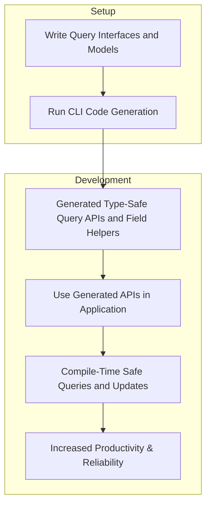

# Quickstart & Typical Workflow

Welcome to the Quickstart & Typical Workflow guide for GORM CLI. This page walks you through the essential steps of defining your database query interfaces and models, generating the corresponding type-safe code, and leveraging the resulting APIs to streamline your application’s database interactions. You’ll see how GORM CLI transforms raw SQL interfaces and Go structs into fluent, compile-time safe query methods and field helpers — all designed to reduce boilerplate, catch errors early, and enhance productivity.

---

## Why This Matters

Imagine developing a Go application where every database query and update is typed, discoverable, and validated at compile time. No more manual SQL string concatenation or runtime surprises. GORM CLI empowers you to write declarative interfaces with embedded SQL templates and generate idiomatic APIs tied directly to your models. This solid foundation lets you focus on business logic rather than plumbing, and scales gracefully as your project grows.


---

## Core Workflow Overview

The typical GORM CLI workflow follows three key steps:

### 1. Define Your Interfaces and Models

Write Go interfaces that declare your key query and mutation methods, annotating them with SQL templates in comments. Define your GORM model structs alongside or in the same package.

```go
// examples/query.go

// Query[T] defines generic query methods for any model type.
type Query[T any] interface {
  // SELECT * FROM @@table WHERE id=@id
  GetByID(id int) (T, error)

  // SELECT * FROM @@table WHERE @@column=@value
  FilterWithColumn(column string, value string) (T, error)

  // SELECT * FROM users ... dynamic WHERE clauses
  QueryWith(user models.User) (T, error)

  // UPDATE @@table with dynamic SET based on fields
  UpdateInfo(user models.User, id int) error

  // SELECT with list conditionals
  Filter(users []models.User) ([]T, error)

  // Filter by specific name and age
  FilterByNameAndAge(name string, age int)

  // Filter by creation time range
  FilterWithTime(start, end time.Time) ([]T, error)
}

// Example model declaration
// models/user.go

type User struct {
  gorm.Model
  Name string
  Age  int
}
```

Here, `@@table` and `@param` are template parameters replaced during code generation, making SQL strongly tied to your structs.

### 2. Generate Code Using the CLI

Run the CLI to parse your interfaces and models, applying your SQL templates and model fields to generate strongly typed query APIs and field helpers.

```bash
gorm gen -i ./examples -o ./generated
```

The generated code includes:
- Typed query implementations matching your interfaces
- Model-specific field helper variables for filtering, updates, and associations

### 3. Use the Generated APIs

With generated code in place, interacting with your database becomes clean, type-safe, and intuitive.

```go
import (
  "context"
  "gorm.io/gorm"
  "generated"
)

func exampleUsage(ctx context.Context, db *gorm.DB) {
  // Query user by ID
  user, err := generated.Query[User](db).GetByID(ctx, 123)
  if err != nil {
    // handle error
  }

  // Filter users by name and age
  users, err := generated.Query[User](db).FilterByNameAndAge("jinzhu", 25).Find(ctx)

  // Update user info
  err = generated.Query[User](db).UpdateInfo(ctx, User{Name: "jinzhu", Age: 20}, 1)
}
```

These generated methods provide autocomplete, compile-time type checks, and a fluent API backed by SQL templates.

---

## Key Benefits in the Workflow

- **Safety and Maintainability**: Your SQL queries are bound to Go types and interfaces, preventing common errors before runtime.
- **Reduced Boilerplate**: Say goodbye to manual SQL building — declare once, generate endlessly.
- **Powerful Field Helpers**: Strongly typed predicate and update helpers let you write expressive queries and updates.
- **Association Handling**: Manage linked data effortlessly with typed association operations.

---

## Practical Tips for a Smooth Start

- **Keep Interfaces Clear**: Keep your query interfaces focused and descriptive; embed SQL templates carefully to mirror your actual queries.
- **Model Your Domain Accurately**: Align GORM model structs and their field tags precisely with your database schema.
- **Leverage Configuration**: Use optional genconfig packages for custom output paths and type mappings when needed.
- **Use Context**: When writing or calling generated methods, provide `context.Context` to manage timeouts and cancellation.

---

## Typical User Journey Diagram




---

## Troubleshooting Common Issues

<AccordionGroup title="Troubleshooting Quickstart Issues">
<Accordion title="No Generated Files After Running CLI">
Verify your interface file path passed to `-i` is correct and contains public interfaces with SQL template comments. Ensure models and interfaces are in the same package or accessible.
</Accordion>
<Accordion title="Compilation Errors in Generated Code">
Double-check your method signatures including return types. All generated methods must comply with expected patterns: one or two returns with error as last value. Check your SQL templates for syntax errors.
</Accordion>
<Accordion title="Runtime Errors or Unexpected SQL Results">
Confirm your SQL templates use correct placeholders and directives (`@@table`, `@param`, `{{where}}`). Validate that parameter names exactly match method parameters.
</Accordion>
</AccordionGroup>

---

## What’s Next?

Your next steps:

- Explore the [Getting Started: Writing Query Interfaces and Models](../getting-started/first-use-configuration/writing-query-interfaces-and-models) guide for detailed interface design patterns.
- Dive into [Generating Code](../getting-started/first-use-configuration/generating-code) to master CLI options and configurations.
- Learn how to fully leverage generated APIs in [Using Generated Query APIs and Field Helpers](../guides/core-workflows/using-generated-apis).
- Finally, enhance your linked data management via [Working with Associations](../guides/core-workflows/working-with-associations).

This page is your gateway to a robust, efficient database access layer that grows with your application’s demands.

---

_For a deeper understanding of GORM CLI’s foundational concepts and terminology, see [Core Concepts and Terminology](/overview/system-architecture-core-concepts/core-concepts-and-terminology). For architectural insights, visit [Architecture and Data Flow](/overview/system-architecture-core-concepts/architecture-and-dataflow)._


---

## Summary
- Define your Go interfaces with embedded SQL templates alongside your GORM model structs.
- Run the CLI generation command to produce type-safe, fluent query and update APIs.
- Use the generated code to execute compile-time checked database operations that align perfectly with your data model.
- Benefit from cleaner code, faster development, and less runtime SQL errors.

---

## Additional Resources

- [GORM CLI Product Overview](../overview/product-intro-core-benefits/what-is-gorm-cli)
- [Key Features at a Glance](../overview/product-intro-core-benefits/key-features-at-a-glance)
- [Value Proposition & Target Audience](../overview/product-intro-core-benefits/value-prop-target-audience)

---

_Start strong with the Quickstart & Typical Workflow—your path to mastering type-safe, maintainable database access with GORM CLI starts here._