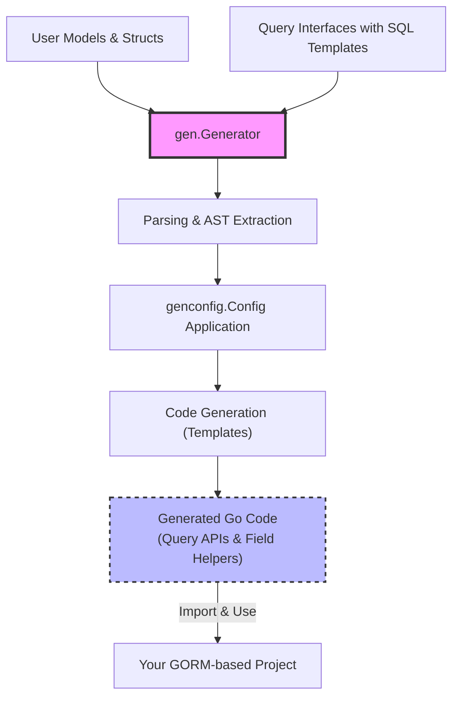

# High-Level Architecture (with Diagram)

Visualize GORM CLI’s architecture, illustrating the journey from your user-defined Go models and query interfaces through the core code generation pipeline to outputted type-safe APIs and rich field helpers. This page clarifies how components interact internally and highlights extension points you can customize.

---

## Why Understanding the Architecture Matters

Whether you’re adopting GORM CLI for the first time or looking to customize and extend its behavior, a clear picture of how the system operates helps you use it effectively and troubleshoot issues efficiently. This high-level overview reveals how your input code transforms into safe, fluent APIs and how the generator’s core parts fit together.

## Architecture Overview

At a glance, GORM CLI’s architecture can be viewed as a linear pipeline that converts user input into generated code:

1. **Input Layer:** Your Go models and interfaces annotated with raw SQL templates.
2. **Parsing & Analysis:** The generator parses your source files’ abstract syntax trees (AST), extracting relevant interfaces and struct definitions.
3. **Configuration & Filtering:** It applies configuration rules (`genconfig.Config`) to determine what to generate.
4. **Code Generation:** Using templates, it emits
    - **Type-safe Query APIs** from annotated interfaces
    - **Model-driven Field Helpers** from structs and associations
5. **Output:** The generated code enables seamless, compile-time safe interaction with the database through GORM.

## Components and Their Roles

| Component                    | Role & Responsibility                                         |
|-----------------------------|--------------------------------------------------------------|
| **User Models & Interfaces**| Your Go structs define schema with associations; interfaces annotate queries with SQL templates. |
| **Generator (`gen.Generator`)** | Processes source files, parses, analyzes AST, applies configs, and orchestrates code output.   |
| **Parsing (`File`, `Interface`, `Struct`)** | Extracts detailed metadata — methods, fields, tags, and SQL templates — from your source code. |
| **Configuration (`genconfig.Config`)** | Controls inclusion/exclusion rules, output paths, custom field mappings, and generation scope. |
| **Templates (`pkgTmpl`)**   | Text templates generate interfaces, method implementations, and field helpers from processed data. |
| **Field Helpers (`field`)**| Typed helpers for basic fields, associations, and custom mappings, supporting expressive queries and updates. |
| **Output Files**            | Generated Go files that integrate with GORM for compile-time safety and developer productivity. |

## How the Code Flow Works

Your Go source files enter the generator, which parses and walks their AST nodes. It identifies:

- Interfaces with SQL query annotations to translate into concrete, type-safe query APIs.
- Structs with database models, including association metadata, to generate powerful field helpers.

Configuration settings refine which files and types to target. After applying filters, the generator uses text templates to craft explicit Go code with method bodies implementing your annotated SQL logic and field helper structures capturing schema details.

This output is then formatted and saved under the configured output directory.

## Key Extension Points

- **Configuration (`genconfig.Config`)**: Customize output path, include/exclude specific interfaces or structs, and map Go types or field tags to custom field helper types.
- **SQL Templates in Interfaces**: Define complex queries combining raw SQL and conditional template directives to tailor the generated methods.
- **Custom Field Helpers**: Extend how fields are handled by providing new helper types mapped via `FieldNameMap` or `FieldTypeMap`.

## Sample User Flow

1. Write your Go model structs representing your database schema with associations.
2. Create interfaces containing method signatures augmented with SQL template comments.
3. Optionally configure generation using `genconfig.Config` for fine-grained control.
4. Run the CLI command `gorm gen -i ./yourpkg -o ./generated`.
5. The generator:
   - Parses source code
   - Extracts interfaces and structs
   - Applies config rules
   - Emits type-safe Go APIs and helpers
6. Import and use the generated code in your GORM-based project for safer, more productive database operations.

## Visualizing the Architecture

## Practical Tips for Using the Architecture

- **Keep your query interfaces focused and annotated clearly with SQL templates.** This ensures generated methods are precise and maintainable.
- **Leverage configuration to include only desired interfaces/structs, avoiding unnecessary generation.**
- **Explore field helper extension by mapping custom Go types for complex fields like JSON to specialized helpers.**
- **Understand that associations generate advanced helpers enabling CRUD operations on related data with compile-time safety — critical for complex schema relationships.**
- **Use the generated APIs as building blocks within your existing GORM workflows to maximize productivity and reduce boilerplate.**

## Troubleshooting Common Issues

<AccordionGroup title="Troubleshooting Code Generation">
<Accordion title="No generated code after running CLI">
- Verify your input path points to the correct package containing annotated interfaces and struct models.
- Confirm your `genconfig.Config` is not excluding all interfaces or structs.
- Check for syntax errors or missing Go files.
</Accordion>
<Accordion title="Unexpected methods or missing interfaces in output">
- Review `IncludeInterfaces` and `ExcludeInterfaces` patterns in your config for unwanted filtering.
- Make sure your interface methods have proper SQL template comments for generation.
</Accordion>
<Accordion title="Generated code fails to compile">
- Ensure your model imports and types match exactly between input and generated output.
- Verify Go version compatibility (requires Go 1.18+ for generics).
- Check that your SQL templates are valid and correctly reference parameters.
</Accordion>
</AccordionGroup>

## Next Steps

- Dive into [Core Concepts and Terminology](/overview/system-architecture-concepts/core-concepts-terminology) to grasp foundational ideas supporting the architecture.
- Explore [Integration & Extensibility Overview](/overview/system-architecture-concepts/integration-and-extensibility) to customize and extend generation.
- Start implementing your first queries by following the [Quickstart Workflow](/overview/feature-highlights-getting-started/quickstart-workflow).

---

By understanding this high-level architecture, you can harness GORM CLI’s full power to generate robust, type-safe database access layers tailored to your Go projects.

---