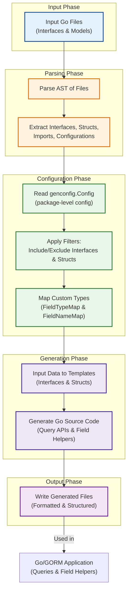

# System Architecture (with Diagram)

## Overview
The System Architecture page offers an essential look into how GORM CLI transforms your Go source files into powerful, type-safe query APIs and field helpers that integrate seamlessly with GORM-powered projects. Through this page, you will learn how your input files—including Go interfaces with embedded SQL templates and model struct definitions—are parsed, processed, and generated into complete, ready-to-use Go code.

This documentation guides you through understanding the entire generation pipeline, the role of configuration in shaping the output, and how the tool fits naturally within common Go and GORM workflows. A clear visual diagram complements the explanation, illustrating the flow of data and actions between components.

---

## What You Will Gain
- A clear understanding of how GORM CLI reads and analyzes your Go source files.
- Insight into the transformation steps from parsed AST data to generated Go source code.
- Knowledge of how configuration controls inclusion, exclusion, and type mapping during generation.
- Awareness of how generated code fits into your GORM-powered projects for safer and more productive development.

---

## Generation Pipeline Explained

At its core, GORM CLI executes a multi-stage pipeline that converts your input into strongly typed Go code:

1. **Input File Analysis**: The generator begins by reading either a single Go file or an entire directory recursively. It parses each file as an abstract syntax tree (AST), extracting all relevant data such as imports, interface declarations with SQL templates, struct (model) definitions, and any package-level configuration.

2. **AST Processing & Data Extraction**: Through traversal of the AST, it collects:
   - **Interfaces**: Methods are parsed to extract parameters, return types, and embedded SQL queries written in method comments. These form the blueprint for the query API generation.
   - **Structs**: Model fields and tags are extracted to facilitate generation of type-safe field helpers, including relations and basic field types.
   - **Configuration**: Custom generation settings are read from recognized package-level variables, enabling you to override default generation paths, define type mappings, inclusion/exclusion filters, and file-level behavior.

3. **Configuration Resolution**: The tool consolidates applicable configurations for each file and applies filters to determine which interfaces and structs should be included or excluded based on patterns and explicit declarations.

4. **Template Rendering & Code Generation**: Extracted interface, struct, and configuration data are passed into Go templates that generate:
   - Interface-driven query API implementations adhering to your SQL templates.
   - Field helpers for models providing fluent and type-safe predicate and association setters.

5. **Output File Writing**: Generated files are written to their specified output directories, preserving package structure and applying `goimports` formatting for clean and idiomatic Go source code.

6. **Integration with Go/GORM Workflows**: The resulting generated code is designed for direct use in your application's data layer. Interfaces become strongly typed API methods, and field helpers enable expressive and safe query and update building consistent with GORM patterns.

---

## Configuration Influence

GORM CLI reads special config literals (`genconfig.Config`) declared within your packages to influence:

- **Output paths**: Choose where generated files land.
- **Type mappings**: Map certain Go types or struct tags to custom field helpers, such as JSON or SQL driver-supported types.
- **Include/Exclude Filters**: Narrow generation to specific interfaces or models using patterns or literal types.
- **File-level behavior**: Control whether configuration applies at individual file level or entire package.

This flexible system enables precise tailoring of generation to your project’s needs.

---

## How It Fits in Your Workflow

- Place SQL-annotated query interfaces and model structs together in your source.
- Optionally declare configuration in the same package to customize generation.
- Run the CLI with your input and output paths.
- Use the generated code seamlessly within your project’s database operations to benefit from compile-time type safety and the convenience of fluent API patterns.

---

## Mermaid Diagram: GORM CLI Generation Pipeline

---

## Practical Tips & Best Practices

- **Organize your source files**: Keep your query interfaces and models in the same package or directory for smooth processing.
- **Leverage configuration**: Use `genconfig.Config` to restrict generation scope and customize mappings for complex or third-party types.
- **Maintain SQL templates carefully**: Embed clear and correct SQL in interface method comments to ensure the generator produces valid, usable APIs.
- **Watch output paths**: Configure `OutPath` in your config to keep generated code separate but well-organized in your repo.
- **Run generator regularly**: Integrate into your build or CI to prevent drift between your interfaces and generated code.

---

## Troubleshooting Common Issues

<AccordionGroup title="Common Issues and Solutions">
<Accordion title="No generated files appear after running the generator">
Ensure your input path points to a valid Go file or directory containing files with interfaces and/or structs.
Check configuration filters (`IncludeInterfaces`, `ExcludeStructs`, etc) to confirm you are not excluding all types inadvertently.
</Accordion>

<Accordion title="Errors parsing Go source files">
Verify your Go files compile normally and contain no syntax errors; the generator uses the Go parser.
Avoid processing generated files themselves, which the generator skips automatically.
</Accordion>

<Accordion title="Generated code has formatting issues or import errors">
The generator runs `goimports` automatically; ensure your Go environment and `goimports` utility are correctly set up.
Check for missing dependencies in your project modules.
</Accordion>

<Accordion title="Custom field mappings not applied">
Confirm your `genconfig.Config` is declared as a package-level variable and is properly referenced.
Use exact type names or struct tag keys as expected by the config.
</Accordion>
</AccordionGroup>

---

## Next Steps

- Visit the [Product Introduction & Value](/overview/getting-started-core/overview-intro) page to deepen your understanding of GORM CLI features.
- Explore [Configuration Concepts](/concepts/customization-integration/generator-config-concept) to tailor generation further.
- Try generating your first code with the [Your First Code Generation](/getting-started/first-run-configuration/your-first-generate) guide.

---

With this understanding of the system architecture and generation flow, you are equipped to harness GORM CLI confidently and integrate its generated code naturally into your development lifecycle.

---