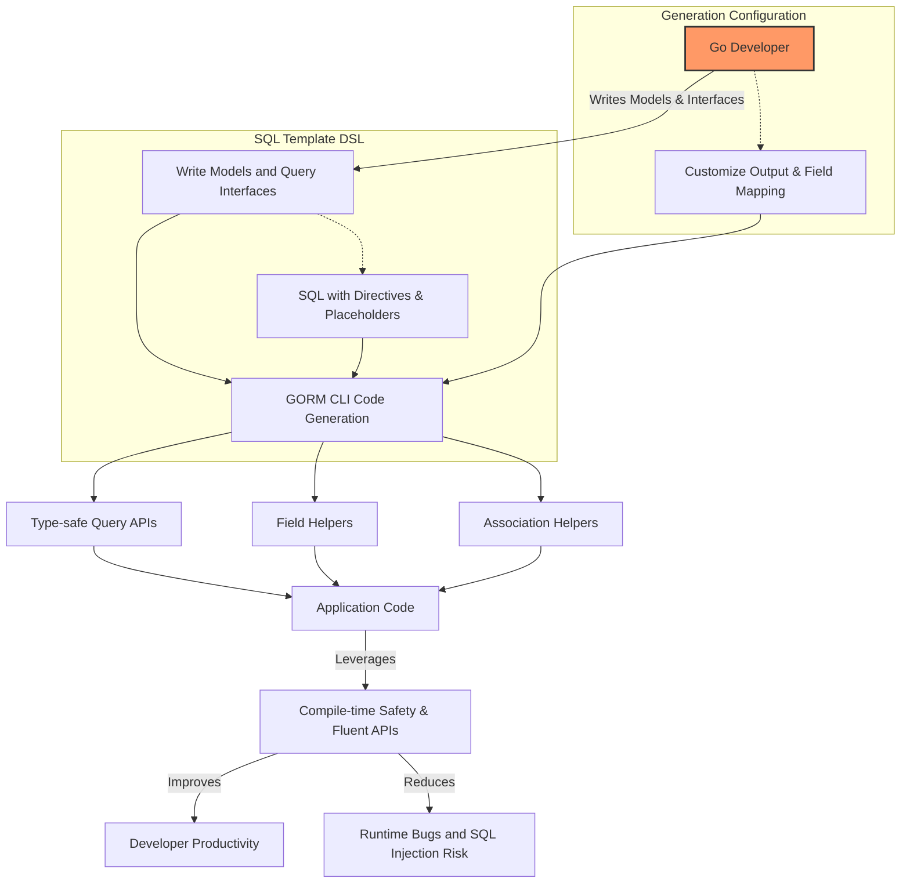

# Core Concepts & Terminology

Unlock the foundational concepts of GORM CLI to harness its full power. This page explains the key building blocks like type-safe query APIs, field helpers, association operations, and the SQL template DSL. You'll also learn the essential terminology that bridges GORM CLI with GORM and Go idioms, so you can write clearer, safer, and more expressive database code.

---

## What You Will Learn

- What are **type-safe query APIs** and how they ensure compile-time safety
- The role of **field helpers** in writing filters, updates, and association operations
- How **association helpers** streamline creating, updating, unlinking, and deleting related data
- The basics of **template-based queries** using the SQL template DSL
- How **generation configuration** influences and customizes code output

---

## Understanding Type-Safe Query APIs

### What Are They?
Type-safe query APIs are generated Go interfaces and concrete implementations that let you perform database queries safely and idiomatically. Instead of manually writing SQL with raw strings, you define Go interfaces whose methods contain annotated SQL templates. GORM CLI generates fully typed, context-aware methods from these interfaces.

### Why Use Them?
They eliminate a broad class of bugs by catching mismatches and errors at compile time. You write clean Go code, leveraging Go's type system while enjoying the flexibility of SQL expressed in comments.

### How It Works
- You declare an interface with methods annotated by raw or templated SQL queries.
- Placeholders like `@param`, `@@table`, and conditional directives (`{{where}}`, `{{set}}`) inside the SQL templates automatically bind to method parameters.
- The generator produces method implementations with typed parameters and return values, integrating seamlessly with GORM's [`*gorm.DB`](https://gorm.io/docs/) interface.

**Example:**
```go
// Query interface defines database queries
// SQL annotations appear in method comments
// SELECT * FROM @@table WHERE id=@id
GetByID(id int) (T, error)
```

**Usage:**
```go
user, err := generated.Query[User](db).GetByID(ctx, 123)
```

---

## Field Helpers: Your Fluent SQL Builders

### What Are Field Helpers?
Field helpers are generated from your model structs, offering typed, discoverable APIs to build SQL predicates and data setters.

### What Problems Do They Solve?
Instead of manually crafting SQL expressions as strings, field helpers provide method chains for common SQL constructs like equality, range queries, pattern matching, and null checks—all type-safe and IDE-friendly.

### Core Field Helper Types
- **Basic Fields:** Support common Go types (`int`, `string`, `bool`, `time.Time`) and custom mapped types.
- **Association Fields:** Represent relationships (`has one`, `has many`, `belongs to`, `many2many`) as typed structs or slices.

**Basic field examples:**
```go
generated.User.Name.Eq("jinzhu")            // name = 'jinzhu'
generated.User.Age.Between(18, 65)          // age BETWEEN 18 AND 65
```

**Update operators:**
```go
gorm.G[User](db).
  Where(generated.User.Name.Eq("alice")).
  Set(
    generated.User.Age.Incr(1),
    generated.User.Status.Set("active"),
  ).
  Update(ctx)
```

---

## Association Helpers: Managing Related Data Intuitively

### What Are Association Helpers?
These helpers simplify operations on related records by wrapping GORM associations in typed field helpers, exposing natural methods to create, update, unlink, or delete related data with full type safety.

### Supported Association Operations:
- **Create:** Insert and link related rows.
- **CreateInBatch:** Create and link multiple related rows efficiently.
- **Update:** Modify related records conditionally.
- **Unlink:** Remove associations without deleting data (e.g., nullify foreign keys or remove join rows).
- **Delete:** Permanently delete related rows (joining rows in many-to-many).

### Example Use Cases
- Creating a user with one or many pets:
```go
gorm.G[User](db).
  Set(
    generated.User.Name.Set("alice"),
    generated.User.Pets.Create(generated.Pet.Name.Set("fido")),
  ).
  Create(ctx)
```
- Updating associated pet information:
```go
gorm.G[User](db).
  Where(generated.User.ID.Eq(1)).
  Set(
    generated.User.Pets.Where(generated.Pet.Name.Eq("fido")).
      Update(generated.Pet.Name.Set("rex")),
  ).
  Update(ctx)
```
- Removing (unlinking) or deleting associations:
```go
gorm.G[User](db).
  Where(generated.User.ID.Eq(1)).
  Set(generated.User.Pets.Unlink()).
  Update(ctx)
```

### Semantics by Association Type
| Association | Unlink Effect                     | Delete Effect               |
|-------------|---------------------------------|-----------------------------|
| belongs to  | Sets parent FK to NULL           | Deletes associated rows     |
| has one / many | Sets child FK to NULL           | Deletes child rows          |
| many2many   | Removes join table rows only     | Removes join table rows only|

---

## Template-Based Queries: SQL with Dynamic Control

### What Is the SQL Template DSL?
GORM CLI extends SQL templates with Go-like templating directives inside interface method comments. This allows you to embed dynamic, conditional SQL generation directly in your interfaces.

### Core Template Directives
| Directive   | Functionality                                 | Example                                  |
|-------------|-----------------------------------------------|------------------------------------------|
| `@@table`   | Resolves to the model's database table name  | `SELECT * FROM @@table WHERE id=@id`     |
| `@@column`  | Dynamic column name substitution              | `WHERE @@column=@value`                   |
| `@param`    | Maps Go function parameters to SQL parameters | `WHERE name=@user.Name`                   |
| `{{where}}` | Wraps conditionals for WHERE clauses           | `{{where}} age > 18 {{end}}`              |
| `{{set}}`   | Wraps updates for SET clauses                   | `{{set}} name=@name {{end}}`              |
| `{{if}}`    | Conditional SQL fragments                       | `{{if age > 0}} AND age=@age {{end}}`    |
| `{{for}}`   | Iterates over collections                       | `{{for _, t := range tags}} ... {{end}}` |

### Example
```sql
-- SQL within Go interface comments
SELECT * FROM @@table
{{where}}
  {{if @user.Name != ""}} name=@user.Name {{end}}
  {{if @user.Age > 0}} AND age=@user.Age {{end}}
{{end}}
```

### Usage
The generator compiles these templates into Go code that automatically binds input parameters, providing both flexibility and safety.

---

## Generation Configuration: Tailoring Code to Your Needs

### How to Customize?
You can optionally add a package-level `genconfig.Config` struct to:

- Change output file paths
- Control which interfaces or structs are included or excluded
- Provide custom field type mappings
- Adjust naming and file-level generation

### Example: JSON Field Mapping
```go
var _ = genconfig.Config{
  FieldNameMap: map[string]any{
    "json": JSON{}, // Use custom JSON field helper for fields tagged with `gen:"json"`
  },
}
```

This customization lets you map Go types or tags to specific field helpers, enabling advanced behaviors like JSON path queries.

---

## Key Terminology Quick Reference

| Term                 | Meaning                                                                         |
|----------------------|---------------------------------------------------------------------------------|
| **Field Helpers**    | Typed builders generated for model fields, used in predicates and updates.      |
| **Association Helpers** | Typed helpers managing relations and association operations (create, unlink, etc). |
| **Template-Based Queries** | SQL statements defined in interface comments with placeholders and directives   |
| **SQL Template DSL** | The embedded templating language used inside interface method comments.          |
| **genconfig.Config** | Optional struct controlling generator behavior and customizations.              |
| **Type-safe Query API** | Generated Go interfaces with strongly typed query methods.                    |

---

## Bringing It All Together

By mastering these core concepts, you increase your productivity and code safety dramatically. Instead of writing fragile raw SQL or error-prone CRUD operations, GORM CLI lets you define clear interfaces and models and get reliable, safe, and idiomatic code automatically.

GORM CLI bridges Go’s type system, SQL’s expressiveness, and GORM’s ORM capabilities into a unified, powerful developer experience.

---

## Example User Flow: From Concept to Usage

1. Write your Go models with fields and associations
2. Define Go interfaces with SQL templates in comments
3. Optionally configure generation with `genconfig.Config`
4. Run the generator `gorm gen -i ./pkg -o ./generated`
5. Use the generated query APIs and field helpers in your application with full IDE support and type safety

---

## Troubleshooting & Best Practices

<AccordionGroup title="Tips and Common Pitfalls">
<Accordion title="Ensure Return Types Are Correct">
Each method annotated with an SQL template must have proper return types — either `(T, error)` or `error` to match expected patterns. Mismatches will cause generator errors.
</Accordion>
<Accordion title="Use Proper SQL Template Placeholders">
Always use `@param` placeholders to bind Go method parameters safely. Avoid embedding variables directly into SQL strings to prevent injection.
</Accordion>
<Accordion title="Field and Association Naming Matters">
Ensure your model field and association names accurately reflect your schema and Go struct conventions to get expected helpers generated.
</Accordion>
</AccordionGroup>

---

## Related Documentation

- [Feature Highlights](/overview/getting-started-core/overview-feature-quicklook): Overview of how key features collaborate
- [System Architecture (with Diagram)](/overview/system-architecture-concepts/architecture-overview): See how components fit together
- [Your First Code Generation](/getting-started/first-run-configuration/your-first-generate): Hands-on getting started guide
- [Configuring the Generator](/concepts/customization-integration/generator-config-concept): Deep dive into generation config

---

Take this core knowledge as your foundation to build powerful, maintainable data access layers with GORM CLI today.


---

## Diagram: Core Concept Relationships

