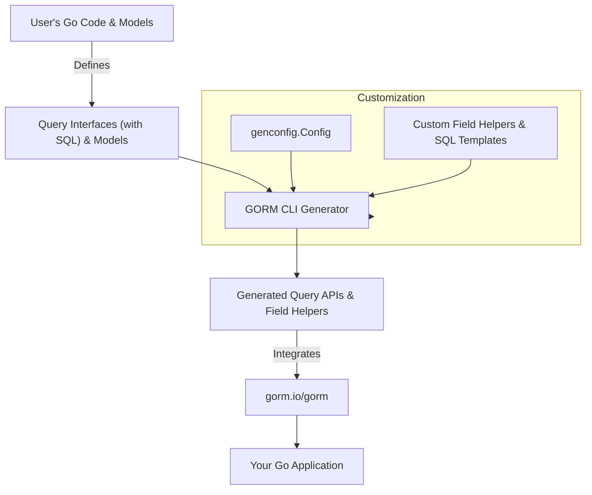

# Integration & Extensibility Overview

GORM CLI is designed to slot seamlessly into your Go and GORM development workflow, empowering you with type-safe, fluent APIs while remaining fully extensible to fit your project’s unique needs. This page provides a compact yet comprehensive overview of how GORM CLI integrates with the GORM ORM and how you can extend its capabilities through configuration, custom field helpers, and SQL template overrides.

---

## Why Integration and Extensibility Matter

Imagine building a Go application with GORM and hitting the limits of conventional ORM flexibility: complex queries become verbose and error-prone, association handling involves tedious boilerplate, or customization requires duplicating generated code. GORM CLI addresses these pain points by generating compile-time safe query APIs and model-driven field helpers that fit naturally with GORM. 

Better yet, it allows you to customize generation and add your own helpers to adapt to advanced scenarios, eliminating repetitive work while staying flexible.

---

## How GORM CLI Fits Into Your Go Stack

At its core, GORM CLI reads your Go interfaces annotated with SQL templates and your data model structs, then produces:

- **Type-safe query APIs** based on your declared query interfaces
- **Model-driven field helpers** for filters, ordering, updates, and associations

These pieces integrate tightly with **`gorm.io/gorm`**, enabling you to compose fluent queries with the confidence of compile-time safety. The generated code leverages GORM’s foundational `*gorm.DB` constructs and extends them with your domain-specific SQL and models.

For example, generated query methods can be called like regular GORM queries, but with strong typing and discoverable parameters:

```go
u, err := generated.Query[User](db).GetByID(ctx, 123)
users, err := gorm.G[User](db).Where(generated.User.Age.Gt(18)).Find(ctx)
```

This integration eliminates impedance mismatch, letting you extend your existing GORM projects without disrupting established patterns.

---

## Customize Generation with `genconfig.Config`

GORM CLI supports extensive customization through package-level declarations of `genconfig.Config`. By creating this literal in the package you want to generate code from, you control how and what the generator produces.

### What You Can Customize

- **Output Directory (`OutPath`)**: Change where generated files go, keeping your project structure clean.
- **Field Type Mapping (`FieldTypeMap`)**: Map Go types like `sql.NullTime{}` to custom field helper types like `field.Time{}` for enhanced querying capabilities.
- **Field Name Mapping (`FieldNameMap`)**: Provide mappings for fields tagged with custom `gen` names to your own helper types.
- **Interface and Struct Filtering**: Use include/exclude patterns to fine-tune which interfaces or structs participate in generation.
- **File-Level Control (`FileLevel`)**: Generate for individual files instead of entire packages when needed.

### Example Configuration

```go
package examples

import (
  "database/sql"
  "gorm.io/cli/gorm/field"
  "gorm.io/cli/gorm/genconfig"
)

var _ = genconfig.Config{
  OutPath: "examples/output",
  FieldTypeMap: map[any]any{
    sql.NullTime{}: field.Time{},
  },
  FieldNameMap: map[string]any{
    "date": field.Time{},
    "json": JSON{},    // custom field helper example
  },
  IncludeInterfaces: []any{"Query*"},
  ExcludeInterfaces: []any{"*Deprecated*"},
  IncludeStructs: []any{"User", "Account*"},
  ExcludeStructs: []any{"*DTO"},
}
```

This level of configuration flexibility makes GORM CLI adaptable to diverse codebases and generation strategies.

---

## Extend With Custom Field Helpers

Beyond the built-in field helpers for common types (string, int, bool, time, etc.), GORM CLI enables you to define and integrate your own custom helpers. This capability is essential when dealing with advanced column types like JSON, encrypted fields, or other database-specific constructs.

### How to Define a Custom Field Helper

1. **Create your helper type** implementing methods to build expressions for your column type.
2. **Declare a `FieldNameMap` entry** in your `genconfig.Config` that links the field tag name to your helper.
3. **Apply the `gen:"<tag>"` struct tag** on model fields to invoke your custom helper during code generation.

#### Example: JSON Field Helper

```go
// JSON is a custom field helper for JSON columns, generating database-specific SQL.
type JSON struct{ column clause.Column }

func (j JSON) WithColumn(name string) JSON {
  c := j.column
  c.Name = name
  return JSON{column: c}
}

func (j JSON) Equal(path string, value any) clause.Expression {
  return jsonEqualExpr{col: j.column, path: path, val: value}
}

// Implementation details involve generating different SQL based on the database dialect.
```

**Usage in model:**

```go
// Profile stores user profile data in JSON format
Profile string `gen:"json"`
```

**Query example:**

```go
got, err := gorm.G[User](db).
  Where(generated.User.Profile.Equal("$.vip", true)).Take(ctx)
```

This enables expressive, type-safe queries tailored to specialized columns.

---

## Override and Extend SQL Templates

GORM CLI's query interface methods are defined with embedded SQL templates using the DSL syntax. This approach lets you:

- Write raw SQL snippets with placeholders
- Use conditional constructs (`{{if}}`, `{{where}}`, `{{set}}`, etc.)
- Iterate collections (`{{for}}`)

You can extend or customize queries by modifying your interface methods or creating new ones with tailored SQL templates to suit complex querying needs.

Example of a conditional query method:

```go
// SELECT * FROM @@table
// {{where}}
//   {{if user.Name != ""}} name=@user.Name {{end}}
//   {{if user.Age > 0}} AND age=@user.Age {{end}}
// {{end}}
FilterUsers(user User) ([]User, error)
```

This flexibility keeps generated APIs close to your application's logic and performance requirements.

---

## Summary Diagram: Integration and Extensibility Pathways



Use this overview to understand where you apply customizations and how your code, generation, and runtime layers fit together.

---

## Practical Tips & Best Practices

- **Define query interfaces close to your models** for best cohesion and automated detection by the generator.
- **Utilize `genconfig.Config` judiciously** to keep generated code well-organized; avoid global configs if you want per-package overrides.
- **Create custom field helpers only when necessary**—start with basic helpers before extending.
- **Reuse SQL template DSL features** to write concise, maintainable query logic.
- **Version control generated code thoughtfully**; consider regenerating on model or interface changes to avoid mismatches.

---

## Troubleshooting Common Integration Scenarios

- _Issue:_ Generated code is missing for some interfaces or models.
  - Solution: Check your `IncludeInterfaces`, `ExcludeInterfaces`, `IncludeStructs`, and `ExcludeStructs` settings in your `genconfig.Config`. By default, all are included unless filtered.

- _Issue:_ Custom field helpers are not applied.
  - Solution: Ensure your model fields have the correct `gen` tag and that your `FieldNameMap` in the config maps the tag name to the helper type.

- _Issue:_ Generated SQL queries are incorrect or incomplete.
  - Solution: Verify your interface method comments SQL templates; ensure placeholders and DSL directives are well-formed.

- _Issue:_ Generated files appear in unexpected directories.
  - Solution: Confirm `OutPath` settings in your config and CLI command; generation respects package-level configs.

---

## Next Steps

Ready to dive deeper? Explore how to configure generation parameters, craft custom field helpers, and design SQL templates:

- [Configuring Generation with genconfig.Config](../guides/advanced-usage/configuring-generation)
- [Using and Defining Custom Field Helpers](../guides/advanced-usage/custom-field-helpers)
- [SQL Template DSL Cookbook](../guides/advanced-usage/template-dsl-cookbook)

Or review the system architecture to see the comprehensive flow:

- [High-Level Architecture (with Diagram)](../overview/system-architecture-concepts/architecture-overview-diagram)

This foundational knowledge will help you master GORM CLI’s integration and extensibility capabilities to accelerate your Go development.

---