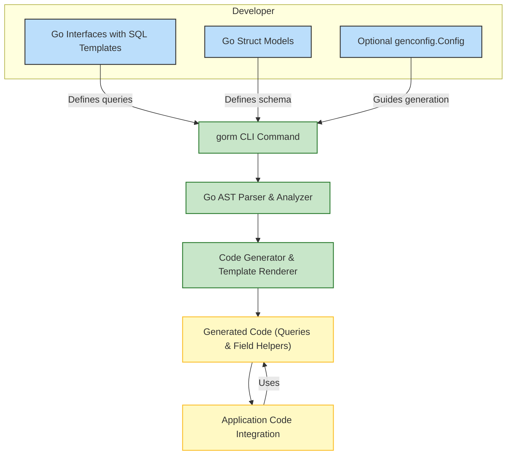

# Architecture and Data Flow

Understand how GORM CLI transforms your Go code and developer intent into powerful, type-safe query APIs and model helpers that seamlessly integrate with your GORM-based projects. This page walks you through the core components, workflows, and system architecture—from your defined interfaces and models, through the command-line tool, to generated outputs ready for integration. A high-level Mermaid diagram visually illustrates these relationships to deepen your grasp.

---

## GORM CLI in Action: From Developer Input to Generated Output

GORM CLI is designed to convert your carefully crafted Go interface definitions and model structs into fluent, type-safe query helpers and field accessors that dramatically reduce boilerplate and improve compile-time safety in GORM projects.

Here’s the journey your code takes:

- **Developer Definitions:** You write raw SQL annotations in Go interfaces and define your domain models as structs.
- **CLI Input Processing:** The `gorm gen` CLI command reads these files, parses your interfaces and models, and applies any generation configuration.
- **Code Generation:** Based on parsed input, the tool produces generated query APIs from interfaces, and strongly typed field helpers from structs.
- **Output Structure:** Generated code is organized in your chosen output directory, preserving package structure and modularity.
- **Integration:** Your application imports and uses these generated packages to perform fluent, type-safe DB operations via GORM.

This pipeline ensures the manual effort you put into writing models and interfaces is amplified by automation, resulting in safer, more maintainable code that directly aligns with your database schema and querying intent.

---

## Component Breakdown

### 1. Developer Input

- **Go Interfaces with SQL Templates:**
  Define methods with SQL annotations using GORM CLI’s template DSL inside Go interface comments. These represent your domain’s query methods.

- **Go Struct Models:**
  Define structs representing database models. These drive generation of field helpers for filters, updates, ordering, and association operations.

- **Optional Configuration:**
  Use `genconfig.Config` declarations to customize output paths, inclusions, type mappings, and generation behavior.

### 2. CLI Command (Entry Point)

- The CLI command `gorm gen -i ./input -o ./output` triggers code generation.
- Internally, it parses interfaces and structs, evaluates associations, applies configurations, and renders output files.

### 3. Parsing and Analysis

- **Go AST Parsing:** Reads Go source code, walks the AST to gather interfaces, methods, structs, and annotations.
- **SQL Template Extraction:** Extracts SQL snippets and metadata from method comments for each interface method.
- **Configuration Resolution:** Applies any generation configurations for type and name mappings.

### 4. Code Generation

- **File Structuring:** Organizes generated code mirroring your input package and directory structure.
- **Interface-Driven Query APIs:** Generates concrete implementations for your SQL-annotated interfaces with type-safe methods.
- **Model Field Helpers:** Generates field accessors and association helpers for each struct, for use with GORM.
- **Association Support:** Includes helpers to create, update, unlink, and delete related entities with compile-time safety.

### 5. Generated Output

- Consists of Go source files with generated models, query APIs, and helper functions.
- Places generated files in the configured output directory.
- Ensures formatting and imports are clean and idiomatic.

### 6. Application Integration

- Developers import the generated packages.
- Use generated query interfaces and field helpers directly alongside standard GORM code.
- Enables compiler-checked queries and association operations, reducing bugs and manual SQL string manipulation.

---

## High-Level Architecture Diagram



---

## Practical Workflow Example

1. **Write your interfaces and models:**

```go
// Query interface with SQL template comment
// SELECT * FROM @@table WHERE id=@id
func GetByID(id int) (User, error)

// User model struct
type User struct {
  ID   uint
  Name string
  Age  int
}
```

2. **Run the CLI:**

```bash
gorm gen -i ./path-to-your-code -o ./generated
```

3. **Use the generated code:**

```go
u, err := generated.Query[User](db).GetByID(ctx, 123)

users, err := gorm.G[User](db).Where(generated.User.Age.Gt(18)).Find(ctx)
```

This flow lets you focus on defining meaningful queries and models while the CLI automates safe, maintainable code generation.

---

## Tips & Best Practices

- Maintain consistent package and directory structures to preserve generation mapping.
- Use generation configuration (`genconfig.Config`) to tailor output directories and field type mappings for your project.
- Leverage SQL template DSL to keep queries concise and expressive, utilizing conditional logic and parameter binding.
- Regularly regenerate code after model or interface changes to keep generated APIs in sync.
- Review generated code during development to gain insight into the APIs you’ll consume.

---

## Troubleshooting Common Issues

<AccordionGroup title="Common Challenges & Solutions">
<Accordion title="Empty or Missing Generated Files">
- Ensure you’ve specified the correct input path with `-i` flag.
- Check your interfaces have methods with properly documented SQL annotations.
- Verify your model structs are exported and included.
- Confirm no configuration filters exclude your desired structs or interfaces.
</Accordion>
<Accordion title="Generation Errors Referencing SQL Templates">
- Validate your SQL template syntax with the DSL rules, especially conditionals.
- Avoid unsupported SQL constructs within template comments.
- Fix any Go syntax errors in your input code.
</Accordion>
<Accordion title="Integration Errors in Application Code">
- Confirm you’re importing the generated package at the correct path.
- Rebuild your project to pick up new generated code.
- Check method signatures match expectations and generated API usage.
</Accordion>
</AccordionGroup>

---

## Next Steps

- Explore the [Quickstart & Typical Workflow](overview/real-world-integration-use-cases/quickstart-and-workflow-overview) to see GORM CLI in a full development context.
- Deep-dive into [Core Concepts and Terminology](overview/system-architecture-core-concepts/core-concepts-and-terminology) to understand the underlying domain terms.
- Review [Value Proposition & Target Audience](overview/product-intro-core-benefits/value-prop-target-audience) to align GORM CLI benefits with your project needs.


---

*Back to [Overview](../index.md)*


---

<Source url="https://github.com/go-gorm/cli" branch="main" paths={[{"path": "internal/gen/gen.go", "range": "1-270"}, {"path": "internal/gen/template.go", "range": "1-75"}]} />
