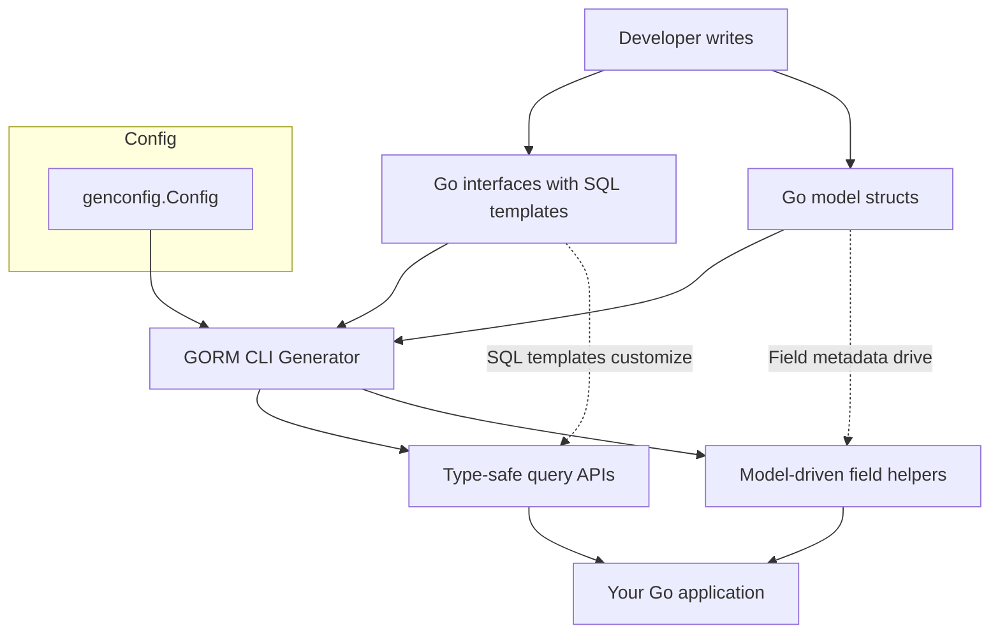

# Core Concepts and Terminology

Understanding the foundational concepts and terms of GORM CLI is essential for harnessing its full power. This page clarifies key ideas such as type-safe query APIs, field helpers, association types, SQL template DSL, context injection, and configuration. With these essentials, you will confidently navigate and use GORM CLI effectively.

---

## Type-Safe Query APIs

At the heart of GORM CLI are **type-safe query APIs**, generated from Go interfaces annotated with raw SQL templates. These APIs provide:

- **Compile-time safety**: Catch errors early by generating methods directly tied to your Go types.
- **Discoverability and fluency**: Intuitive and chainable APIs tailored to your models and queries.

### What Does This Mean for You?
Write an interface with commented SQL templates, and GORM CLI creates a concrete, generic API for your database operations.

Example interface method:
```go
// SELECT * FROM @@table WHERE id=@id
GetByID(id int) (T, error)
```

Generated method usage:
```go
user, err := generated.Query[User](db).GetByID(ctx, 123)
```

This preserves typing, reduces SQL boilerplate, and integrates seamlessly with GORM's ORM.

---

## Model-Driven Field Helpers

GORM CLI generates **field helpers** from your Go structs, representing model fields as strongly typed constructs. These helpers enable:

- **Safe and expressive query predicates** (e.g., `generated.User.Age.Gt(18)`)
- **Fluent updates and filters**
- **Structured access to associations and relations**

### Field Types
The helpers reflect field semantics:

- **Basic fields**: ints, floats, strings, bools, times, []byte
- **Named types with Scanner/Valuer or serializers**
- **Association fields**: represented as specialized helpers for related data

Example usage:
```go
gorm.G[User](db).
  Where(generated.User.Name.Eq("alice"), generated.User.Age.Incr(1)).
  Update(ctx)
```

This approach combines safety with powerful, readable expressions.

---

## Associations: Relationship Types and Operations

GORM CLI recognizes standard ORM associations and provides dedicated helpers to manage them efficiently. The primary association types are:

- **Belongs To**: The child model holds the foreign key to the parent.
- **Has One**: One-to-one relation where the parent owns a child.
- **Has Many**: One-to-many relation where the parent owns many children.
- **Many2Many**: Many-to-many with a join table linking both sides.

### Supported Association Operations

You can perform these on association helpers within Set calls:

- **Create**: Insert and link new associated records per parent.
- **CreateInBatch**: Batch create and link multiple associated records.
- **Update**: Update associated records based on optional filters.
- **Unlink**: Remove the foreign key link without deleting the record.
- **Delete**: Remove associated records, often cascaded or join table rows.

Example of creating a user with associated pets:
```go
gorm.G[User](db).
  Set(
    generated.User.Name.Set("alice"),
    generated.User.Pets.Create(generated.Pet.Name.Set("fido")),
  ).
  Create(ctx)
```

### Semantics by Association Type
- **BelongsTo**: Unlink clears parent FK; Delete removes linked rows.
- **HasOne/HasMany**: Unlink clears child FK; Delete removes child rows.
- **Many2Many**: Unlink/Delete remove join rows only, preserving parent and child.

---

## SQL Template DSL

GORM CLI uses a powerful **SQL templating DSL** embedded in Go interface method comments to enable dynamic, type-safe SQL generation.

### Key DSL Constructs

| Directive   | Purpose                               | Example                            |
|-------------|-------------------------------------|----------------------------------|
| `@@table`   | Resolves to model's table name      | `SELECT * FROM @@table WHERE id=@id` |
| `@@column`  | Dynamic column name binding          | `WHERE @@column=@value`           |
| `@param`    | Bind Go params to SQL parameters     | `WHERE name=@user.Name`            |
| `{{where}}` | Conditional WHERE clause block        | `{{where}} age > 18 {{end}}`       |
| `{{set}}`   | Conditional SET clause for UPDATE    | `{{set}} name=@name {{end}}`       |
| `{{if}}`    | Conditional expression                | `{{if age > 0}} AND age=@age {{end}}` |
| `{{for}}`   | Iteration over collections            | `{{for _, t := range tags}} ... {{end}}` |

### Example:
```sql
-- Dynamic WHERE based on parameters
SELECT * FROM @@table
{{where}}
  {{if name != ""}} name=@name {{end}}
  {{if age > 0}} AND age=@age {{end}}
{{end}}
```

### What This Enables
- Conditional filtering without manual SQL string concatenation
- Secure binding of parameters to prevent injection
- Flexible and readable SQL generation aligned with Go data structures

---

## Context Injection

If your interface method signatures omit `context.Context`, GORM CLI automatically injects it as the first parameter in the generated code. This enables:

- **Consistent request tracing and cancellation support**
- Simplified original interface definitions without manual context plumbing

Example:
```go
// User-defined interface method without context
GetByID(id int) (T, error)

// Generated method signature includes context
GetByID(ctx context.Context, id int) (T, error)
```

Use this context object to propagate deadlines, cancellations, or other request-scoped values within your database operations.

---

## Configuration and Customization

GORM CLI provides flexible configuration via a package-level `genconfig.Config` variable. This allows customizing generation behavior without extra CLI flags.

Key configuration options include:

- **OutPath**: Specify output directory for generated files
- **FieldTypeMap**: Map Go types to custom field helper types (e.g., map `sql.NullTime` to `field.Time`)
- **FieldNameMap**: Map specific struct field names (via `gen` tag) to custom helpers (e.g., JSON helper)
- **IncludeInterfaces / ExcludeInterfaces**: Whitelist or blacklist specific interfaces by pattern/name
- **IncludeStructs / ExcludeStructs**: Whitelist or blacklist models for generation
- **FileLevel**: Apply configuration per file instead of whole package

Example configuration snippet:
```go
var _ = genconfig.Config{
  OutPath: "generated",
  FieldTypeMap: map[any]any{
    sql.NullTime{}: field.Time{},
  },
  FieldNameMap: map[string]any{
    "json": JSON{},
  },
  IncludeInterfaces: []any{"Query*"},
  ExcludeInterfaces: []any{"*Deprecated*"},
}
```

This powerful config mechanism lets you tailor generation to your project's unique needs.

---

## Summary

By mastering these core concepts — type-safe query APIs, field helpers, associations, SQL templating, context injection, and generation configuration — you are equipped to use GORM CLI efficiently and confidently in your Go projects. Understanding these building blocks makes writing, generating, and maintaining safe and fluent database access code straightforward and productive.

---

## Additional Resources

For a deeper dive into how these concepts fit into the bigger picture, consider exploring:

- [What is GORM CLI?](../product-intro-core-benefits/what-is-gorm-cli) — Product intro and benefits
- [Key Features at a Glance](../product-intro-core-benefits/key-features-at-a-glance) — Highlights of main capabilities
- [Architecture and Data Flow](../system-architecture-core-concepts/architecture-and-dataflow) — System-wide overview diagram and process
- [Quickstart & Typical Workflow](../../real-world-integration-use-cases/quickstart-and-workflow-overview) — Hands-on guide to generate and use helpers

These links complete your foundational understanding and help you get started quickly with practical examples.

---

<AccordionGroup title="Common Pitfalls and Tips">
<Accordion title="Avoiding SQL Injection">
Always use the provided parameter binding mechanism (`@param` syntax and placeholders) in your SQL templates. Never concatenate raw strings or embed untrusted input directly in SQL.
</Accordion>
<Accordion title="Effective Use of Configuration">
Keep your `genconfig.Config` close to your interfaces and models. Use include/exclude patterns prudently to avoid unnecessary code generation, improving build times and clarity.
</Accordion>
<Accordion title="Handling Associations Safely">
Ensure you understand the unlink and delete semantics for each association type to avoid unintentional data loss.
</Accordion>
</AccordionGroup>

---

## Diagram: Core Conceptual Overview



This illustrates the flow from your handwritten code through the CLI generator producing strong APIs used in your applications.

---

## Next Steps

- Write your first Go interface with annotated SQL queries.
- Define your model structs carefully with field tags and associations.
- Run `gorm gen` to generate APIs and field helpers.
- Explore the generated code and integrate into your project.

For detailed guides, see [Quickstart & Typical Workflow](../../real-world-integration-use-cases/quickstart-and-workflow-overview).

---

## Troubleshooting

- **Generated code not matching expectations?** Review your method SQL comments and field tags.
- **Missing types or imports?** Check your package-level `genconfig.Config` for custom mappings.
- **Interface methods missing context.Context?** GORM CLI injects it automatically; ensure your usage matches.

If issues persist, consult the [Debugging and Optimizing guide](../../guides/real-world-examples/debugging-and-optimizing).

---


<Check>
Mastering these core terms and concepts transforms your experience with GORM CLI from trial to mastery, enabling you to write safer, cleaner, and more maintainable database access code.
</Check>


---

<Source url="https://github.com/go-gorm/cli" branch="main" paths={[{"path": "internal/gen/generator.go", "range": "1-330"}]} />
<Source url="https://github.com/go-gorm/cli" branch="main" paths={[{"path": "README.md", "range": "1-250"}]} />