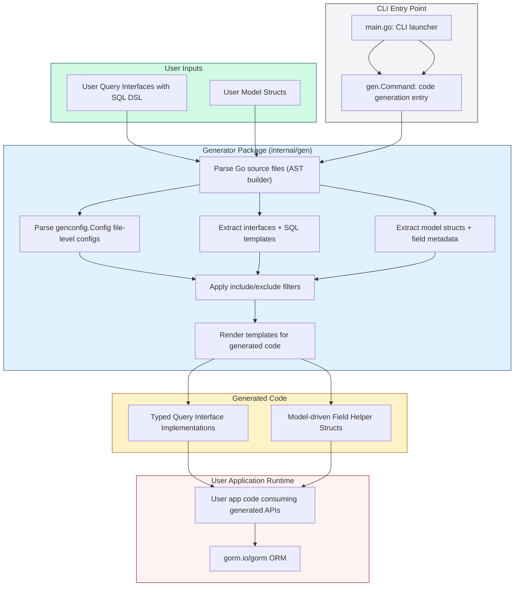

# System Architecture and Data Flow

## Overview
This page visualizes the architecture of **GORM CLI**, illustrating the flow of data and code transformations from user input—interfaces and models—to the generated strongly typed query APIs and field helpers. It highlights key components such as the CLI entry point, internal core packages, and outlines how the generated code integrates seamlessly with GORM and user applications.

Understanding this architecture equips users with a clear mental model of how GORM CLI processes their code, enabling better configuration, debugging, and extension.

---

## Architecture at a Glance

GORM CLI transforms Go source code containing annotated query interfaces and model structs into fully generated Go code that provides:

- **Type-safe, interface-driven query APIs** with embedded SQL templates
- **Model-driven, strongly typed field helpers** for filters, updates, and associations

The generated code integrates directly with the standard GORM ORM, offering compile-time safety and eliminating boilerplate.

---

## Key Components and Their Roles

| Component                | Description                                                                                      |
| ------------------------ | ------------------------------------------------------------------------------------------------ |
| **CLI Entry Point**       | The command line interface (`main.go`) that launches the generation process via the `gen` command.
| **Generator Package (`internal/gen`)** | Core machinery that parses source files, extracts annotated interfaces and structs, and produces generated code using templates.
| **Model Structs and Interfaces** | User-defined Go types and annotated query interfaces provide input for generation.
| **Generated Code**        | Output files containing the generated typed query interfaces and field helpers.
| **GORM Integration**      | The generated code relies on `gorm.io/gorm` for ORM operations, enabling fluent and safe data access in user applications.

---

## Data Flow and Processing Steps

1. **Source Input**
   - User writes Go **interfaces** annotated with SQL templates in comments.
   - User defines corresponding **model structs**.

2. **CLI Invocation**
   - The `gorm gen` CLI command, implemented as a Cobra command in `main.go`, is executed with paths to source files.

3. **Parsing & Analysis**
   - The generator loads files and builds ASTs (abstract syntax trees) for all input Go files.
   - Interfaces and model structs are scanned:
     - Interfaces: methods are extracted, and SQL templates in comments are parsed.
     - Structs: fields, types, and tags are parsed, including embedded anonymous fields.

4. **Configuration Application**
   - Package-level `genconfig.Config` values allow customization such as inclusion/exclusion filters and type mapping.

5. **Code Generation**
   - SQL template DSLs in interface method comments are converted into Go method bodies.
   - Model fields are analyzed to generate typed field helpers for predicates and updates.
   - Templates produce output Go files that expose:
     - Interfaces with typed query methods
     - Model field helpers for filters and association handling

6. **Output**
   - Generated files are written to configured output directories with proper imports and formatting.

7. **Integration in User Applications**
   - Users consume generated APIs seamlessly with GORM to write safe, fluent queries and updates.

---

## Diagram: GORM CLI System Architecture and Data Flow

---

## Practical Benefits of This Architecture

- **Clarity in Usage:** Users can understand exactly how their input Go code is transformed, reducing guesswork.
- **Customization:** Configuration files allow scoped generation, filtering interfaces and structs to fit project needs.
- **Robustness:** Generated code follows a strictly defined flow ensuring type safety and correctness.
- **Extensibility:** The modular parsing and generation pipeline enables adding new features like custom field mappers or template DSL extensions.
- **Seamless GORM Integration:** The generated code is a natural extension to GORM’s APIs, requiring no complex wiring.

---

## Tips for Users

- Organize your query interfaces and model structs consistently in packages or directories to maximize generator efficiency.
- Use the configuration (`genconfig.Config`) to include or exclude interfaces and structs as needed—especially in large projects.
- Write clear, well-documented SQL templates in interface method comments to produce predictable outputs.
- Explore generated code to understand the structure and leverage helpers to write safe queries with less boilerplate.

---

## Next Steps

To proceed with using GORM CLI:

- Visit [Getting Started with GORM CLI](../../guides/core-workflows/getting-started) to write your first query interfaces and models.
- Learn about [Generating and Using Type-Safe Query APIs](../../guides/core-workflows/generating-and-using-query-apis) for practical usage.
- Explore the [Model-Driven Field Helper Generation](../../guides/core-workflows/model-driven-field-helpers) guide to fully utilize generated helpers.

---

## Reference
- Source code for CLI entry point: `main.go`
- Core generator internals: `internal/gen/generator.go`, `internal/gen/utils.go`
- SQL Template test and processing: `internal/gen/sqlparser_test.go`

---

For deeper context, see:
- [What is GORM CLI?](../product-intro-concepts/what-is-gorm-cli)
- [Target Audience and Use Cases](../product-intro-concepts/target-audience-use-cases)
- [Core Concepts and Terminology](../product-intro-concepts/core-concepts-terminology)

---

This diagram and explanation reflect the design implemented in the current `main` branch of the [gorm/cli GitHub repository](https://github.com/go-gorm/cli).

