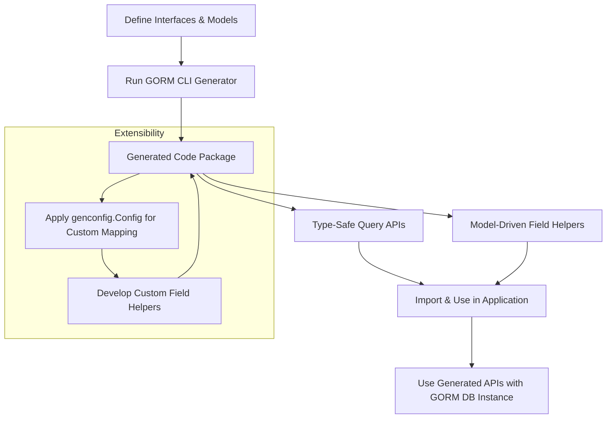

# Integration and Extensibility

GORM CLI integrates seamlessly into your existing GORM projects by generating code that complements and enhances the standard GORM API. This page explains exactly how the CLI fits into your development workflow, what configuration is necessary (if any), how to leverage the generated code alongside native GORM APIs, and how you can extend the system with custom field helpers and mappings to suit advanced use cases.

---

## Why Integration Matters

As a Go developer using GORM, you're looking for type safety, fluent APIs, and maintainability without disrupting your familiar workflows. The **Integration and Extensibility** page guides you through embedding GORM CLI into your projects so you can harness:

- **Safe, discoverable type-safe query APIs generated from your interfaces**
- **Model-driven field helpers for streamlined filtering, updating, and association handling**
- **Optional extensibility points allowing customized code generation and field mapping**

This enables you to upgrade your existing GORM-based repositories with minimal friction while supercharging query expressiveness and reducing boilerplate.

---

## How GORM CLI Fits into Your GORM Project

### Plugging In: From Interface and Model to Generated APIs

At the core, GORM CLI transforms user-defined Go interfaces annotated with SQL templates and Go structs representing models, into:

- **Type-safe query interfaces** — Methods with strongly-typed inputs and outputs,
- **Field helpers** — Generated fields for predicates, setters, and association operations.

The generator outputs curated Go packages containing these generated helpers and query implementations, which you import into your application just like any other Go package.

### Configuration: What You Need (and What You Don't)

- **No configuration required for basic use:** Simply define your interfaces and models, run the CLI, and import the generated code.
- **Optional generation config (`genconfig.Config`)**:
  - Customize output paths
  - Map custom Go types to specific field helpers
  - Include or exclude interfaces and structs by pattern
  - Adjust scope to package or file level

This config can be declared as a package-level variable and auto-detected by the generator, seamlessly adapting generation to your project structure.

### Using Generated Code with Existing GORM APIs

The generated code complements standard GORM usage patterns:

- Call generated query methods passing a `*gorm.DB` instance, benefiting from interface-driven APIs with SQL templates.
- Use generated field helpers in conjunction with `gorm.G[T](db)` for filtering, updating, ordering, and association management.

Example usage:

```go
// Use generated type-safe query interface
user, err := generated.Query[User](db).GetByID(ctx, 123)

// Use model-driven field helpers filtering with existing GORM
users, err := gorm.G[User](db).Where(generated.User.Age.Gt(18)).Find(ctx)
```

Both styles integrate naturally into your existing codebase, allowing gradual adoption.

---

## Extending GORM CLI via Custom Field Helpers and Mapping

### Motivation for Extensibility

Out of the box, GORM CLI handles Go's basic types and common GORM patterns, but every project has unique requirements — JSON fields, custom types, or specialized behaviors.

### Custom Field Helpers

You can declare custom field helpers to generate specialized query logic tailored to your types. For example, a JSON helper can generate different SQL depending on the database (MySQL, SQLite, PostgreSQL). You provide the helper implementation, and map it in your generation config.

Example JSON helper use case:

- Create a `JSON` field helper type implementing custom SQL expressions for JSON column equality.
- Map struct fields with a `gen:"json"` tag to this helper in your `FieldNameMap` config.
- The generator produces correct predicates seamlessly respecting your database dialect.

### Custom Mapping via `genconfig.Config`

You control type mapping through:

- **FieldTypeMap**: Map Go types (e.g., `sql.NullTime`) to the desired field helper
- **FieldNameMap**: Map custom `gen:"name"` tags on struct fields to specific helpers

This declarative approach provides powerful extensibility without needing internal generator changes.

---

## Practical Tips for Successful Integration

- Keep your interface methods focused and use templated SQL for flexibility and clarity.
- Organize generated code output paths to fit with your project structure via `OutPath`.
- Use associations and batch create/update/unlink/delete helpers generated to maintain relationship integrity.
- Extend with custom helpers early for project-specific needs to maximize type safety.
- Leverage the generated APIs alongside native GORM queries for a smooth hybrid approach.

---

## Summary Flow: User Workflow Integration



---

## Getting Started with Integration

1. Create your Go interfaces and models defining queries and data structures.
2. Optionally write a `genconfig.Config` to tailor output and mappings.
3. Run the `gorm gen` CLI tool referencing your interface input and choose the output directory.
4. Import generated packages and start using the fluent, type-safe APIs in your app alongside plain GORM.
5. Extend with custom helper types as your project needs evolve.

For detailed step-by-step instructions, see the [Getting Started guides](../getting-started).

---

## Troubleshooting Integration

<AccordionGroup title="Common Integration Challenges">
<Accordion title="Generated Code Not Found or Imported Incorrectly">
Verify that your generator output directory matches your import paths and Go module layout. Make sure to run `go mod tidy` after adding generated packages.
</Accordion>
<Accordion title="Conflicts Between Native and Generated API Usage">
Use `gorm.G[T](db)` consistently and avoid mixing incompatible query builder logic with generated code. Always use the generated field helpers or interface methods, not raw strings.
</Accordion>
<Accordion title="Custom Field Mapping Not Taking Effect">
Double-check tag names and that your `genconfig.Config` is declared in the correct package and format. Validate your custom helpers implement the required methods.
</Accordion>
</AccordionGroup>

---

This page should empower you to confidently integrate and extend GORM CLI into your GORM projects, unleashing strong typing and fluent query capabilities with ease.

---

## Next Steps

- Explore [Defining Query Interfaces & Models](../../getting-started/first-run-and-validation/defining-interfaces-models) for hands-on examples.
- Dive into [Generating & Using Type-Safe Query APIs](../../guides/core-workflows/generating-and-using-query-apis) to master query generation.
- Customize further with [Customizing Code Generation & Field Mapping](../../guides/advanced-patterns/customizing-code-generation).
- Review the [Core Concepts and Terminology](../product-intro-concepts/core-concepts-terminology) to deepen your understanding.


<Source url="https://github.com/go-gorm/cli" paths={[{"path": "examples/query.go", "range": "1-150"},{"path": "internal/gen/gen.go", "range": "1-70"},{"path": "README.md", "range": "1-190"}]}/>
