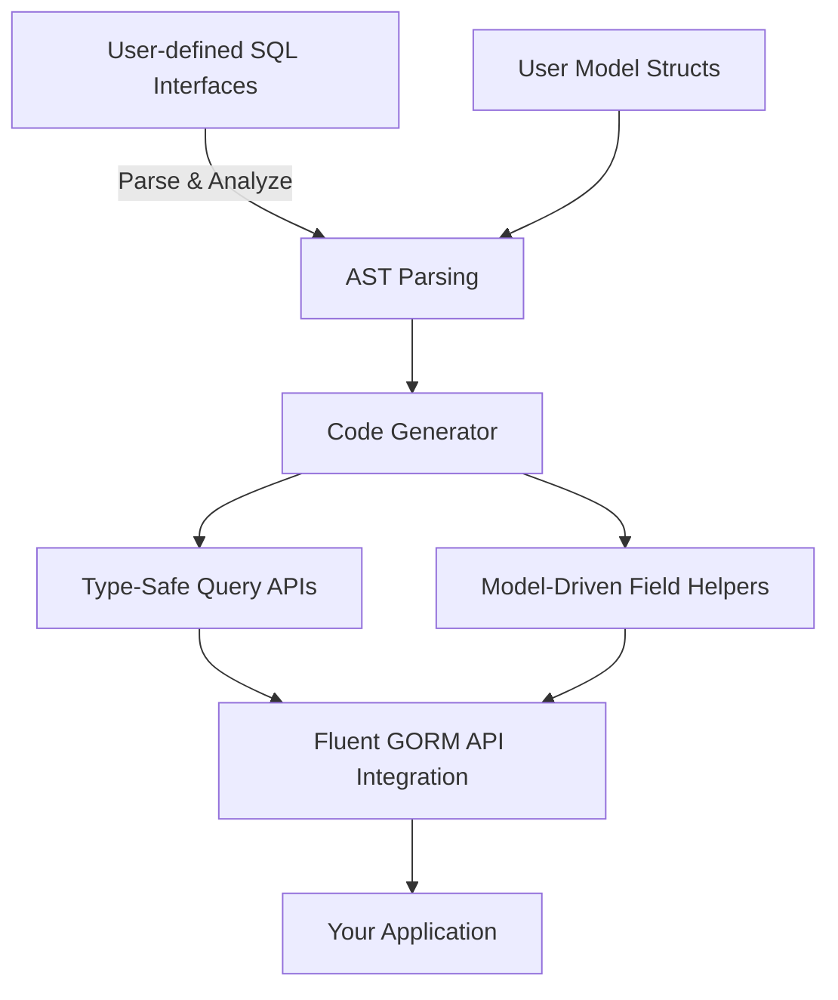

# Quick Feature Overview

## Unlock Type-Safe, Fluent Code Generation for GORM

GORM CLI empowers Go developers to generate two synergistic types of code that transform how you write data access logic: interface-driven, type-safe query APIs, and model-driven field helpers. By combining these generators, you unlock fluent, compile-time-safe, and discoverable APIs that seamlessly integrate with GORM ORM workflows.

---

## Two Powerful Generators, One Workflow

### 1. Interface-Driven Query APIs

At the heart of GORM CLI is the ability to turn Go interfaces annotated with raw SQL templates into concrete, type-safe query APIs.

- **What it does:** Generate query method implementations based on your interface definitions where SQL or template SQL fragments are embedded in method doc comments.
- **Why it matters:** Save countless hours by eliminating boilerplate, avoid runtime query errors with compile-time validation, and design your data layer around expressive, reusable interfaces.

**Example:**
```go
// Define an interface with templated SQL in comments
// SELECT * FROM @@table WHERE id=@id
GetByID(id int) (T, error)
```
The generator produces a method with concrete SQL bindings and fluent GORM query integration.


### 2. Model-Driven Field Helpers

Complementing the query APIs, GORM CLI generates strongly typed, model-driven field helpers based on your struct definitions.

- **What it does:** From model structs, generate field predicates and setters for filtering, updating, and ordering queries.
- **Why it matters:** Use a fluent API for building safe queries and updates with zero runtime errors, plus effortless navigation of associations.

**Example:**
```go
// Model struct
type User struct {
  ID   uint
  Name string
  Age  int
}

// Generated field helpers
generated.User.Age.Gt(18)           // age > 18 filter
generated.User.Name.Like("%smith%") // LIKE query
```

---

## How They Work Together

- **Composite API Experience:** Use interface methods returned by GORM CLI combined with field helpers to build advanced queries and updates fluently.
- **Association Helpers:** Automate complex relationship management with generated helpers for belongs to, has many, and many2many associations.
- **Template DSL Enables Custom Queries:** Embed complex conditional SQL logic directly inside interface method comments, leveraging powerful directives like `{{where}}` and `{{set}}`.


## Key Features and Capabilities

- **Type-Safe Query APIs:** Interface methods with signature-checked parameters and return types automatically generate safe, efficient SQL and GORM code.
- **Model Field Helpers:** For each struct field, generate predicates (e.g., `.Eq()`, `.Gt()`, `.Between()`) and setters that integrate directly into GORM query chains.
- **Association Operations:** Automatically generate helpers for creating, updating, unlinking, deleting related records with compile-time guarantees.
- **Configurable Generation:** Use `genconfig.Config` for fine-grained control on included interfaces, structs, custom mappings, and output paths.


## Real-World Scenario

Imagine building a user management system:
- You define a `Query` interface with methods like `GetByID`, `FilterByNameAndAge`, each embedding SQL templates.
- Define your `User` struct with fields plus associations like `Pets`, `Languages`.
- Run GORM CLI to generate:
  - A typed `Query` implementation with safe parametrized queries.
  - Field helpers on `User` for building filters such as `User.Age.Between(18, 65)`.
  - Association helpers to manage pets and languages fluently.

This setup drastically reduces runtime bugs, improves discoverability, and accelerates development.

---

## Why Should You Care?

- **Robustness:** Shift error detection from runtime to compile-time.
- **Maintainability:** Standardize query methods and field access across large teams.
- **Productivity:** Avoid repetitive boilerplate and focus on business logic.
- **Flexibility:** Customize generation via config files to suit project needs.


## Getting Started Preview

1. **Write your SQL-annotated Go interfaces and structs**
   - Annotate interfaces with inline SQL using the template DSL.
   - Define Go structs that model your database schema.

2. **Configure generation (optional)**
   - Use a `genconfig.Config` variable in your package for overrides.

3. **Run the CLI generator**
```bash
gorm gen -i ./path/to/interfaces -o ./generated
```

4. **Use the generated code**
   - Call generated query methods with type-safety and integrate field helpers for complex queries.

---

## Tips & Best Practices

- **Leverage DSL directives** highly: `{{where}}`, `{{set}}`, conditionals make your queries dynamic yet type-safe.
- **Define interfaces that match your business queries** instead of ad-hoc query strings.
- **Leverage association helpers** to manage relational data cleanly with supported operations.
- **Use config overrides** to map custom field types or to restrict generation scope.


## Common Pitfalls

- Not returning the expected method results (see return value conventions).
- Forgetting to include `context.Context` triggers automatic injection.
- Misconfiguring includes/excludes in `genconfig.Config` leading to empty generation.

---

## Diagram: GORM CLI Core Feature Flow


---

## Next Steps

- Explore the [Getting Started with GORM CLI](/guides/core-workflows/getting-started) guide for practical instructions.
- Deep dive into [Generating & Using Type-Safe Query APIs](/guides/core-workflows/generating-and-using-query-apis).
- Learn how model-driven helpers simplify filters and updates in [Model-Driven Field Helper Generation](/guides/core-workflows/model-driven-field-helpers).
- Customize code generation with [Configuration & Extensibility](/concepts/advanced-topics/configuration-extensibility).

---

This overview sets the foundation for mastering GORM CLI’s transformative code generation capabilities that streamline and safeguard your GORM-powered Go projects.

---
