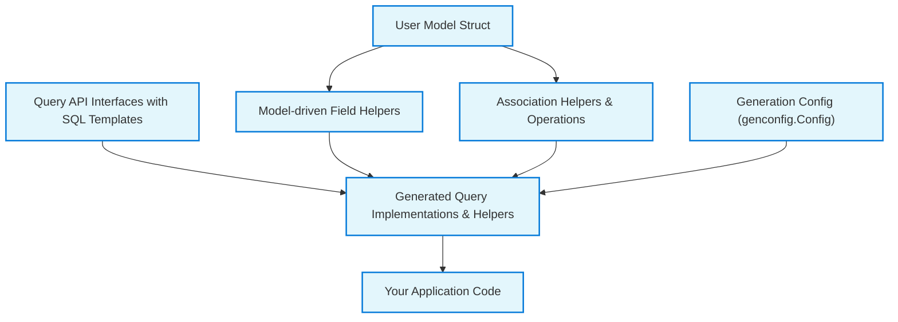

# Core Concepts & Terminology

Welcome to the foundational guide on GORM CLI’s core concepts and terminology. This page helps you understand the critical building blocks and domain-specific language you will encounter as you use the GORM CLI ecosystem for generating type-safe query APIs and model-driven field helpers. By mastering these concepts early, you can navigate the documentation and code with confidence and unlock the full productivity gains of GORM CLI.

---

## Understanding the Core Domain of GORM CLI

At its heart, GORM CLI enables Go developers to generate fluent, type-safe database access code by combining *query API interfaces*, *model structs*, and customizable *configuration points*. It produces two powerful outputs:

- **Query API Interfaces:** User-written Go interfaces annotated with SQL templates defining your data-access queries.
- **Model-Driven Field Helpers:** Generated helpers from your GORM model structs that empower safe, expressive filters, updates, and association management.

### Why These Concepts Matter

Each concept encapsulates user intent and usage patterns in GORM CLI-generated code. Understanding these components lets you write effective query templates, configure generation precisely, and leverage association operations without confusion.

---

## Key Concepts Explained

### 1. Query API Interfaces

**What Are They?**

- Go interfaces where each method includes an SQL template as a comment.
- Methods define parameterized SQL queries, providing an interface-driven way to express custom queries.

**Why Use Them?**

- They generate type-safe, concrete implementations eliminating manual boilerplate.
- Provide compile-time validation, ensuring queries match method signatures.

**Core Elements:**

- Placeholders like `@@table` (resolved to table name) and `@param` (binding Go parameters).
- Template directives like `{{where}}`, `{{set}}`, and `{{if}}` to build dynamic SQL clauses.

**Example:**

```go
// SELECT * FROM @@table WHERE id=@id
GetByID(id int) (T, error)
```

### 2. SQL Template Comments

- Placed directly above interface methods, these are parsed by the generator.
- Use GORM CLI's SQL Template DSL featuring `@@table`, `@@column`, `@param`, `{{where}}`, `{{set}}`, and more.
- Allow dynamic, conditional, or iterative SQL generation based on method parameters.

**Practical Tip:** Write clear, parameterized templates to fully leverage type safety.

### 3. Field Helpers

**Definition:**

- Generated from your GORM models, field helpers provide strongly typed methods representing columns and associations.
- Enable concise expressions for filters (`Eq`, `Gt`, `Between`), updates (`Set`, `SetExpr`), and conditional matching.

**Benefit:**

- Avoid SQL or string-based queries manually.
- Ensure you use correct field names and types, catching issues at compile time.

**Types of Fields:**

- Basic fields: int, string, bool, time, sql.Null* types, with extensions for JSON via custom helpers.
- Associations: represented as struct or slice types such as `field.Struct[T]`, `field.Slice[T]` for linked models.

**Example:**

```go
generated.User.Age.Gt(18)              // age > 18
generated.User.Name.Like("%jinzhu%") // name LIKE '%jinzhu%'
```

### 4. Association Operations

GORM CLI models capture relationships between entities (has one, has many, belongs to, many2many, polymorphic). The generator provides helpers supporting these operations with compile-time safety:

- **Create:** Insert and link new associated rows automatically.
- **CreateInBatch:** Batch insert multiple linked rows.
- **Update:** Update associated rows conditionally.
- **Unlink:** Remove links by setting foreign keys to NULL or deleting join table rows (without deleting data).
- **Delete:** Delete associated rows or join rows for many2many.

**Semantics vary by association type:**

| Association   | Unlink Behavior                          | Delete Behavior                         |
|---------------|-----------------------------------------|---------------------------------------|
| belongs to    | Sets FK on parent to NULL                | Removes associated rows                |
| has one/many  | Sets FK on child to NULL                | Removes child rows                     |
| many2many     | Deletes join rows only                   | Deletes join rows only                 |

**Example:**

```go
// Create user with pets attached
gorm.G[User](db).Set(
  generated.User.Name.Set("alice"),
  generated.User.Pets.Create(generated.Pet.Name.Set("fido")),
).Create(ctx)
```

### 5. Configuration Points (`genconfig.Config`)

**What is it?**

- A Go struct users declare in their packages/directories to customize code generation behavior.

**Use Cases:**

- Control output paths.
- Include/exclude interfaces and structs by pattern or type.
- Customize field type mappings (e.g., mapping `sql.NullTime` to a `Time` helper).
- Configure custom field naming rules (map struct tags to custom helpers).
- Set generation to file-level or package-level granularities.

**Example:**

```go
var _ = genconfig.Config{
  OutPath: "examples/output",
  IncludeInterfaces: []any{"Query*"},
  ExcludeStructs: []any{"*DTO"},
  FieldTypeMap: map[any]any{
    sql.NullTime{}: field.Time{},
  },
}
```

---

## Domain Terms You’ll Encounter

| Term               | Meaning                                                  |
|--------------------|----------------------------------------------------------|
| `@@table`          | Placeholder replaced by the current model's table name   |
| `@@column`         | Placeholder replaced by a column name (dynamic binding)  |
| `@param`           | Parameter binding from Go method argument                |
| `{{where}}`        | Template directive for conditional WHERE clauses         |
| `{{set}}`          | Template directive for conditional SET (UPDATE) clauses  |
| Field Helper       | Generated struct methods representing model fields       |
| Associations       | Relationships between models (has one/many, belongs to)  |
| `CreateInBatch`    | Batch link-create operation for associations              |
| `Unlink`           | Operation to clear foreign key relations                  |
| `genconfig.Config` | Generation configuration struct to customize CLI output |

---

## How These Concepts Fit Together

1. You **define your Go models** — including relationships and special struct tags.
2. You **write query API interfaces**, using SQL templates for method definitions.
3. Optionally, you **configure the generator** using `genconfig.Config` to control what and how code is generated.
4. GORM CLI **generates query implementations** and *field helpers* for models.
5. In your application, you use the **generated query APIs and field helpers** to write fluent, safe database access code.

---

## Practical Tips & Best Practices

- **Use descriptive names** for interfaces and methods reflecting your query intent.
- **Take advantage of configuration** to include only relevant interfaces/structs and to map custom types.
- **Leverage association helpers carefully**, using `Unlink` and `Delete` with awareness of relation semantics.
- **Keep SQL templates succinct and use conditional directives** to avoid verbose repetitive queries.
- **Refer to the User model example** in `examples/models/user.go` to understand complex associations and polymorphic relations.

---

## Troubleshooting & Common Gotchas

- If generated methods do not match expected signatures, verify SQL templates and parameter bindings.
- Using `CreateInBatch` requires batch slices of correct model types.
- Polymorphic associations require proper GORM struct tags (`polymorphic:Owner`), else helpers won’t generate accurately.
- Configurations inconsistently applied? Check if you declared `genconfig.Config` at package or file level.

---

## Visual Overview of Concepts and Relationships



---

## Next Steps

- Explore [Model-Driven Field Helpers](https://docs.gorm.io/concepts/data-models-and-templates/model-driven-field-helpers) to deepen your use of generated fields.
- Learn to write effective [Template-based Query APIs](https://docs.gorm.io/guides/essential-workflows/template-based-query-apis).
- Review customization options in [Configuring Code Generation](https://docs.gorm.io/concepts/configuration-and-extensibility/configuring-generation).

---

This foundational knowledge empowers you to read the rest of the GORM CLI documentation with clarity and confidence. The cohesive terminology and concepts here are your map to fluent data layer automation with GORM CLI.

---

For concrete usage examples, see `examples/models/user.go` and `examples/query.go` in the source repository.

---

*End of Core Concepts & Terminology*