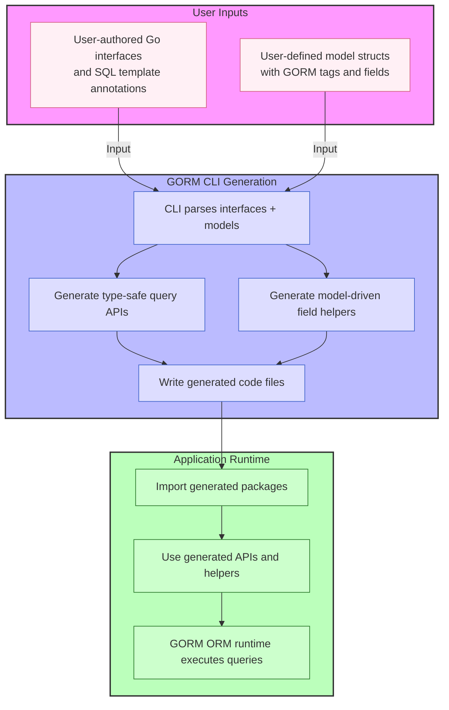

# How GORM CLI Works: Architecture Overview

Unlock a clear understanding of GORM CLI’s inner workings—from the interfaces you write, through the generation process, to the seamless integration of generated code with the GORM runtime. This page offers a visual and narrative guide that maps your journey from source inputs to powerful, type-safe API usage in your application.

---

## Visualizing the Workflow: From Interfaces to Runtime Integration

Imagine you start by crafting Go interfaces and model structs that represent your application’s database layer. GORM CLI then takes these inputs and automates the creation of two essential elements:

- **Type-safe query APIs generated from your annotated interfaces** — methods with SQL templating that translate into fluent, compile-time safe Go functions.
- **Model-driven field helpers** — typed helpers for your model fields and associations that simplify filters, updates, and link/unlink operations.

These pieces form a bridge between your declarative interface design and a robust, error-resistant codebase, fully integrated with the GORM runtime for executing queries.

---

## Core Components and Their Roles

### 1. User Inputs: Interfaces and Models

- **Interfaces:** You define Go interfaces annotated with SQL templates that describe queries, filters, updates, and filtering conditions you want.
- **Models:** Your Go structs representing database tables, with fields tagged for GORM and optionally marked for custom helper generation.

These inputs are the foundation upon which the CLI generates safe, fluent APIs.

### 2. GORM CLI Generation Process

- The CLI tool, invoked typically as `gorm gen -i ./your/interfaces -o ./generated`, parses your interfaces and models together.
- It comprehends your SQL templating directives, interface patterns, and model definitions.
- It then generates **two complementary code sets**:

  - **Query APIs:** Typed interface implementations with methods matching your SQL templates, enabling compile-time safety.
  - **Field Helpers:** Model-based field and association helpers for building filters, updates, and association operations.

- Generated code is placed in your chosen output directory, ready for import.

### 3. Application Runtime

- Your application imports the generated Go packages alongside GORM.
- Your business logic calls the fluent, type-safe APIs generated by GORM CLI.
- Behind the scenes, these APIs build and execute SQL queries via GORM’s runtime, ensuring seamless ORM integration.

---

## Why Understanding This Architecture Matters

By grasping the flow from your source interfaces and models, through code generation, to runtime use, you can:

- **Write better interfaces and models**: optimize annotations and struct designs aware of the generation impact.
- **Debug effectively**: trace how source annotations become generated code used in your application.
- **Customize generation**: leverage config options to finely tune helper types and generation scope.
- **Extend workflow**: integrate your own SQL templates or field helpers with confidence.

---

## Practical User Flow Example

Consider a step-by-step flow combining knowledge of this architecture:

<Steps>
  <Step title="1. Write Interface & Models">
  Define an interface with SQL templated comments and a model struct.
  </Step>
  <Step title="2. Run CLI Generator">
  Execute `gorm gen -i ./examples -o ./generated` to parse and generate code.
  </Step>
  <Step title="3. Import Generated Code">
  In your app, import the generated package and use generated APIs.
  </Step>
  <Step title="4. Query and Update Safely">
  Call generated query methods and use field helpers to build filters and updates with compile-time checking.
  </Step>
  <Step title="5. Execute Via GORM">
  The fluent APIs produce SQL operations executed through GORM's runtime seamlessly.
  </Step>
</Steps>

Success is achieved when your database operations are performed type-safely, with less manual SQL, and integrated cleanly.

---

## Troubleshooting Common Issues

<AccordionGroup title="Common GORM CLI Generation & Integration Issues">

<Accordion title="Generated Code Not Found or Not Imported">
Ensure you have run the CLI generator with the correct input and output paths, then import the generated package properly in your project. Check for build errors referencing generated files.
</Accordion>

<Accordion title="Type Safety Errors Despite Generation">
Verify your interfaces have properly formatted SQL templates and matching method signatures. Incorrect templates or mismatched types can cause generation mismatches.
</Accordion>

<Accordion title="Association Helpers Missing or Incomplete">
Check your model struct tags for associations and ensure they follow GORM conventions (e.g., `gorm:"foreignkey"`, `gorm:"many2many"`). Missing or incorrect tags prevent generation of association helpers.
</Accordion>

<Accordion title="CLI Generation Command Fails or Errors">
Review the CLI invocation flags `-i` (input) and `-o` (output) for correctness. Validate your interfaces do not use unsupported constructs. Consult `internal/gen/gen.go` CLI command source for error details.
</Accordion>

</AccordionGroup>

---

## Next Steps

- Dive into writing effective **[Template-based Query APIs](https://your.documentation.url/overview/intro-and-value-prop/product-purpose-value)** with safe SQL templating.
- Explore **[Model-driven Field Helpers](https://your.documentation.url/concepts/data-models-and-templates/model-driven-field-helpers)** for streamlined filters and association handling.
- Learn how to **[Configure Code Generation](https://your.documentation.url/concepts/configuration-and-extensibility/configuring-generation)** for custom needs.
- Check out **[Integration with GORM Runtime](https://your.documentation.url/concepts/core-architecture/integration-with-gorm)** for deep understanding of runtime behavior.

Harness this architectural insight to maximize GORM CLI’s benefits and build cleaner, safer, and more maintainable Go ORM layers.

---

## References

- [Core CLI command logic and flags](https://github.com/go-gorm/cli/blob/main/internal/gen/gen.go)
- [Code generation templates](https://github.com/go-gorm/cli/blob/main/internal/gen/template.go)
- [Example user model with associations](https://github.com/go-gorm/cli/blob/main/examples/models/user.go)
- [Query interface example](https://github.com/go-gorm/cli/blob/main/examples/query.go)

---