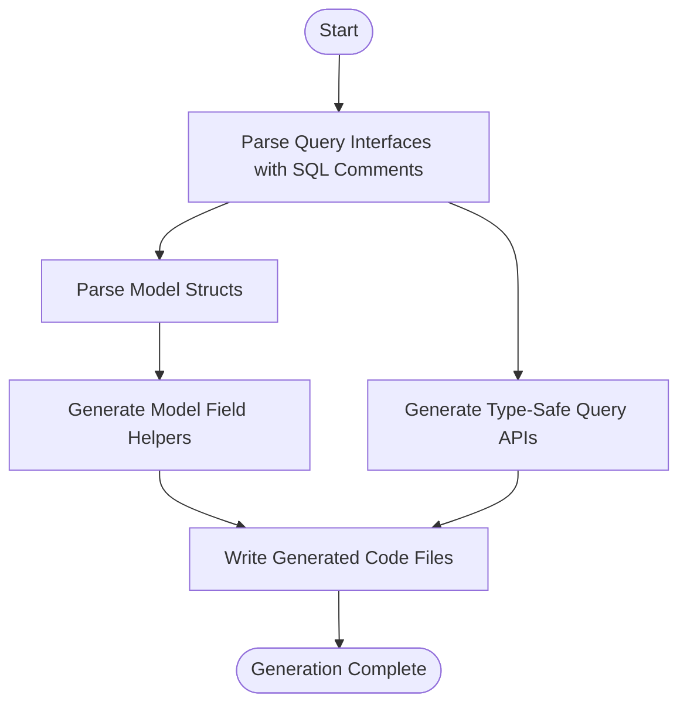

# GORM CLI: Product Overview & Value Proposition

## Empowering Go Developers with Type-Safe GORM Access

GORM CLI revolutionizes the way Go developers interact with GORM by generating interface-driven, type-safe query APIs and model-driven field helpers. It transforms your model definitions and query interfaces into fluent, discoverable, and compile-time safe data access layers.

---

### Why GORM CLI Matters

Writing and maintaining data access code can become error-prone, especially when raw SQL strings or reflection-based queries are involved. GORM CLI addresses this by:

- Enforcing **compile-time safety** so errors surface early in your development cycle.
- Offering **interface-driven query APIs** that let you define precise queries with embedded SQL templates.
- Generating **model-driven helpers** that simplify working with filters, updates, and associations.

This leads to more maintainable code, fewer runtime surprises, and a faster development experience.

---

## What Is GORM CLI?

GORM CLI is a code generator designed for Go developers using GORM to interact with databases. It automates the creation of:

- **Query APIs from interfaces:** Write generic Go interfaces decorated with SQL templates, and GORM CLI generates concrete methods that are type-safe and integrate tightly with `gorm.io/gorm`.
- **Field helpers from models:** Based on your Go structs representing data models, it produces strongly typed helpers to construct filters, update clauses, and manage complex associations effortlessly.

By focusing on user-defined interfaces and model structs, GORM CLI eliminates common runtime errors found in dynamic query construction.

### Core Benefits

- **Compile-time Safety:** Catch mistakes early by generating strongly typed, checked code.
- **Discoverable APIs:** Method names and model fields become part of an expressive, fluent API.
- **Interface-Driven Flexibility:** Combine hand-crafted SQL with typed parameters for complex queries.
- **Seamless GORM Integration:** Works directly with the GORM ORM, preserving existing workflows.

---

## Key Value Propositions

- Generate **typed query interfaces** allowing you to express complex queries with precision and clarity.
- Produce **model-centric field helpers** that simplify building predicates, updates, and handling associations.
- Empower your team with APIs that are both **intuitive** and **compile-safe**, boosting productivity and reducing bugs.
- Benefit from a **template-based SQL DSL** offering conditional, dynamic queries inside your interface methods.
- Customize generation with optional per-package configurations for field mappings and output organization.

---

## How It Works: User Workflow

1. **Define your models** as standard Go structs embedding GORM types, representing your database schema.
2. **Write query interfaces** where methods are annotated with SQL templates in comments to specify your SQL behavior.
3. **Run the GORM CLI generator**; it scans your interfaces and structs to create strongly typed Go code.
4. **Use the generated code** in your application for type-safe data queries and updates.

Example:

```go
// Query interface with embedded SQL template
// SELECT * FROM @@table WHERE id=@id
GetByID(id int) (T, error)

// Model struct example
type User struct {
    gorm.Model
    Name string
    Age  int
}
```

After running the generator, you gain code like:

```go
u, err := generated.Query[User](db).GetByID(ctx, 123)
```

This call is fully type-safe, discoverable, and auto-completes in editors.

---

## Core Features & Capabilities

- **Interface-Driven Code Generation:** Define generic interfaces with SQL templates; methods become concrete query functions.
- **Model-Driven Field Helpers:** From your struct fields, generate typed filter, update, and association helpers to build queries fluently.
- **Template-Based SQL DSL:** Supports directives like `@@table`, `@param`, `{{where}}`, `{{set}}`, `{{if}}` and loops for dynamic query building.
- **Association Support:** Generate helpers for create, update, unlink, delete operations on related models, respecting association types (has one, has many, belongs to, many2many).
- **Configurable Generation:** Use a package-level `genconfig.Config` to override output paths, include/exclude specific structs or interfaces, and map custom types.

### Real-World Example: Update User Info

```go
// UpdateInfo updates fields conditionally
// UPDATE @@table
//  {{set}}
//    {{if user.Name != ""}} name=@user.Name, {{end}}
//    {{if user.Age > 0}} age=@user.Age, {{end}}
//  {{end}}
// WHERE id=@id
UpdateInfo(user User, id int) error
```

Generated code safely applies only non-zero fields, reducing errors and boilerplate.

---

## Why Should You Care?

### Benefits

- **Error Reduction:** Avoid run-time errors by catching invalid queries or bad field names at compile time.
- **Maintainability:** Clear interfaces and generated helpers result in easy-to-understand, shareable, and refactorable data access layers.
- **Developer Efficiency:** Spend less time writing repetitive code; focus on business logic instead.
- **Extensibility:** Use custom type mappings and configuration for advanced scenarios.

### Common Use Cases

- Building type-safe data layers for Go applications leveraging GORM.
- Complex query needs requiring conditional SQL with type safety.
- Managing rich model associations with compile-time validated operations.
- Automating repetitive query and update boilerplate in larger teams.

### Before and After

| Without GORM CLI                 | With GORM CLI                         |
|--------------------------------|-------------------------------------|
| Raw string queries prone to typos and runtime errors | Typed, interface-based queries validated at compile time |
| Manual writing of filters and updates per field      | Field helpers that provide fluent builders for common predicates |
| Error-prone association management                    | Type-safe, expressive association helpers for complex relations |

---

## Getting Started Preview

### Quick Steps

- **Write your query interfaces:** Define method signatures with embedded SQL comments.
- **Define models:** Create Go structs representing your tables.
- **Install GORM CLI:** `go install gorm.io/cli/gorm@latest`
- **Run generator:** `gorm gen -i ./yourpkg -o ./generated`
- **Use generated code:** Import and leverage the generated queries and helpers.

### Prerequisites

- Go 1.18 or higher (supports generics).
- Familiarity with GORM and Go interfaces.

### Next Steps

Proceed to:
- [Target Audience & Common Use Cases](../what-is-gorm-cli/target-audience-use-cases)
- [Feature Summary](../../core-concepts-architecture/feature-overview)
- [Quickstart Workflow](../../getting-started-examples/quickstart-workflow)

---

## Additional Tips and Best Practices

- Use meaningful interface method names to describe queries clearly.
- Leverage the template DSL to express conditional logic inside SQL comments.
- Configure `genconfig.Config` in your packages to tailor generation paths and type mappings.
- Manage associations with generated helpers to safely perform related data operations.
- Always validate generated code with your test suite to ensure expected behavior.

---

Explore the rest of the GORM CLI documentation for in-depth guides on workflows, configuration, and advanced patterns.

---

_For the underlying architecture details and template format, see the [Core Concepts & Architecture](../../core-concepts-architecture/feature-overview)._

---

### Example Quick Snippet Using Generated Code

```go
// Fetch a user by ID
user, err := generated.Query[User](db).GetByID(ctx, 42)
if err != nil {
    log.Fatal(err)
}

// Update a user's name conditionally
err = generated.Query[User](db).UpdateInfo(ctx, User{Name: "newname"}, 42)
if err != nil {
    log.Fatal(err)
}

// Use generated field helpers for filtering
users, err := gorm.G[User](db).
        Where(generated.User.Age.Gt(18)).
        Find(ctx)
if err != nil {
    log.Fatal(err)
}
```

---

## Diagram: High-Level Flow of GORM CLI Generation



---

For more, explore the [Quickstart Workflow](../../getting-started-examples/quickstart-workflow) to start generating your own code today.

---

© GORM CLI Project 2024

---